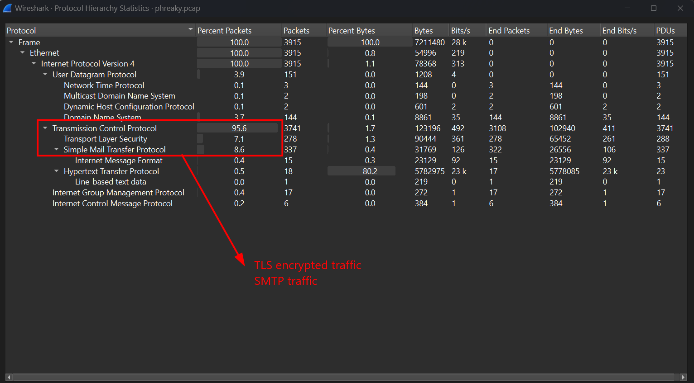
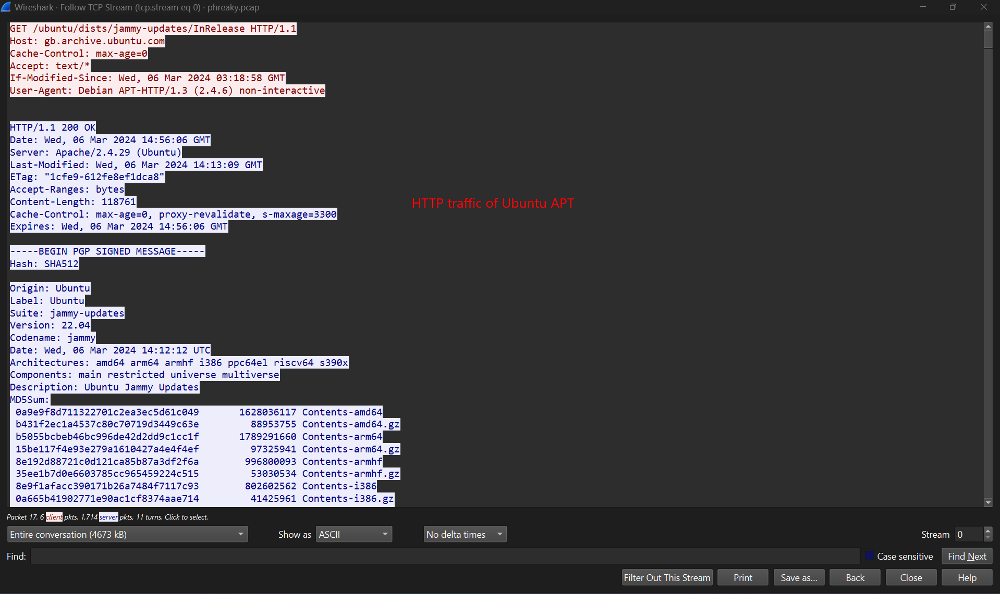
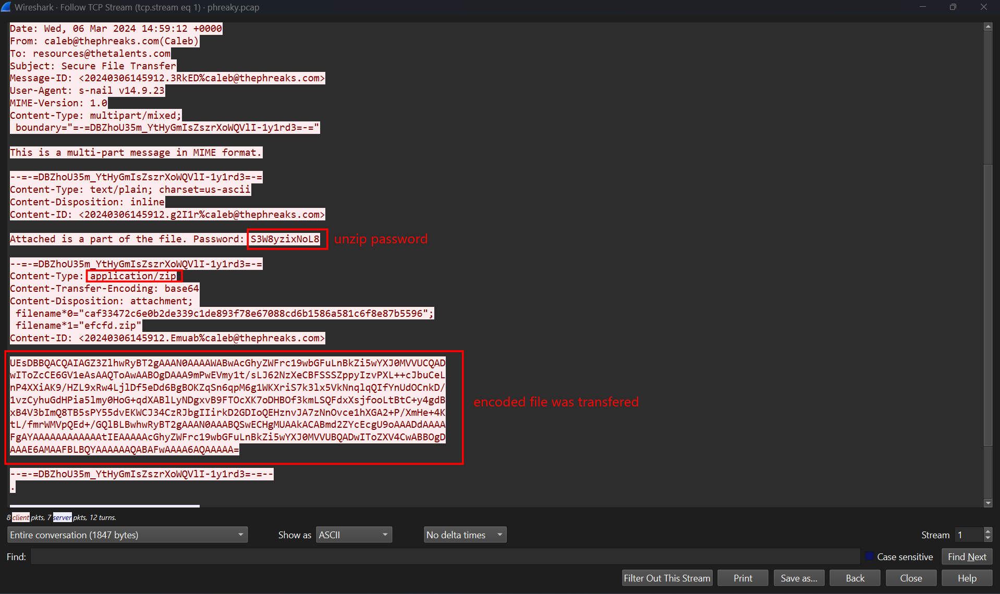
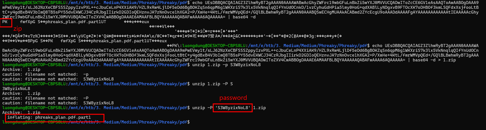
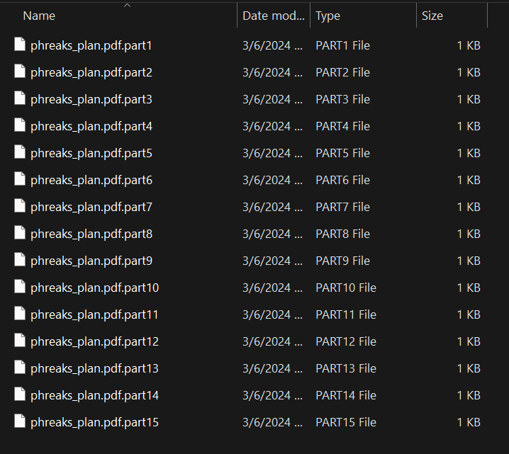
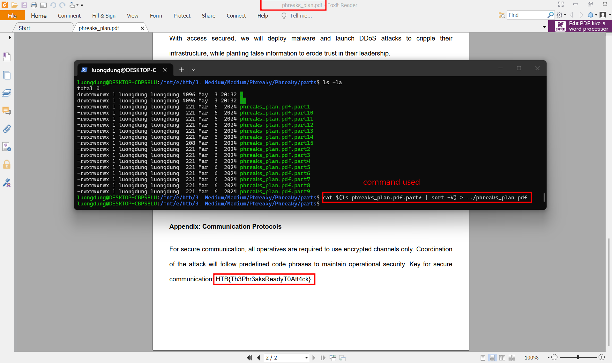

# Phreaky
**Challenge scenario**: In the shadowed realm where the Phreaks hold sway, A mole lurks within leading them astray. Sending keys to the Talents, so sly and so slick, A network packet capture must reveal the trick. Through data and bytes, the sleuth seeks the sign, Decrypting messages, crossing the line. The traitor unveiled, with nowhere to hide, Betrayal confirmed, they'd no longer abide.

## Overview
The challenge provided a packet capture as described.

In Hierarchy, it shown that some packets are transfered through SMTP traffic. SMTP is a protocol used to send emails between a client and a mail server, or between mail servers themselves. If any files is transfer through this traffic, it will be encoded as Base64.

In TCP Stream 0, it is HTTP traffic of Ubuntu APT, it is checking the package list from Ubuntu mirror.

## Recreate PDF file

In Stream 1, it is a zip file having password that was transfered through SMTP traffic.

Decoded it to have the zip file and unzipped it, the first part of the PDF is recovered. The original PDF file was cut in to 15 pieces, all of them was transfered by the same method, through SMTP traffic.
So I recovered all pieces, join them to have the original PDF file.

**FLAG: HTB{Th3Phr3aksReadyT0Att4ck}**

