# Precious guidance
**Challenge scenario**: Miyuki has come across what seems to be a suspicious process running on one of her spaceship's navigation systems. After investigating the origin of this process, it seems to have been initiated by a script called "SatelliteGuidance.vbs". Eventually, one of your engineers informs her that she found this file in the spaceship's Intergalactic Inbox and thought it was an interactive guide for the ship's satellite operations. She tried to run the file but nothing happened. You and Miyuki start analysing it and notice you don't understand its code... it is obfuscated! What could it be and who could be behind its creation? Use your skills to uncover the truth behind the obfuscation layers.

## First stage
As described in scenario, a file named SatelliteGuidance.vbs is provided. At first glance, I just notice it is defining arrays, variables and there is only one function named polymerase()
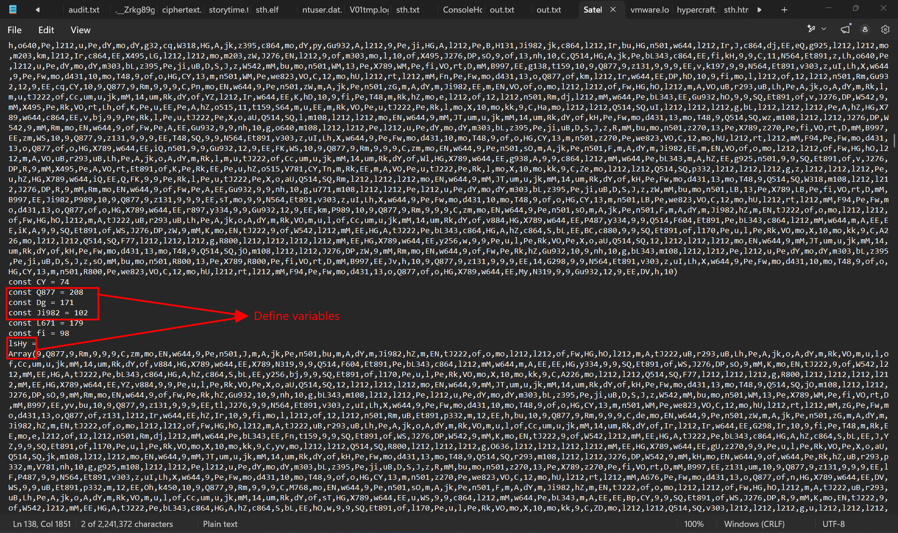
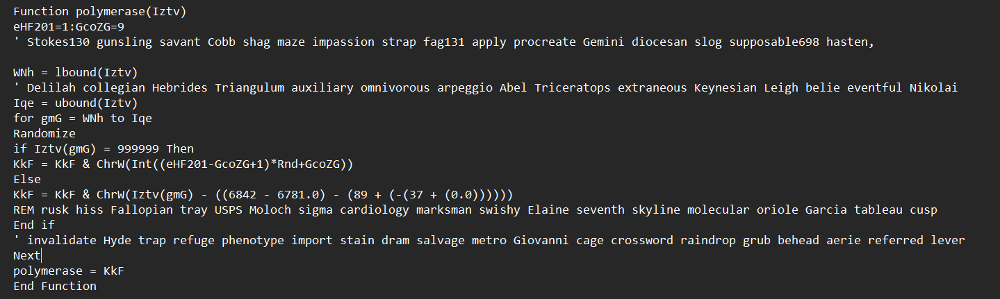
It has been obfuscated, but it can be rewrite like this
```
Function polymerase(Iztv)
    Dim gmG As Long
    Dim KkF As String
    
    For gmG = LBound(Iztv) To UBound(Iztv)
        If Iztv(gmG) = 999999 Then
            Randomize
            KkF = KkF & ChrW(Int(9 * Rnd + 1))
        Else
            KkF = KkF & ChrW(Iztv(gmG) - 9)
        End If
    Next gmG
    
    polymerase = KkF
End Function
```
Overall, it takes the index of each character in Iztv array, minus it by 9 and convert back into characters. At the end of this script, it calls for functions that will be define in stage2 of the challenge.
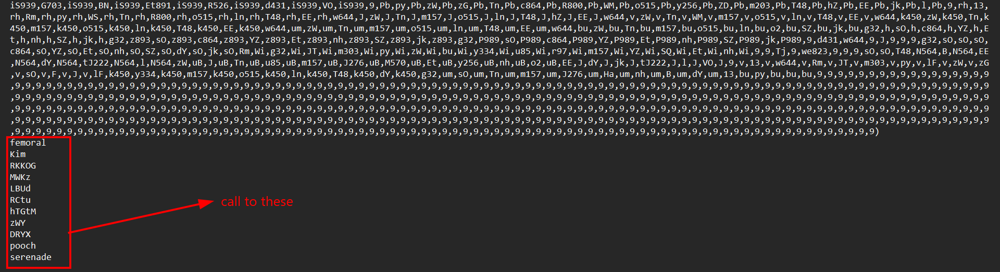

## Stage 2
It is execute(polymerase()) in the original script, I modified them all to Wscript.echo(polymerase()) and redirect output to stage2.vbs using this command
```
cscript SattelitteGuidance.vba > stage2.vbs
```
Most of the functions that was called earlier in stage 1 is for anti VM. 
### femoral()
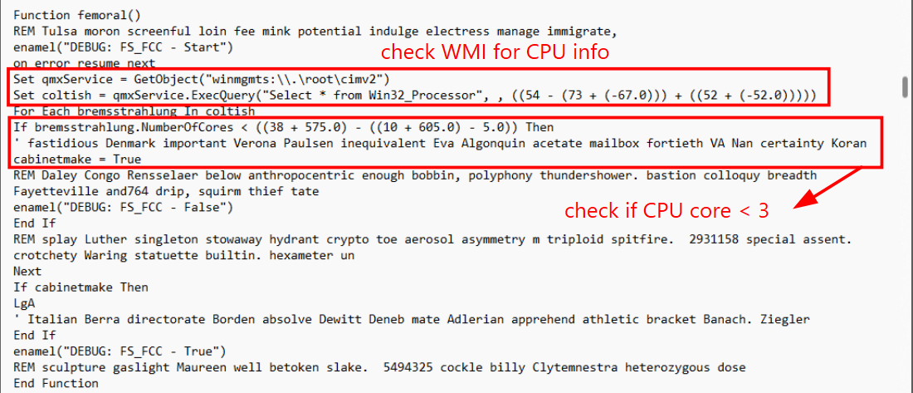
This function use WMI (Windows Management Instrumentation) to get information about system's hardware. It checks for the number of CPU cores, if it is less then 3 --> VM --> quit. Since in real machine, the number of CPU core is from 4 or more, but in VM, the configuration is restricted, and mostly we will make it about 1 or 2 to avoid memory overflow.

### Kim()
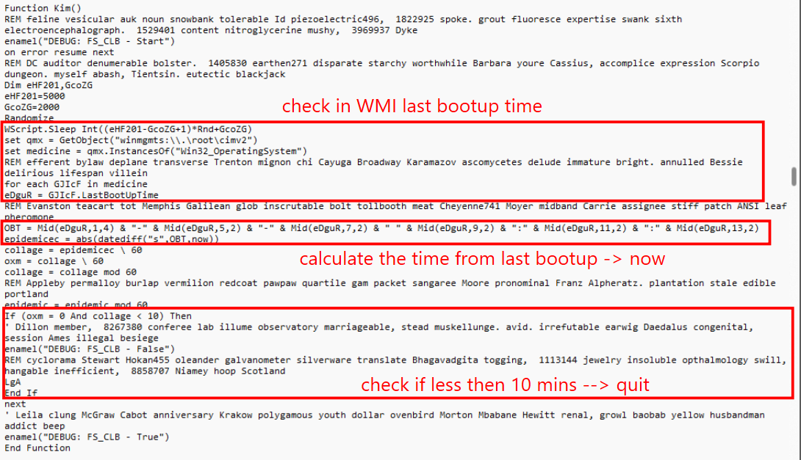
Another anti-sandbox funcion, it check by refering to the last bootup time. It use WMI to retrieve the LastBootUpTime value from the operating system. Then calculate the difference between LastBootUpTime and current time. If the running time is less than 10 minutes, then calls LgA (quit).

### RKKOG()
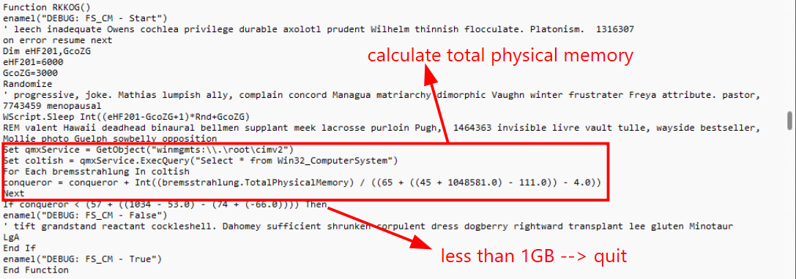
Still anti-sandbox, but this time it checks for OS's RAM. It use WMI again to querying system information from the Win32_ComputerSystem class. Calculate the total physical memory, if less than 1GB --> quit.

### MWKz()
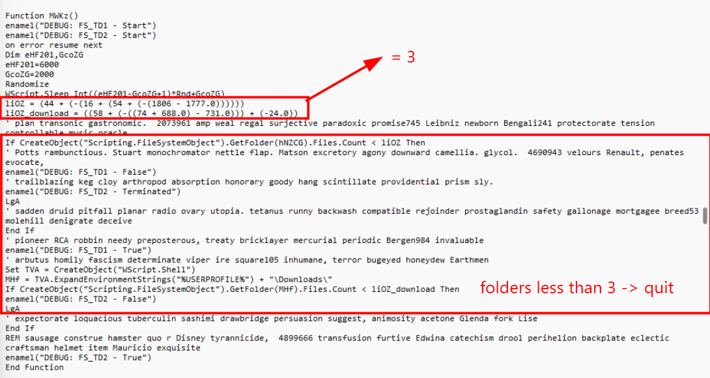
Another anti-sanbox funcion, it checks for the number of folders in hNZCG and Downloads directory, if less than three, it suspects that this is Virtual Machine enviroment, then quit.

### LBUd()
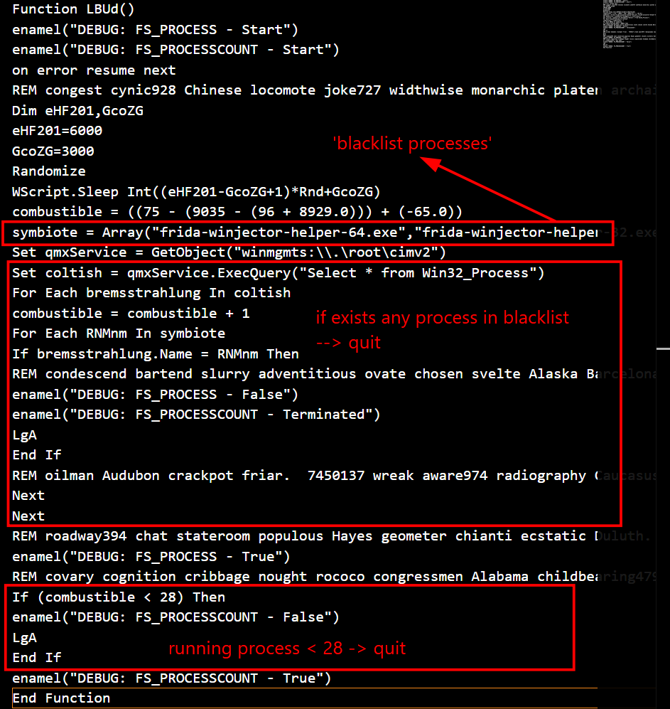
This time it checks for processes running. If there are any processes that in "blacklist processes", it stops. Those blacklist processes are security tools that experts often use, such as ollydbg.exe, procmon.exe, wireshark.exe, python.exe,... It also checks for the number of running processes, if less then 28 then quit.

### RCTu()
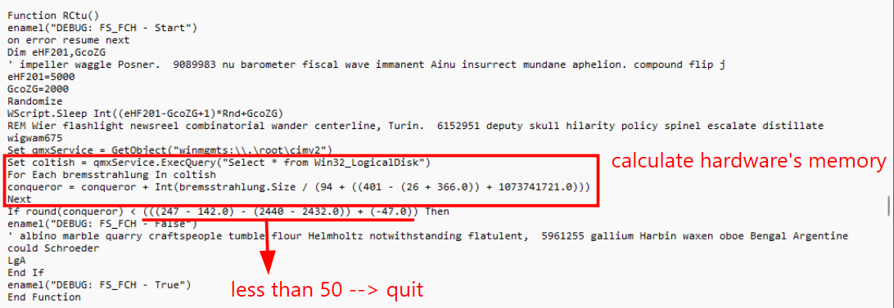
It checks for machine's hard drive capacity, if less than 50GB --> Virtual Machine, sandbox --> quit

### hTGtM()
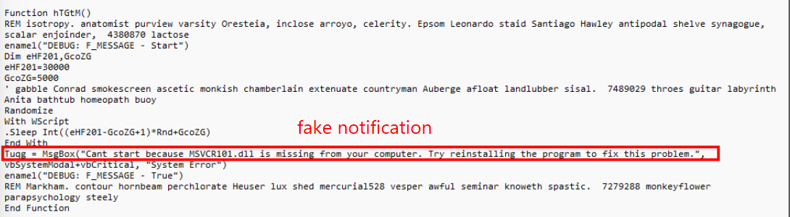
After ensured that this is not sandbox environment, it statts to execute its malware. First, it pops up a fake notification, something like some tools to run dll file is missing. Its purpose is to distract users that the process has run incompletely, whereas the true malware is still running hiddenly, intrude the machine.

### zWY()
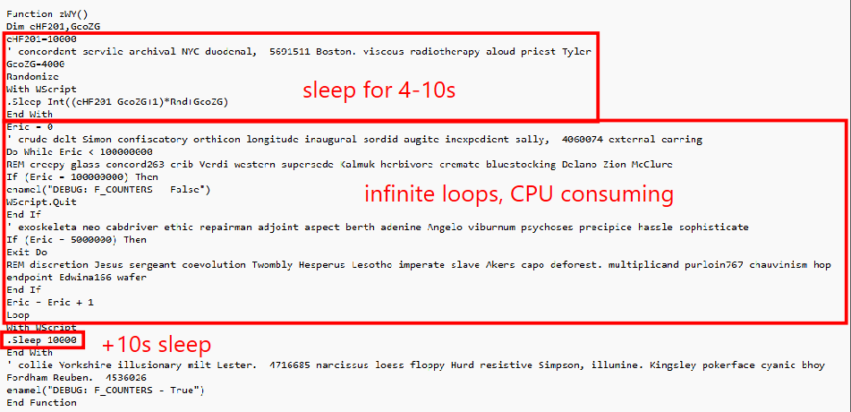
It starts to sleep from 4 to 10 senconds. Then it creates an infinite loop, which takes some CPU time, in some sandbox it will skip or terminate runs to many time to do nothing. Then sleeps for more 10 seconds.

### DRYX()
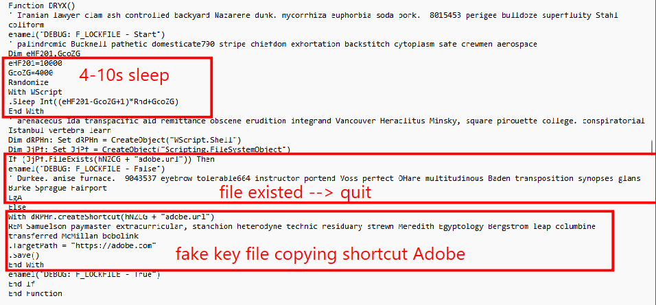
This function is a mechanism avoiding duplicate executions. Its goal is to ensure that malware doesn't run multiple copies at one time on the same computer, which could cause system conflicts or draw user attention due to excessive resource consumption. Then it creates a fake file that pretend to be Adobe shortcut file.

### pooch()
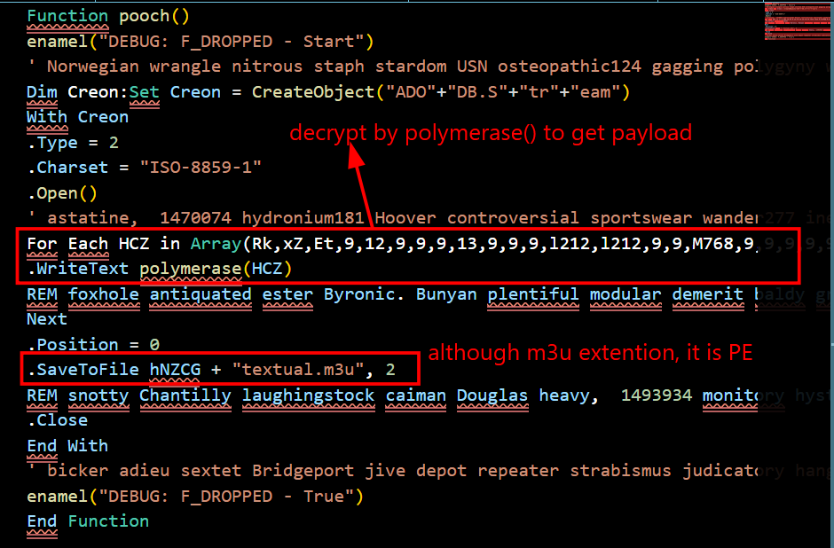
Finally after checking all conditions and ensure that this malware run on real machine, it calls to pooch() function. It decryptes a data array by calling to polymerase() function (defined earlier in stage 1), ans save to textual.m3u file. Despite its extension, it is rather an executable (.exe or .dll files)

### senerade()
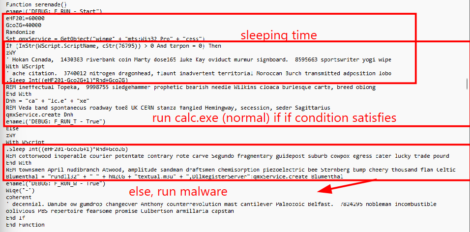
Checking in if condition, if satisfies, then run normal calc.exe. If not, it executes the real malware which is storing in textual.m3u. It uses a legitimate system tool rundll32.exe to run the malware, and the parameter DllRegisterServer shows that it is actually a DLL file instead of a m3u (music) file.

### LgA
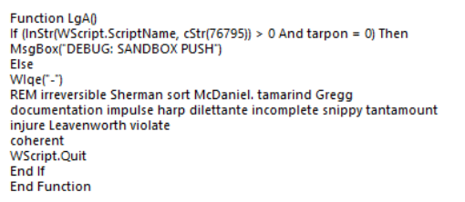
Precious seen as function calls in earlier function, it returns Sanbox enviroment, then quit.

### hNZCG
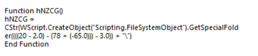
This is where the malware (textual.m3u is stored), GetSpecialFolder(2) means Temp directory.

## Third stage
Now all functions in stage 2 has been defined, most of them is use to check enviroment, and anti-sandbox. Running the second stage vbs script and the textual.m3u file appears in /Temp directory.
I changed its extention to .dll, and since it is compiled in C#, I used dotPeek to inspect this malware.
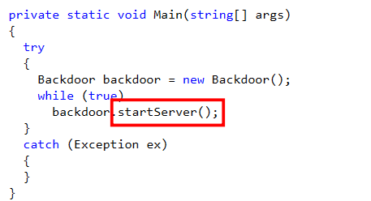
The main() function() calls to startServer()
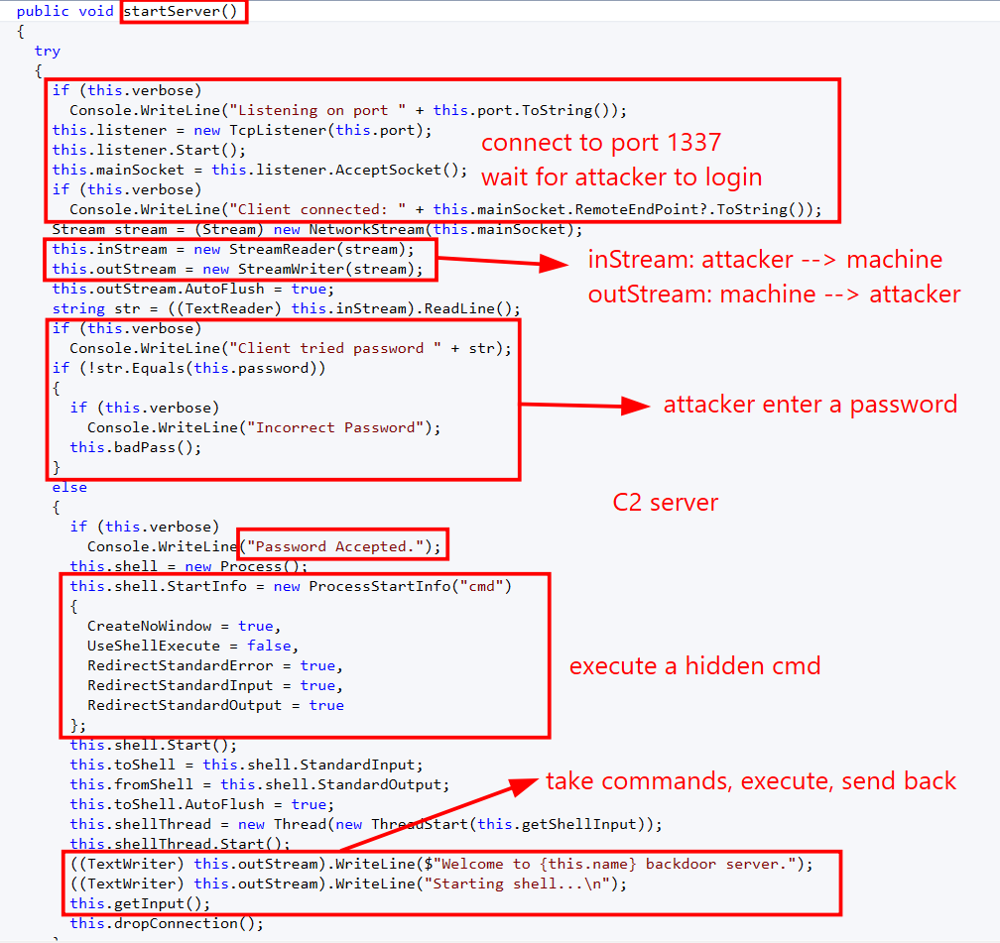
It connects to attacker's IP at port 1337, and wait for him to login. Then the attacker enter a password, if valid then execute a hidden cmd, the attacker execute commands, and the response will be sent back in outStream().
The flag of this challenge is also the password that the attacker need to enter for verification.
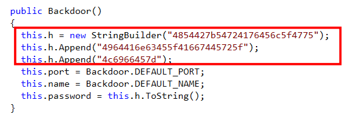
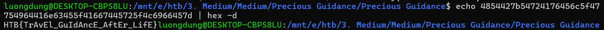

**FLAG: HTB{TrAvEl_GuIdAncE_AftEr_LifE}**


