# Red Failure
**Challenge scenario**: During a recent red team engagement one of our servers got compromised. Upon completion the red team should have deleted any malicious artifact or persistence mechanism used throughout the project. However, our engineers have found numerous of them left behind. It is therefore believed that there are more such mechanisms still active. Can you spot any, by investigating this network capture?

## First stage
The challenge provides solely a packet capture. Inspecting the Hierarchy and mostly packets use TCP Stream, including some HTTP protocol.
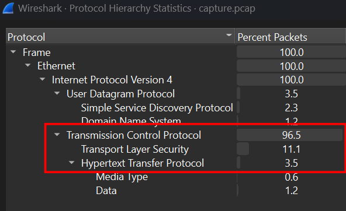
At first, I spot the Server Key Exchange and Handshake Messgae.
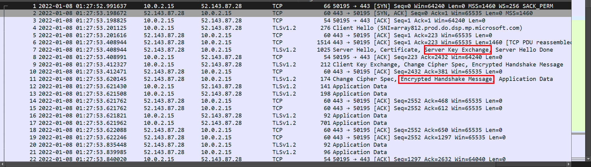
Follow TCP Stream for more information, at Stream 1, I have got a obfuscated Powershell script
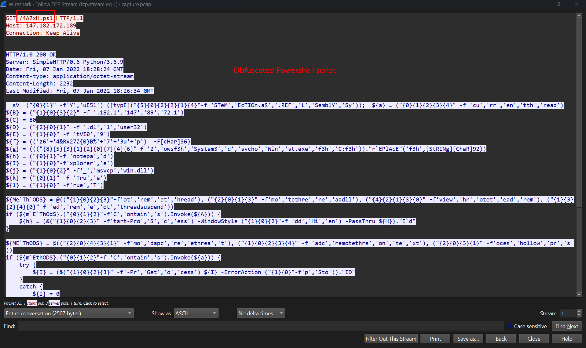
Deobfuscate this to have the original script
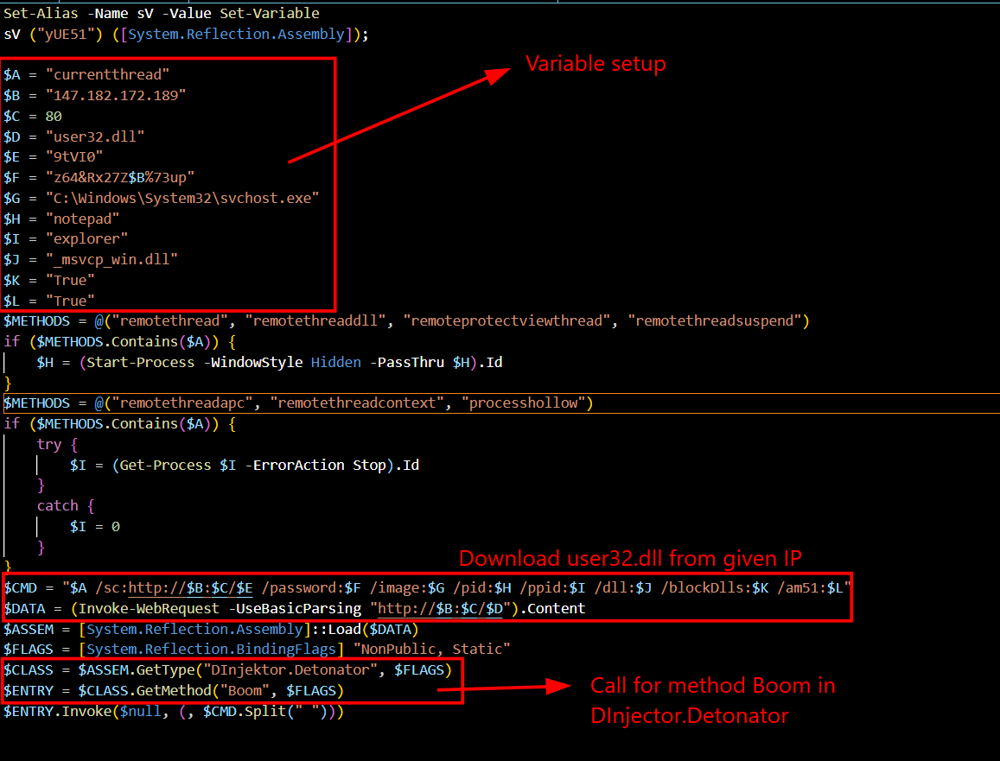
It downloads an executable named user32.dll, get the method Boom in DInjector.Detonator and Invoke it.

## Second stage
In Stream 2, since the malicious script has been run on client's machine, so that user32.dll is download.
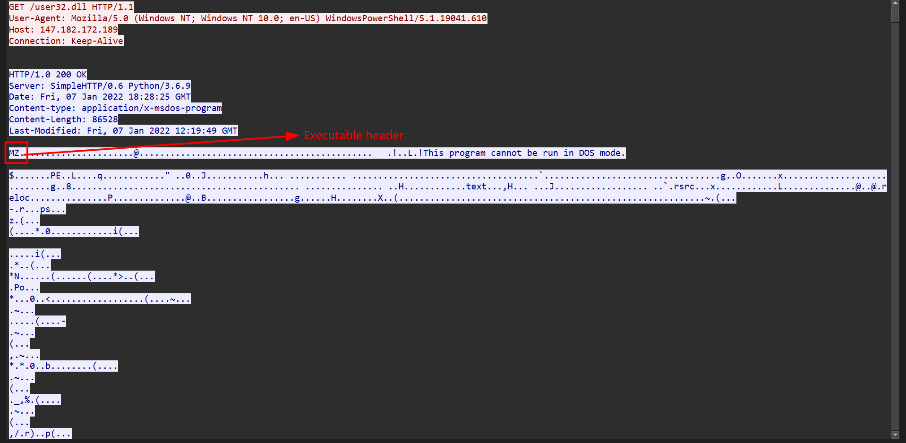
I extract this executable and use dotPeek for better analysis, specially pay my attention to DInjector.Detonator.Boom.
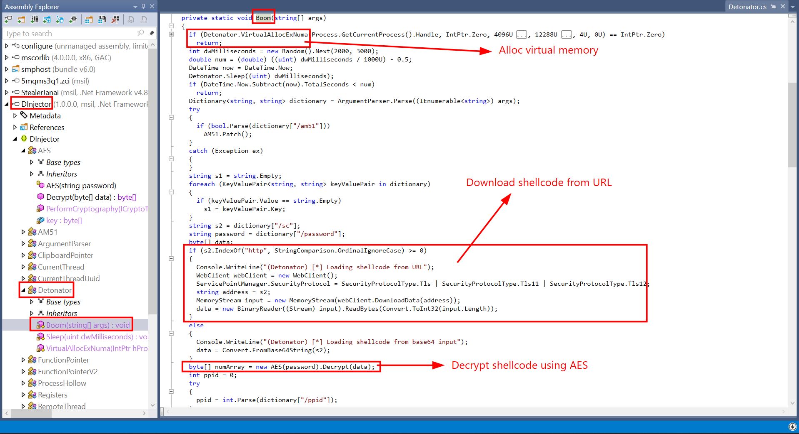
Overall, this Boom function will download a encrypted shellcode from an URL and decrypt it with AES-CBC.

## Third stage
Back to the traffic, in TCP Stream 3 is the encrypted shellcode.
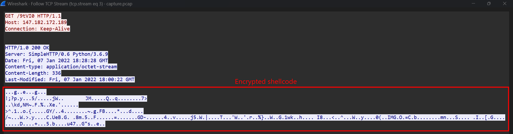
So figure out how to decrypt this, I noticed AES.Decrypt
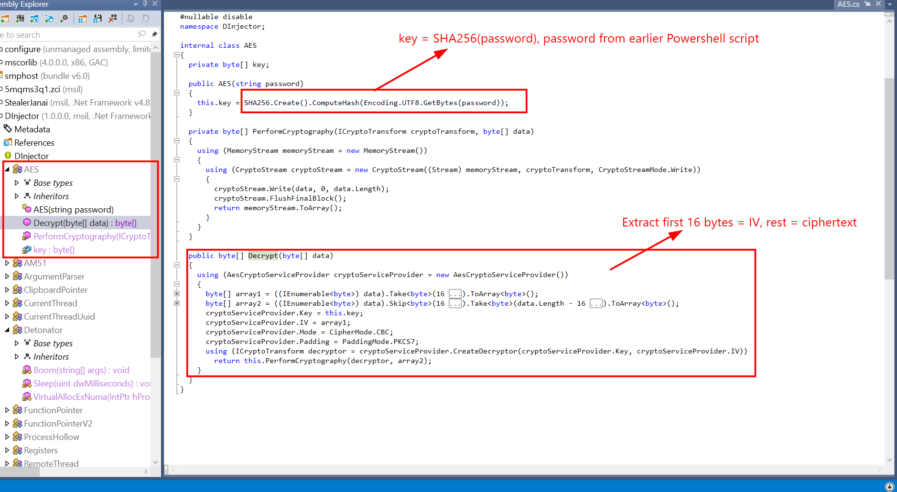
The Key used in decryption is SHA256 dump of the password in earlier malicious Powershell script. And IV is extracted as the first 16 bytes.
Again I extract the original shellcode from pcap file and decrypt it. 
But I need the AES key first.
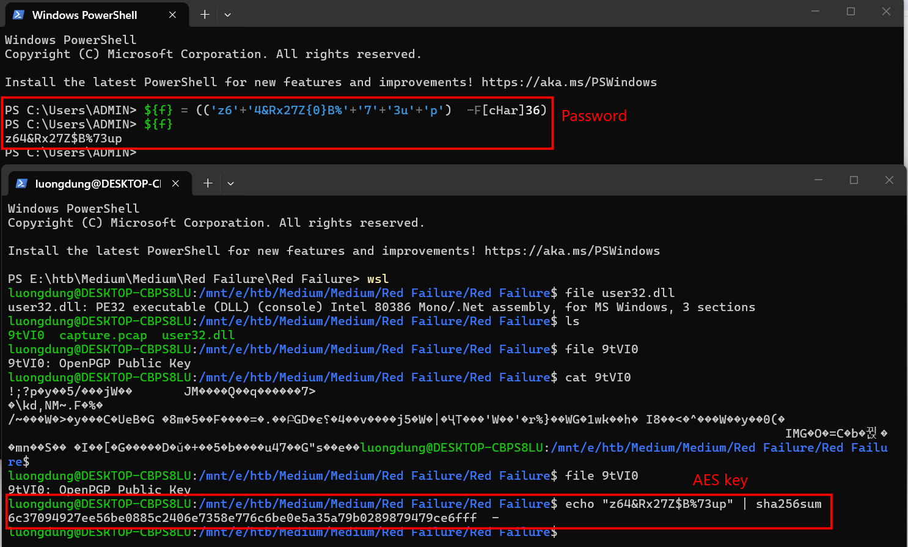
I used a Python script to decrypt it to get the original shellcode.
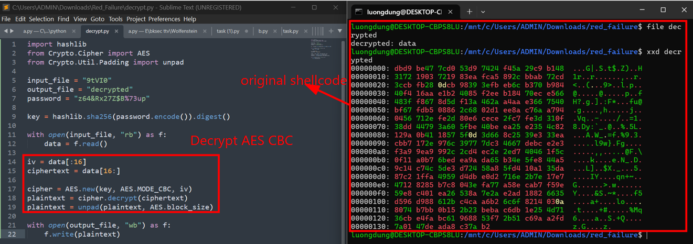
Through some googling, I have found scdbg - A shellcode debugger built on the libemu library, it hooks Windows API calls and provides an interactive debug shell to see what the shellcode is attempting to do.
Clone it and debug the shellcode returns the flag of this challenge.
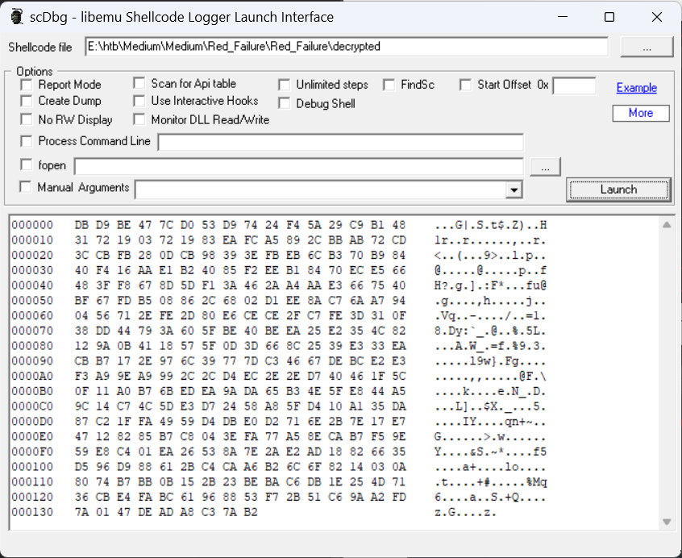
This is scDbg's GUI.
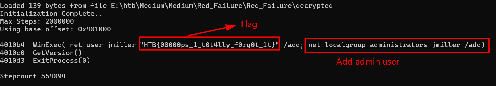
This shellcode will load a persistence into client's machine by adding a administrator user.
**FLAG: HTB{00000ps_1_t0t4lly_f0rg0t_1t}**

---

