# RedTrails
**Challenge scenario**: Our SOC team detected a suspicious activity on one of our redis instance. Despite the fact it was password protected it seems that the attacker still obtained access to it. We need to put in place a remediation strategy as soon as possible, to do that it's necessary to gather more informations about the attack used. NOTE: flag is composed by three parts.

## Overview
This is a redis related challenge. **Redis** (Remote Dictionary Server) is an open-source, in-memory data structure store used primarily as a blazing-fast database, cache, and message broker. By storing data in RAM rather than on disk, it provides sub-millisecond latency for real-time applications. It supports various data structures (strings, hashes, lists, sets) and is commonly used for caching, session management, and gaming leaderboards.

The challenge provides solely a packet capture. Open for Hiararchy, all the packages go through TCP Stream, and parts of them are RESP.
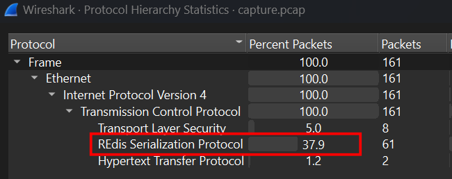

Furthurmore, I also spotted some malicious packages, perhaps this is the Redis Request and Response for actions from the attacker.
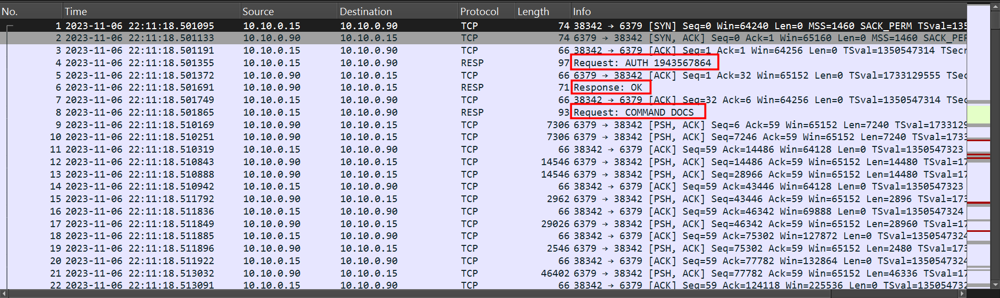

Follow TCP Stream for more detail.
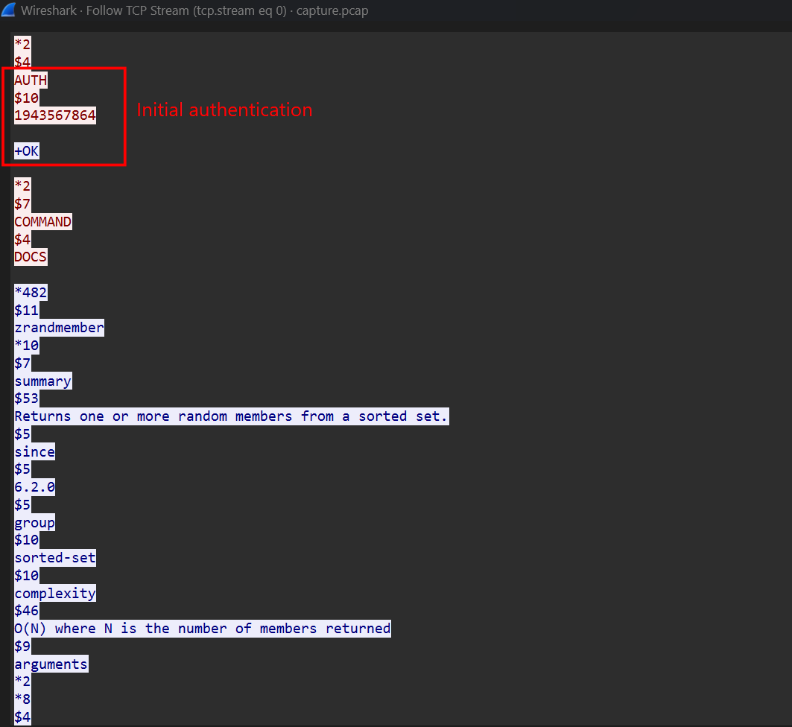
Right in TCP Stream 0, the attacker had initial accessed to Redis through RESP Protocol. Executing COMMAND DOCS to get the detailed information about functions that this server was serving.
At the end off this Respond is the second part of the flag.
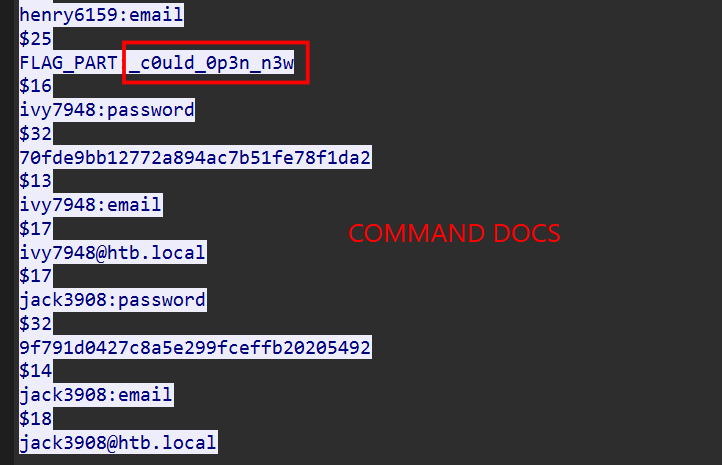
After that, the attacker downloaded a malicious file from unofficial pypi link and execute it on client's machine.
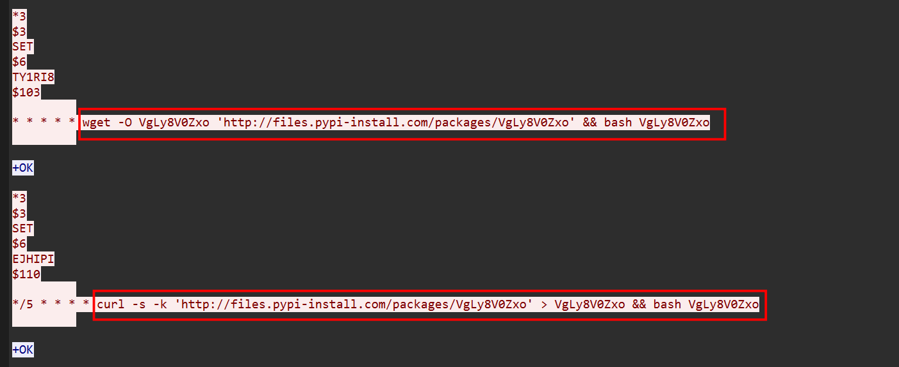

## Decode malicious file
We can see the content of this file in TCP Stream 1.
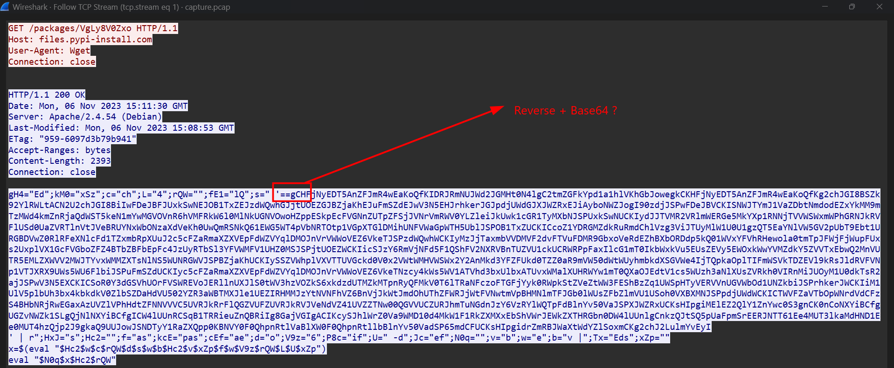
A highly encoded script, a double "=" at the beginning of the script raised suspicion about Reverse and Decode Base64 the string.
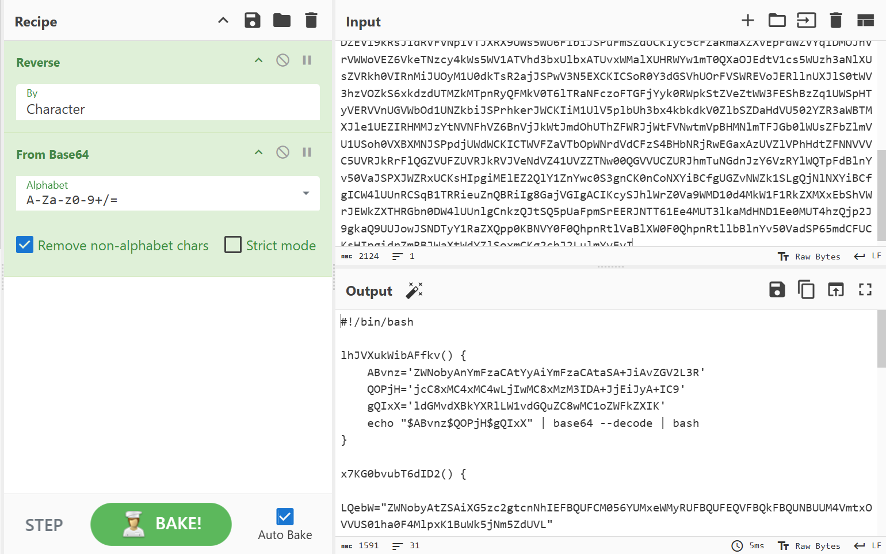
And it is trully is. Another script and execute with bash.
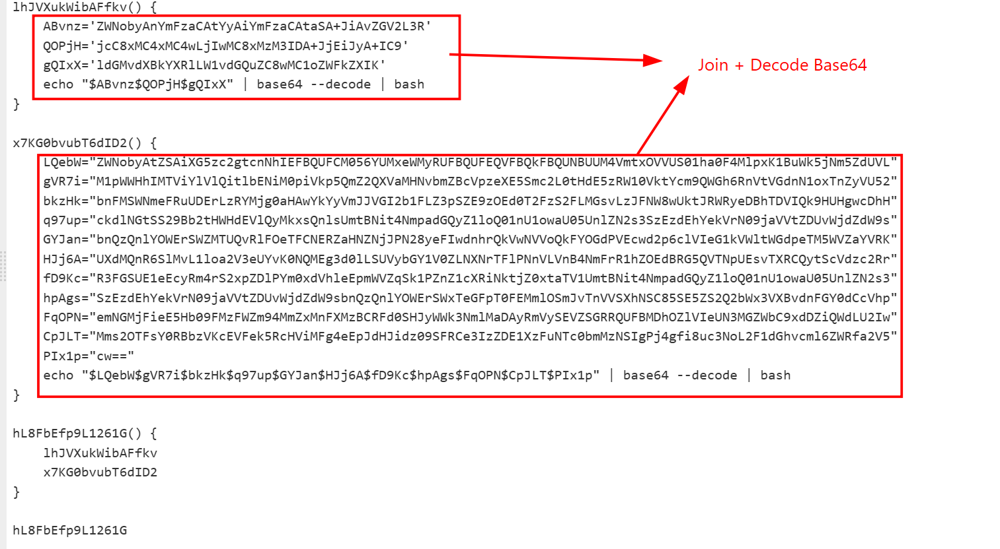
Joinning all parts in each function and decode Base64.
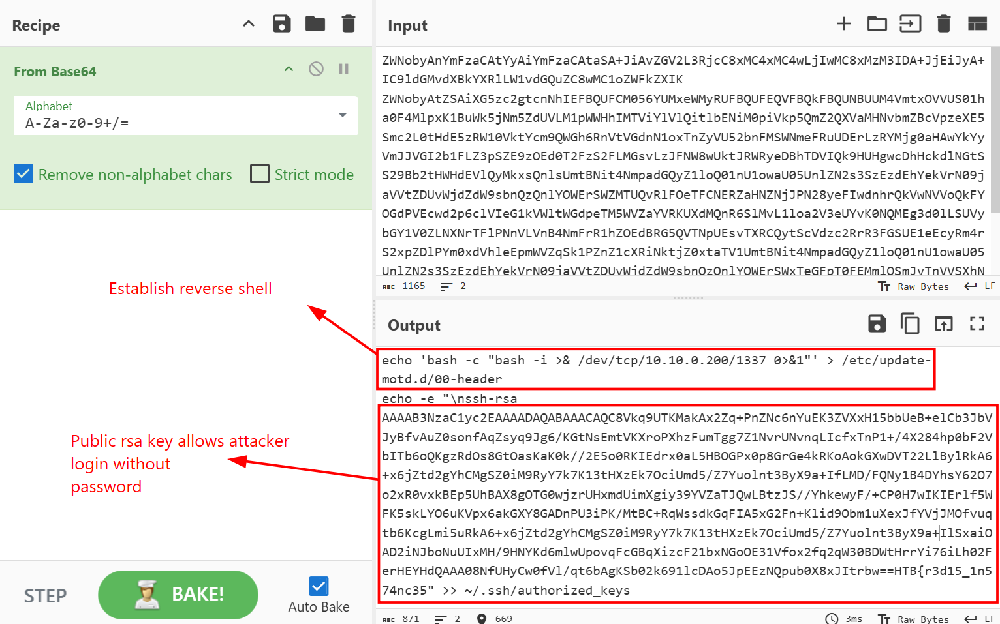
The attacker established a reverse shell back to his/her computer and add a public RSA key allowing logon without password. Backdoors had been installed for persistence purposes.
Hidden in the RSA key is the first flag of this challenge.

## Decrypt traffic
Now I only need the last part of the flag.
Continue for TCP Stream 2, I can see all the command executed on Redis by the attacker.
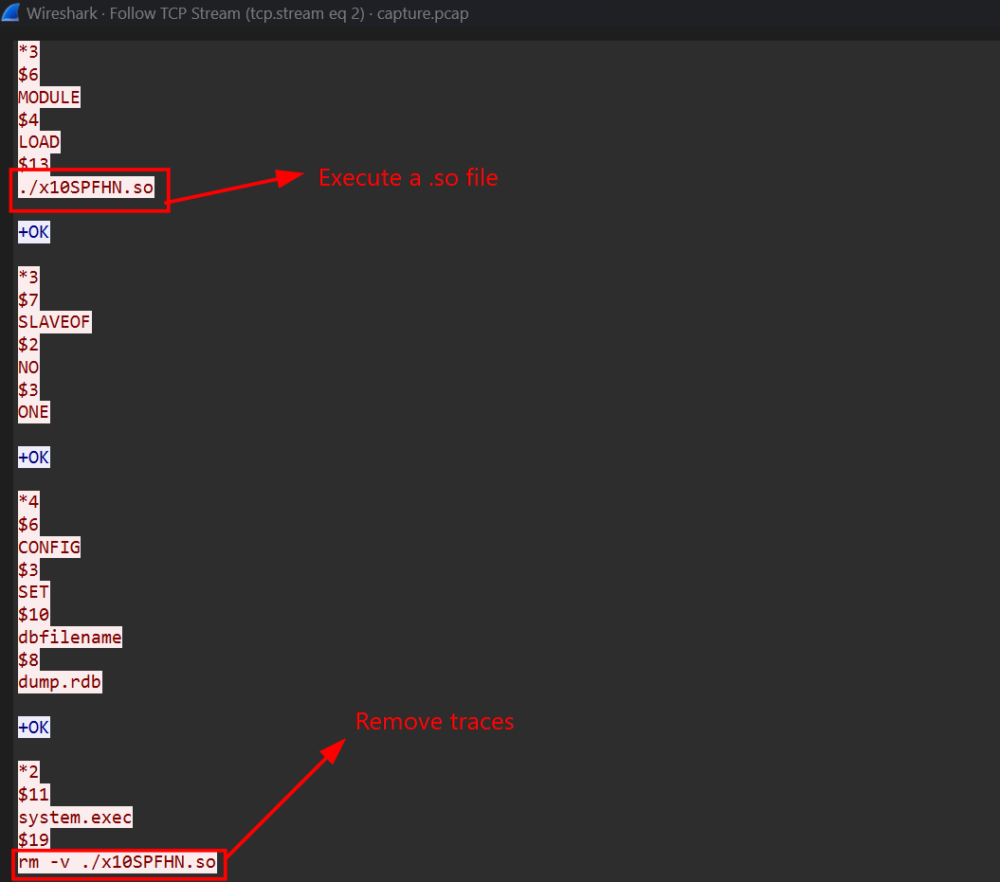
But notably, the response from Redis has somehow be encrypted as hex values.
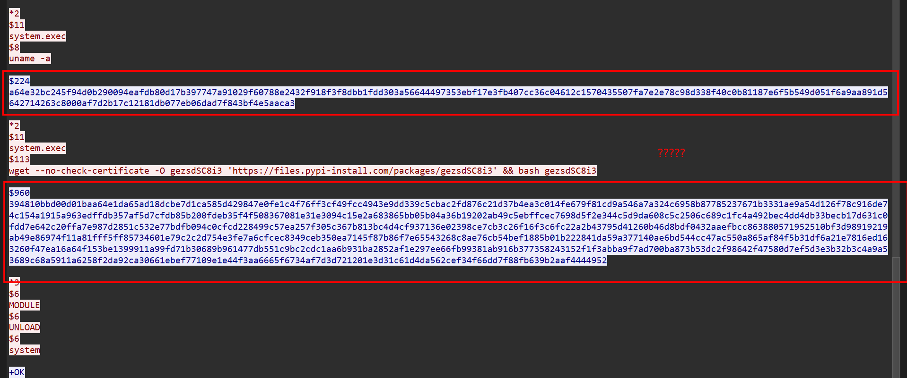
Continue following those TCP Stream, I found that in Stream 6, Redis server has returned a ELF executable file.
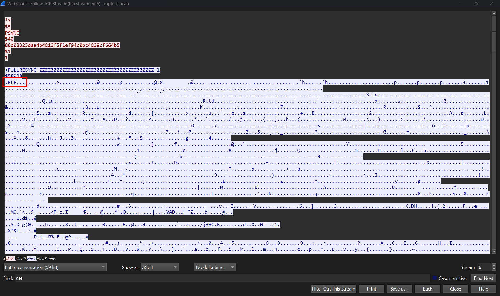
So I save this Stream as raw and extract the ELF file only using Notepad.
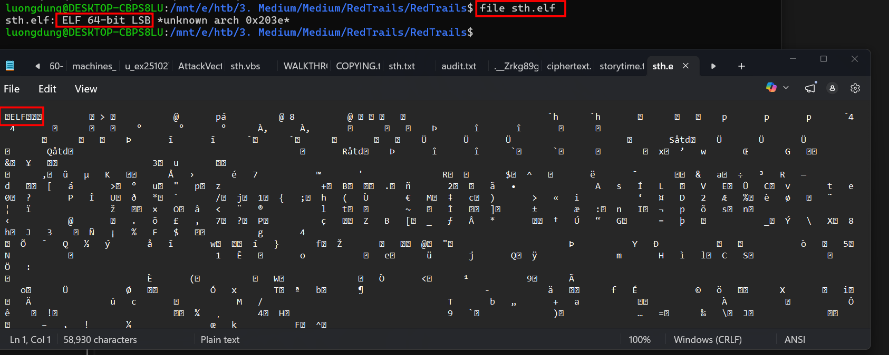
There are also exfiled data in this file.
**Strings** through this file, turns out the hex strings that I found earlier in Stream 2 is the payload which has been encrypted AES-CBC and encoded as hex.
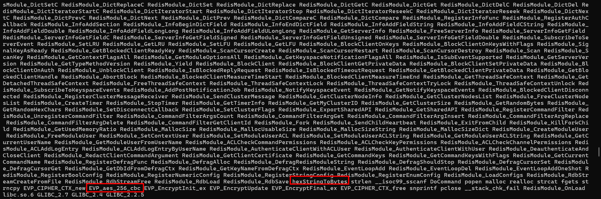
The key and IV to decrypt is also visible in the result of **strings** command.
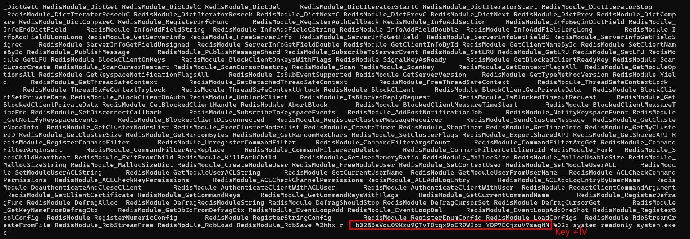
Which these information, I can finally decrypt the Redis response in Stream 2 and found the last part of the challenge.
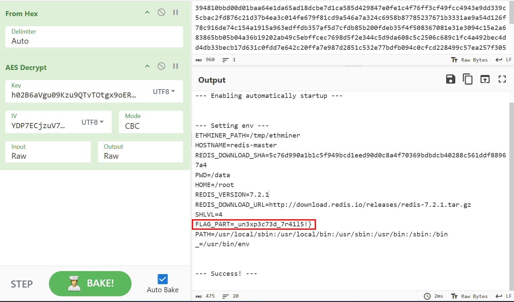
Doing some findings, turns out the attacker was installing ethminer, an open-source program used to mine Ethereum, download a .tar.gz file and hide this binary in /tmp directory.

**FLAG: HTB{r3d15_1n574nc35_c0uld_0p3n_n3w_un3xp3c73d_7r41l5!}**

---

