# Reflection
**Challenge scenario**: You and Miyuki have succeeded in dis-empowering Draeger's army in every possible way. Stopped their fuel-supply plan, arrested their ransomware gang, prevented massive phishing campaigns and understood their tactics and techniques in depth. Now it is the time for the final blow. The final preparations are completed. Everyone is in their stations waiting for the signal. This mission can only be successful if you use the element of surprise. Thus, the signal must remain a secret until the end of the operation. During some last-minute checks you notice some weird behaviour in Miyuki's PC. You must find out if someone managed to gain access to her PC before it's too late. If so, the signal must change. Time is limited and there is no room for errors.

## Overview
A memory dump of Windows's machine if provided. First I checked for its general info.
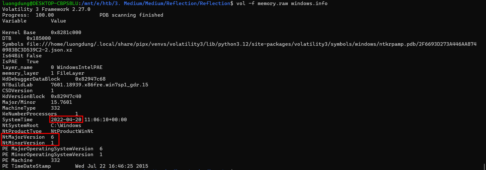
Windows version 6??? And the dump time is from 2022, suggesting that for some tools, Volatility 2 would be better then Vol3.
Using Pslist revealed something interesting.
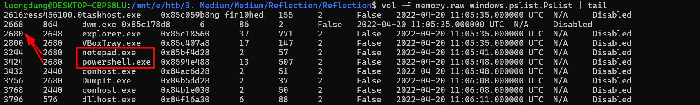
From explorer.exe then calls to notepad.exe and powershell.exe, cannot be normal with this.
Since powershell was running at the time, I checked for used commands by consoles (Vol2).
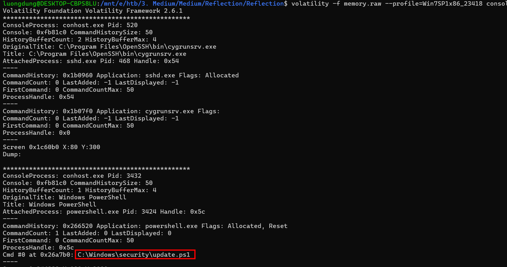
It executed a malicious Powershell script. To see its content, I search for that using filescan, and dump it with its virtual address.
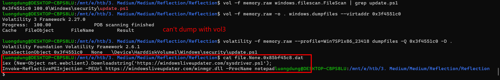
It downloads a Powershell script and execute it right in memory. Invoke-ReflectivePEInjection is used to inject some executables directly into another process's memory. In this case, the injected dll was winmgr.dll downloaded from the Internet, and the targeted process was notepad.exe. This explains why notepad.exe is the process that was born from explorer.exe.

## Dll dump
Since I knew that some malicious dll has been injected into notepad.exe, I used malfind, which is a volatility's tool listing process memory ranges that potentially contain injected code. Although it is deprecated, it is still suitable for this challenge.
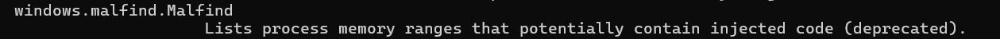
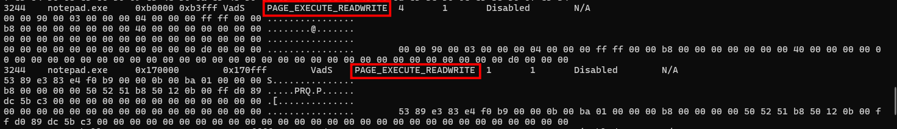
PAGE_EXECUTE_READWRITE here means this memory region can read, write, and execute code, raising suspicion since normal processes never requires both writable and executable.
So I dumped the memory region from 0xb0000 to 0xb3fff into a DLL file.
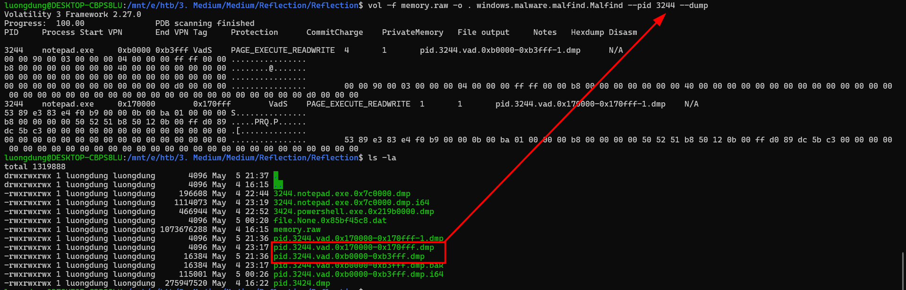
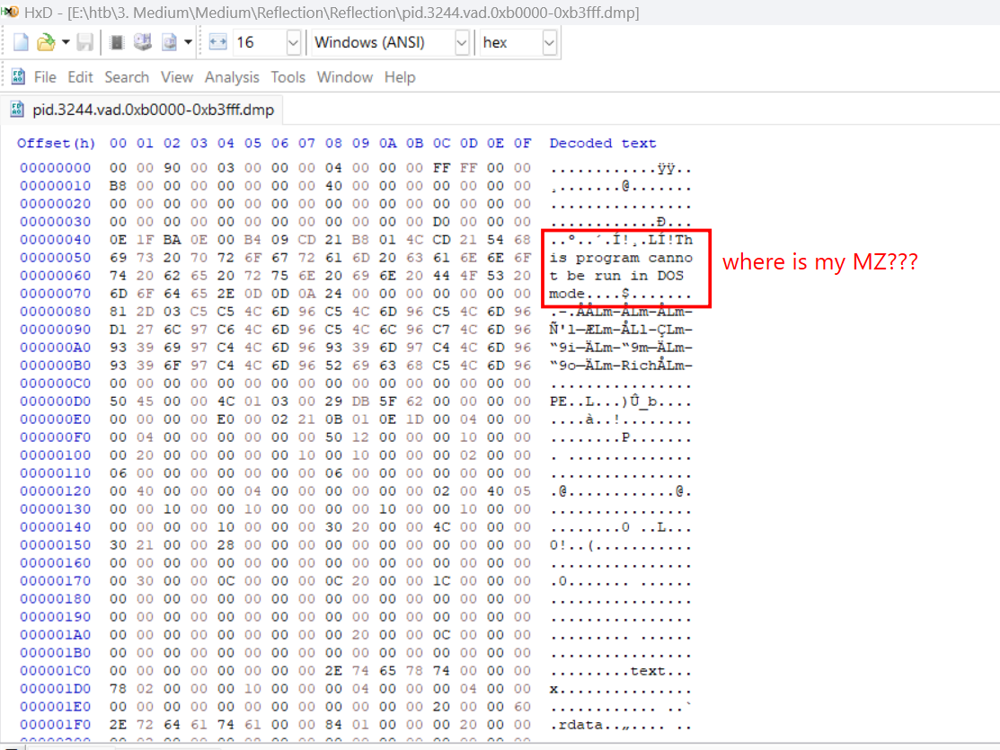
But it does not have the characteristic MZ header.

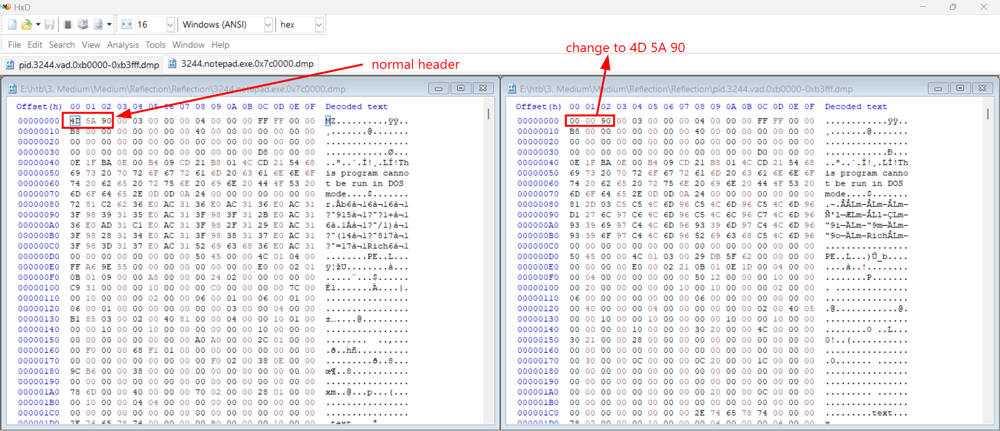
So I compared the header between a normal executable file and this dll. Noticed the differences, I changed the dll's header to 4D 5A (MZ).
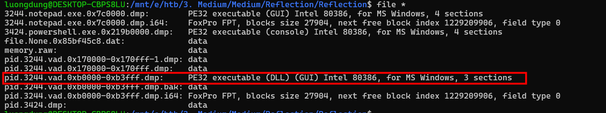
And recovered the executable. Intel 80386 means x86 architecture 32-bit.

But it failed when I reversed by IDA. 
After multiple findings, I found out that after the DLL is loaded into memory, the sections are expanded according to SectionAlignment, usually 0x1000. 
But with dll which is still on-disk or on the web server, its sections are arranged using FileAlignment, usually packed more tightly, for instance **file offset 0x0400  .text**. If IDA loads a file as Portable Executable (PE), it uses PointerToRawData, meaning it reads .text from file offset. So when I load this dll which was dumped from the memory (it has been loaded), it does like this
```
.text:  read from PointerToRawData = 0x400
.rdata: read from PointerToRawData = 0x800
.reloc: read from PointerToRawData = 0xA00
```
But the real data from the memory dump is at
```
real .text  = 0x1000
real .rdata = 0x2000
real .reloc = 0x3000
```
--> IDA reads the wrong offsets, causing the code and export table to appear as zeroes or invalid data like this
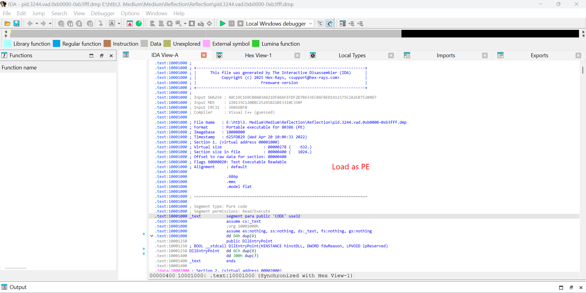

But IDA still work, if I load this file as Binary. Since then, IDA will not apply PointerToRawData, it keeps the file offsets as-is, allowing me to analyze that dll exactly.

## Binary file with IDA
So I loaded the dll file as Binary.
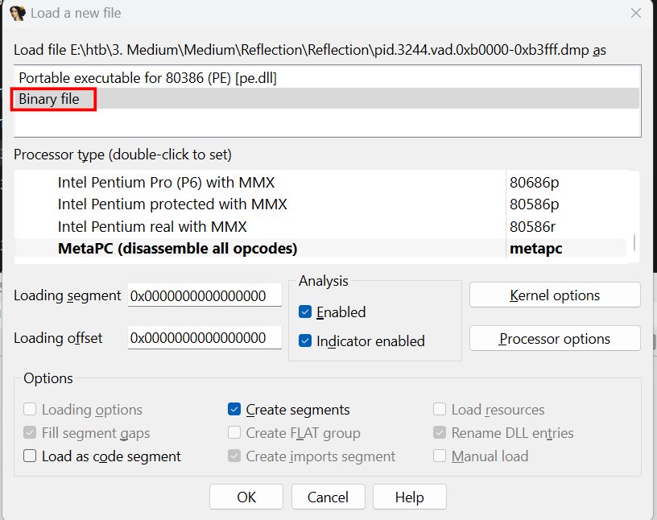
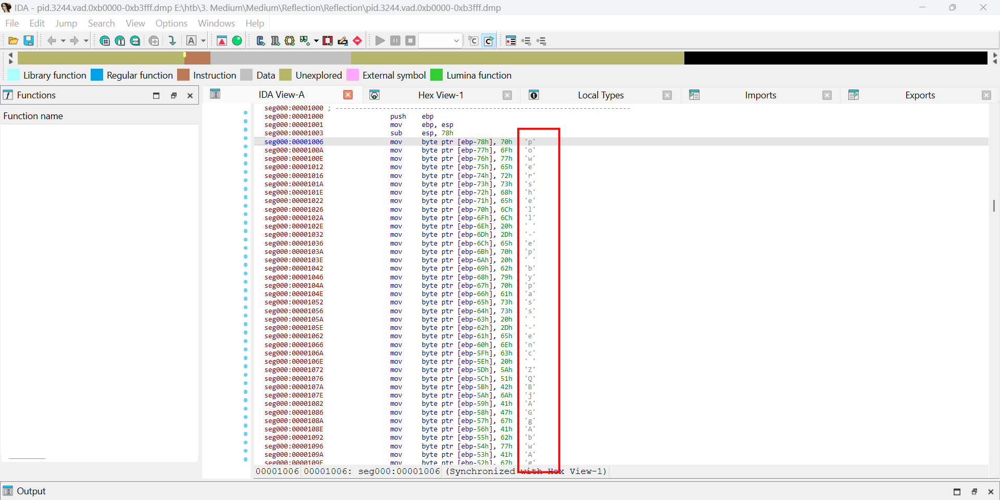
And a Powershell command appears.
Decode that command reavaled the flag of this challenge.
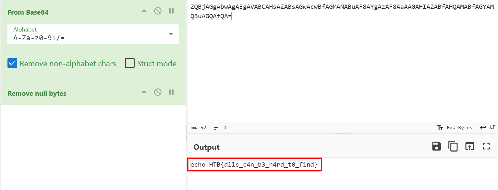

The flag can also be found if we understand the machine code
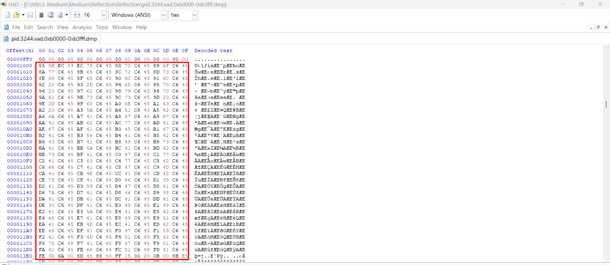
For example:
C6 45 88 70  --> mov byte ptr [ebp-78h], 70h ; 'p'
It is writing each characters into stack buffer. Joining all the characters and we can see the full Powershell command.

**FLAG: HTB{dlls_c4n_b3_h4rd_t0_f1nd}**

---

