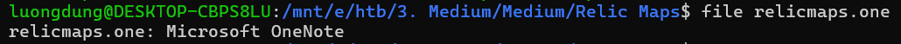
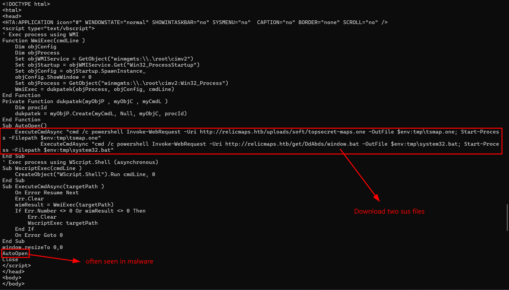
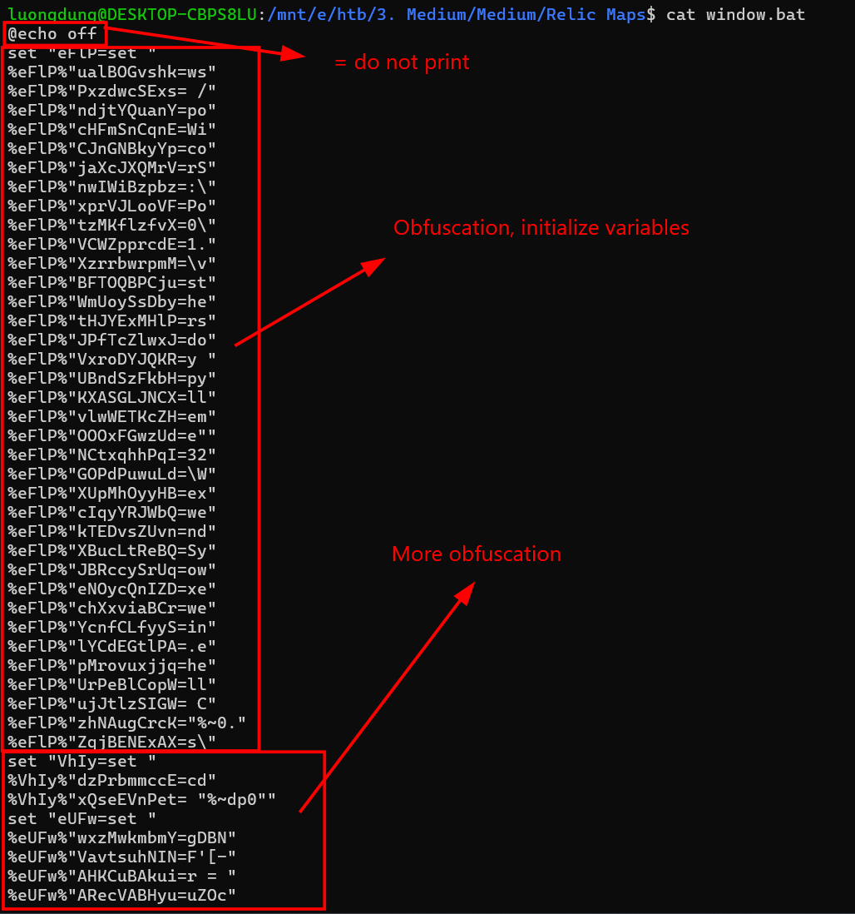
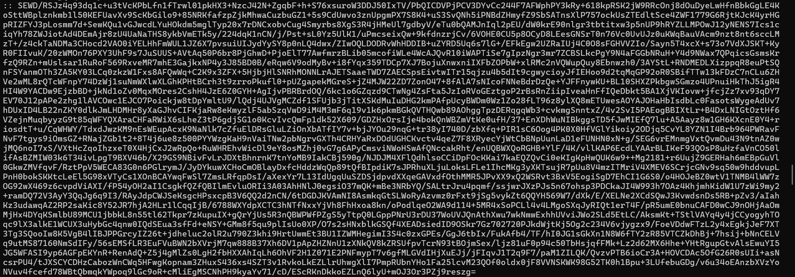
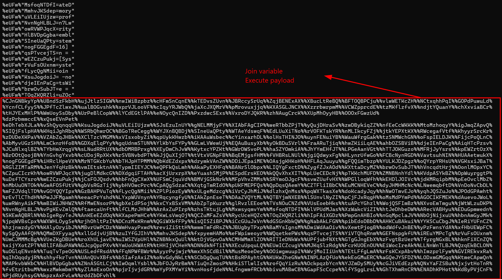
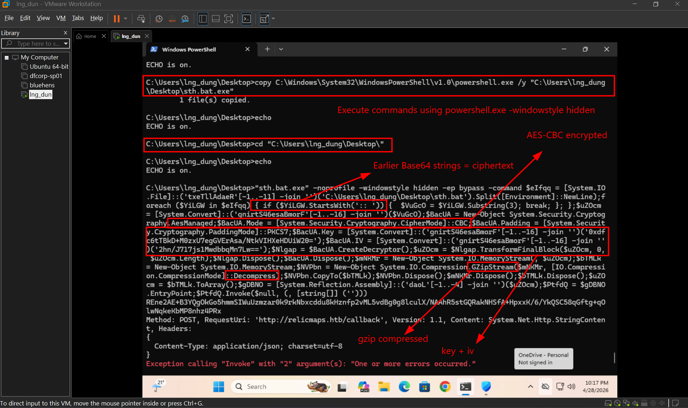
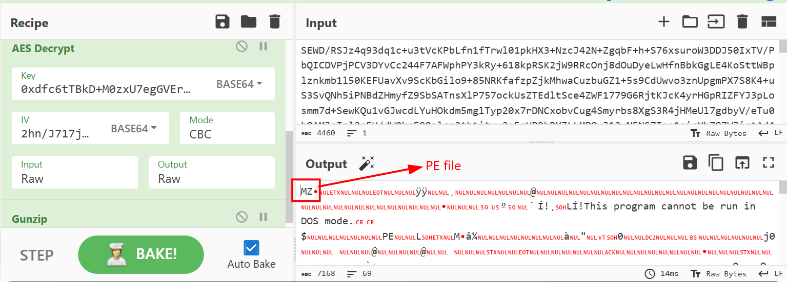
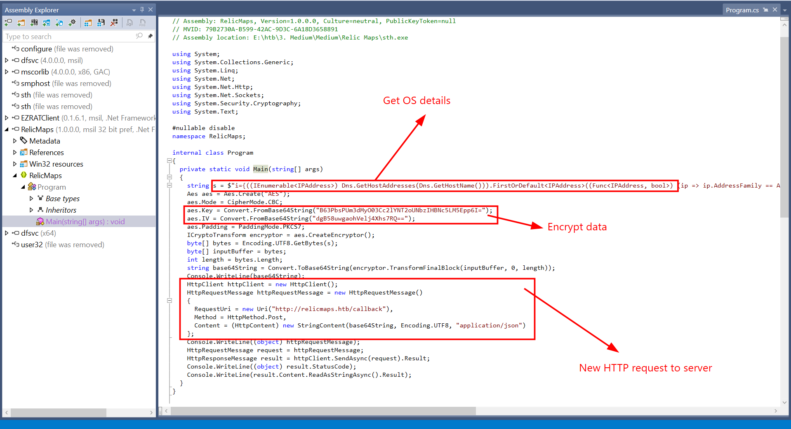

# Relic maps
**Challenge scenario**: 
```
Pandora received an email with a link claiming to have information about the location of the relic and attached ancient city maps, but something seems off about it. Could it be rivals trying to send her off on a distraction? Or worse, could they be trying to hack her systems to get what she knows?Investigate the given attachment and figure out what's going on and get the flag. The link is to http://relicmaps.htb:<instance port>/relicmaps.one. The document is still live (relicmaps.htb should resolve to your docker instance).
```

## Overview
Downloaded from the provided link, I got a .one file, which is the extension of Microsoft OneNote files.

Suprisingly, using strings reveals a HTML code block containing some suspicious VBS script.

It downloads two malicious file, one is topsecret-maps.one and a window.bat file, from the same host and IP. Then executes those two processes. Furthurmore, AutoOpen() function is defined, which raised my suspicion since it is often seen in malware.

## Second stage
I downloaded two files, after examining the other .one file a bit, I found that it is just a decoy. The real malware is in window.bat.

The first line, @echo off, means like execute this code, do not print anything, some continuing lines are for obfuscation and variables initialization.

I also found a malicious Base64 encoded string.

At the end of the bat file, the attacker joined all created variables and execute its payload. Dynamic analysis is perhaps the best choice now. I change the original bat file to @echo on, and echo with some last line, where it joins variables. And ofcourse on my VM, where real-time protection is turned off.

It decode Base64 the strins that we saw earlier, decrypt it with AES-CBC and gunzip to have the final payload, and then execute it with powershell. So I guess it is possibly be an executable.

## Third stage
To I used corresponding recipes from Cyberchef to get the original file, and it is trully an executable. 

I downloaded the file for furthur analysis, and since it is compiled in C#, I used dotPeek to reverse.

This malware collects OS informations, such as hostname, username, IP address, encrypts those information and create a HTTP Request to server.
This is patently the sign of exfiltration and malware callback.
Also in that s string, the flag is shown.

**FLAG: HTB{0neN0Te?_iT'5_4_tr4P!}**


