# Rogue
**Challenge scenario**: SecCorp has reached us about a recent cyber security incident. They are confident that a malicious entity has managed to access a shared folder that stores confidential files. Our threat intel informed us about an active dark web forum where disgruntled employees offer to give access to their employer's internal network for a financial reward. In this forum, one of SecCorp's employees offers to provide access to a low-privileged domain-joined user for 10K in cryptocurrency. Your task is to find out how they managed to gain access to the folder and what corporate secrets did they steal.

## Overview
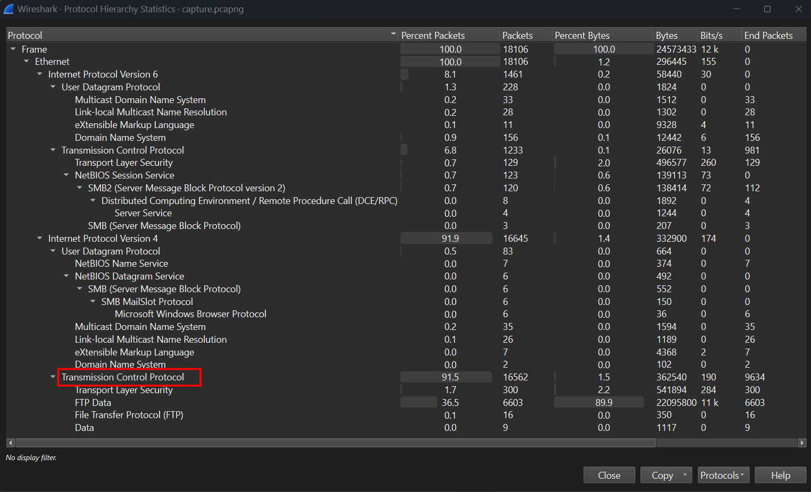
Looks like most of packages are transfered through TCP traffic, including some through TLS encrypted and FTP ( File Transfer Protocol).
I followed TCP Stream and in Stream 0, it shows that the attacker has already accessed to this machine.
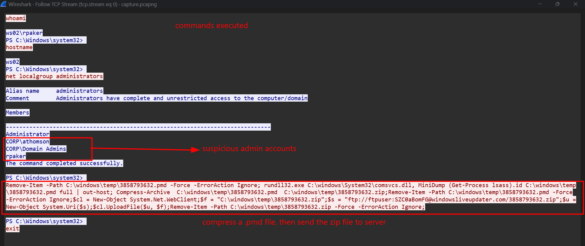
The attacker executed basic commands, namely whoami, hostname, net localgroup administrators. And he got the response from the machine. After that, he compressed a .pmd file to a zip file, and sent to server as user SZC0aBomFG. Then deleted all related artifacts. Luckily, I can still obtain this zip file by extracting FTP-data objects. Unzip it and I had the original .dmp file, which is the process dump of lsass process. 
LSASS(Local Security Authority Subsystem Service) is a critical system process responsible for security-related tasks, including verify users login, manage password changes, enforce policies.
Then I dumped all credentials in that LSASS dump by pypykatz, using this command
```
pypykatz lsa minidump 3858793632.pmd
```
Some Logon sessions was shown, like this
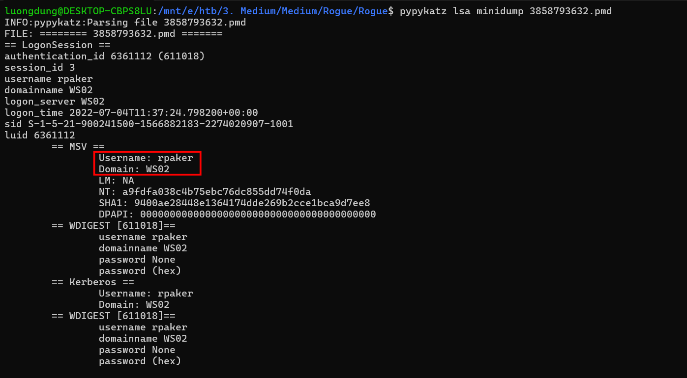
Some specifics are
- username: name of the logon user
- domain: the domain that this user belongs to
- SID: A unique user identifier on a Windows system.
- NTLM hash:
-- NT: NTLM hash of rpaker user. This can be use to attack Pass the Hash to login to services that does not requires root password
-- Kerberos: user has Kerberos identification

## SMB2 encryption
There was many logon sessions like this. So I need to recognise what user was authenticating in SMB session.
Filtered for **smb** protocol for result.
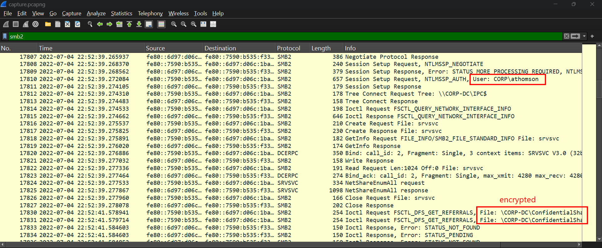
The logon user was athomson from CORP domain, it is also visible in pypykatz command earlier.
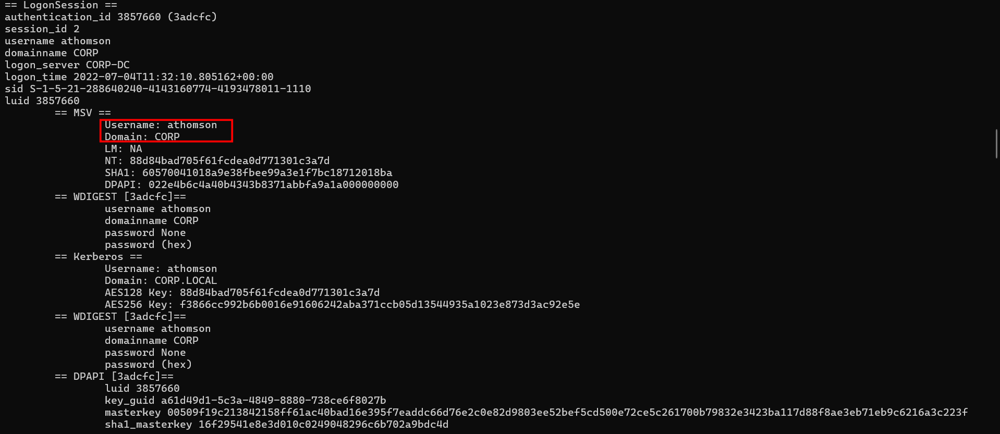
```
NT: 88d84bad705f61fcdea0d771301c3a7d
```
Some files was transfered through this session, but it was encrypted. So let's decrypt this SMB traffic.
I filtered for **smb2.cmd == 1**, this is where client authenticate with server, containing NTLM authentication to calculate session key. After identifying the NTLMSSP_AUTH request for CORP\athomson, I selected the corresponding Session Setup Response packet. This response returned **STATUS_SUCCESS**, confirming that the SMB authentication was successful.
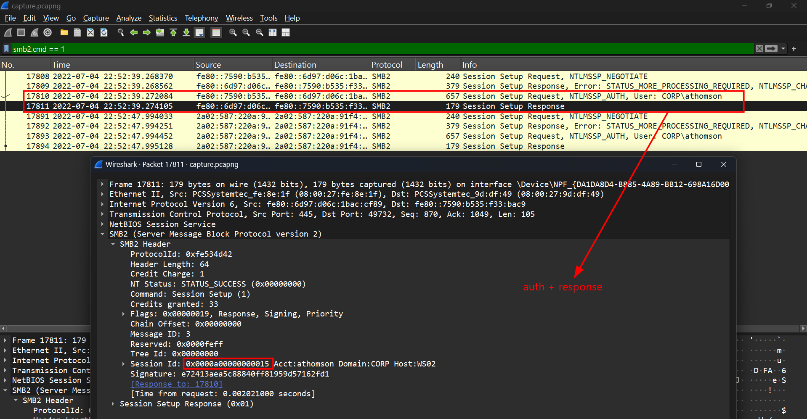
```
Session ID: 0x0000a00000000015
```
We will alsp need NTProofStr, which is a concrete proof showing that the client has exact password, without sending real password through traffic. And Encrypted Session Key which is the encrypted session key in NTLM authentication process. 
Thost two can be found in Request authentication packet, in 
```
Session Setup Request 
-> Security Blob
→ GSS-API
→ Simple Protected Negotiation
→ negTokenTarg / negTokenInit
→ NTLM Secure Service Provider
```
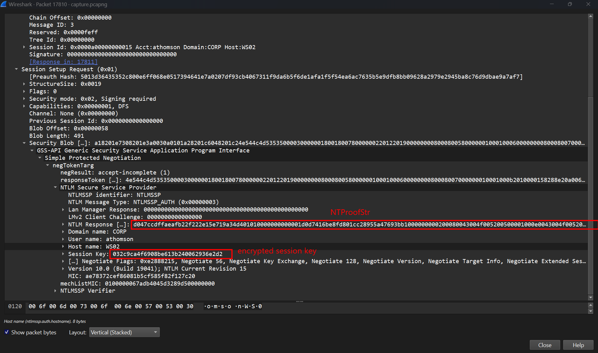

To decrypt the traffic, I need the Random Session Key, the flow will be like this
```
NTLM hash + username + domain
--> NTLMv2 hash
NTLM hash + NTProofStr
--> Key exchange key
Key exchange key + encrypted session key
--> random session key
```

So I used this python script to get session key:
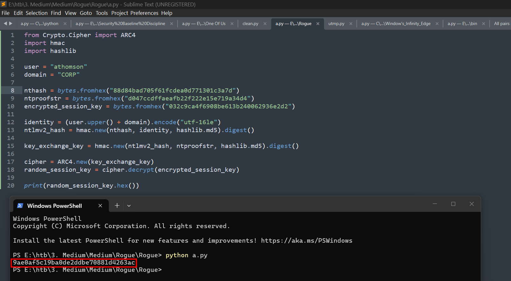

## Decrypt traffic
With this Random Session Key, I can now finally decrypt this SMB2 traffic by Edit Preferences Protocols SMB2, then add decryption key.
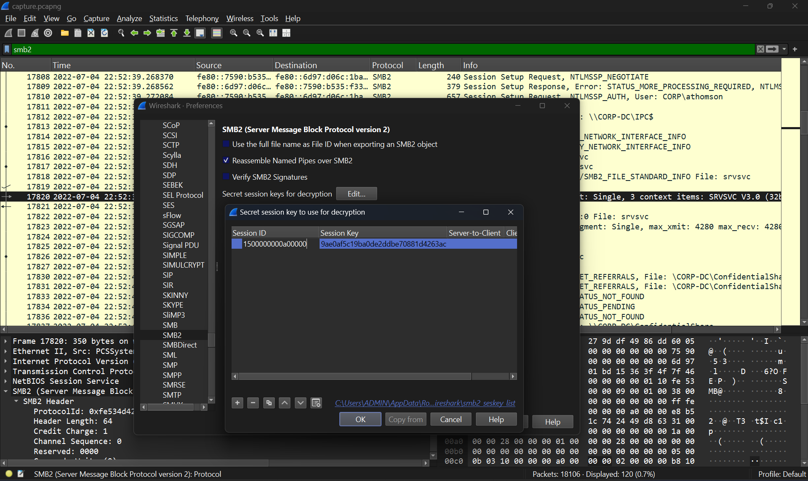
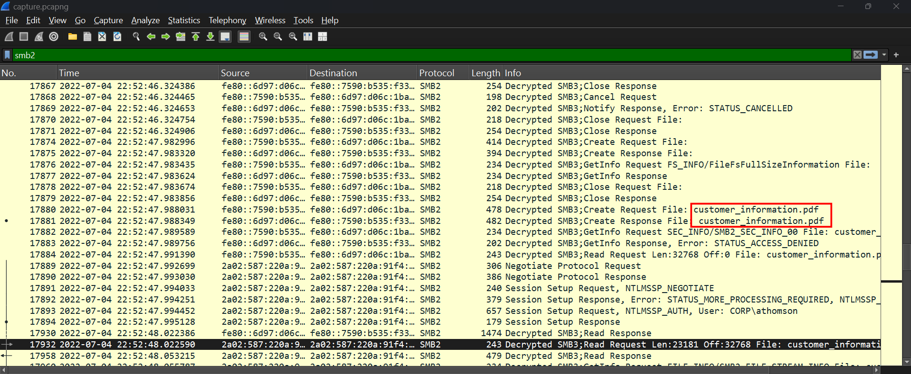
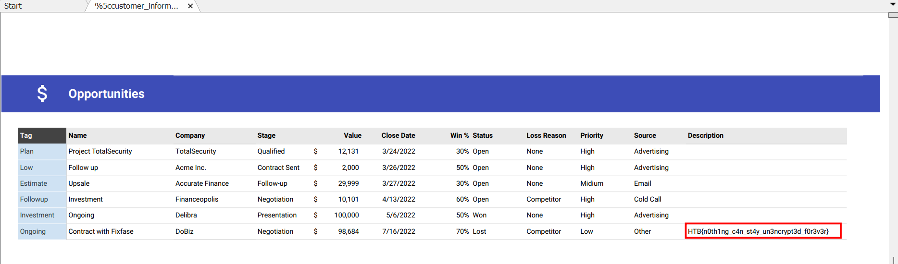

The exfiled data was a PDF file containing customers's credentials, and also the flag of the challenge in the third page.

**FLAG: HTB{n0th1ng_c4n_st4y_un3ncrypt3d_f0r3v3r}**


