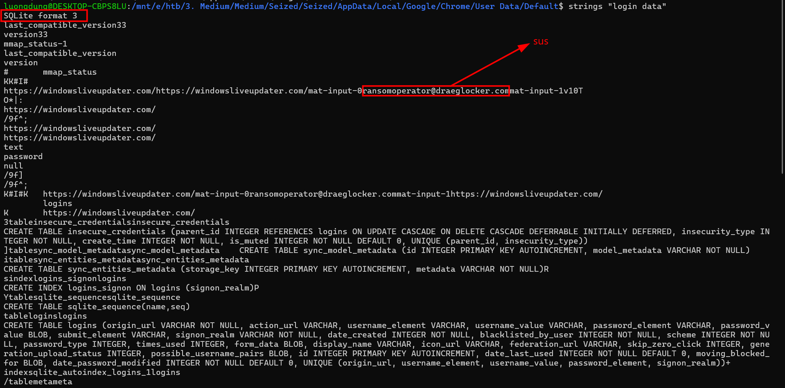
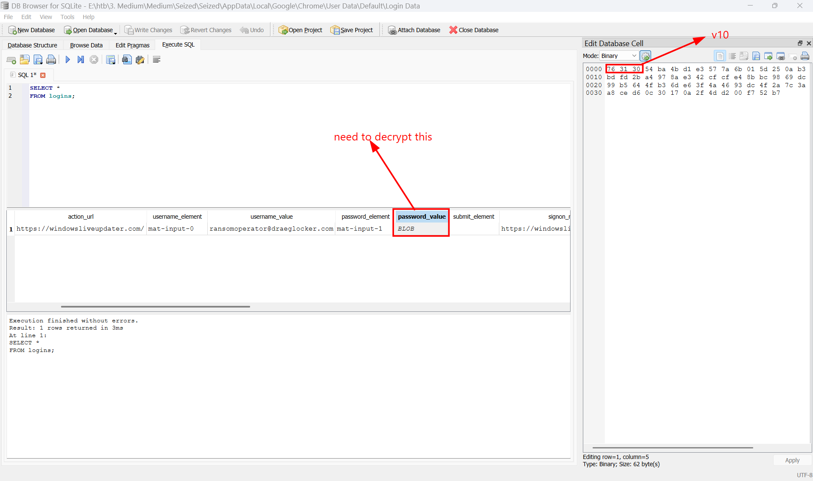
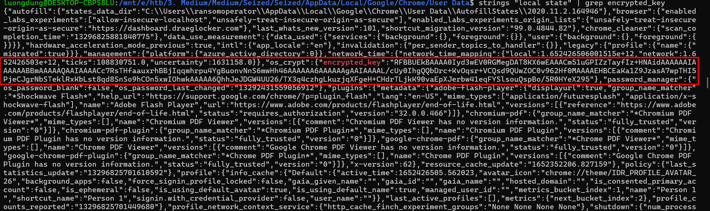
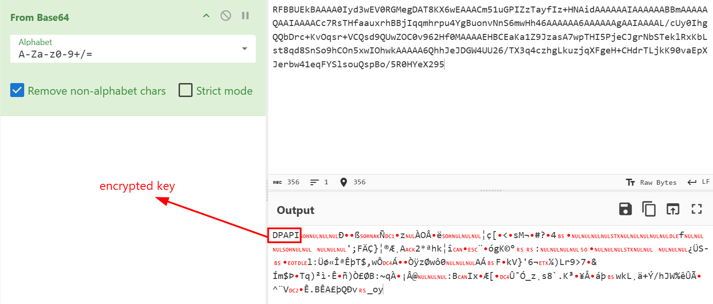
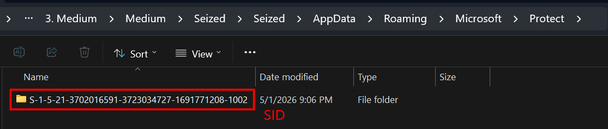
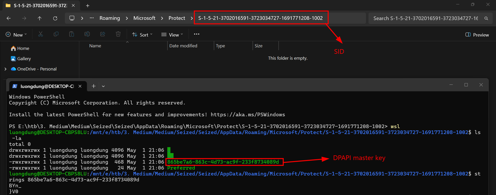
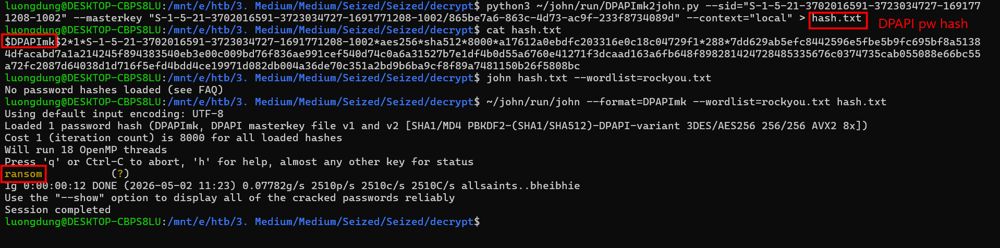
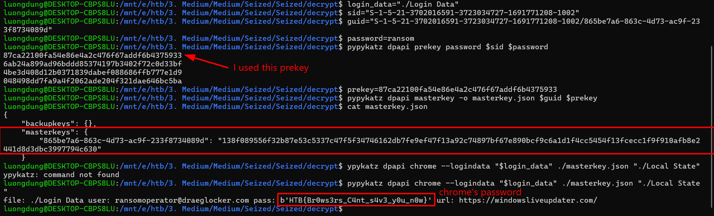

# Seized
**Challenge scenario**: Miyuki is now after a newly formed ransomware division which works for Longhir. This division's goal is to target any critical infrastructure and cause financial losses to their opponents. They never restore the encrypted files, even if the victim pays the ransom. This case is the number one priority for the team at the moment. Miyuki has seized the hard-drive of one of the members and it is believed that inside of which there may be credentials for the Ransomware's Dashboard. Given the AppData folder, can you retrieve the wanted credentials?

## Overview
So the whole AppData folder of the compromised machine is given. Since Google Chrome is download, I used strings with "Login Data" to find for any suspicious credentials.

A very sus user named ransomoperator@draeglocker.com has logon. And since this file is a SQLite database, I used DB Browser for furthur analysis.

Yes and I should have find the password_value for this malicious user. From the prefix v10, it shows the victim is using Chrome version 80-126, where the passwords are encrypted using AES-GCM, the key for AES encryption is encrypted by DPAPI, and save to Local State in Google/Chrome/User Data.
And I have found the encrypted AES-key in Local State.

## Decrypt machine's password
To decrypt this AES key, I need the DPAPI masterkey, and Window's password, and also user's SID.
Since Windows stores masterkey in AppData\Roaming\Microsoft\Protect\SID, so I search for it in this directory.

And I found it. Next, I found the GUID of the key, but it is hiden in Windows Explorer.

So the last thing I need to decrypt this Chrome password is the victim's machine password. Well since there is no hint about how to find the password, I used JohnTheRipper with rockyou.txt (a 130+kb file of most famous passwords).
I used this command to run John the Ripper's DPAPImk2john.py script to convert Windows' DPAPI masterkey information into a hash format that John can use to crack/verify passwords.

## Decrypt Chrome password
So now I had everything I need to decrypt the Chrome password. I used Pypykatz to decrypt.

And the password of this user is also the flag of the challenge.

**FLAG: HTB{Br0ws3rs_C4nt_s4v3_y0u_n0w}**

