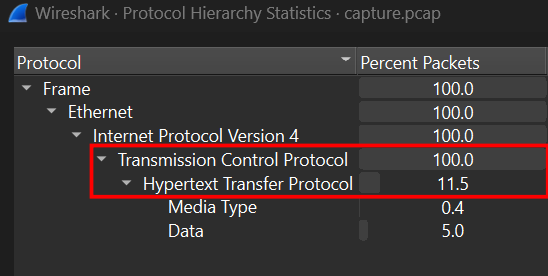
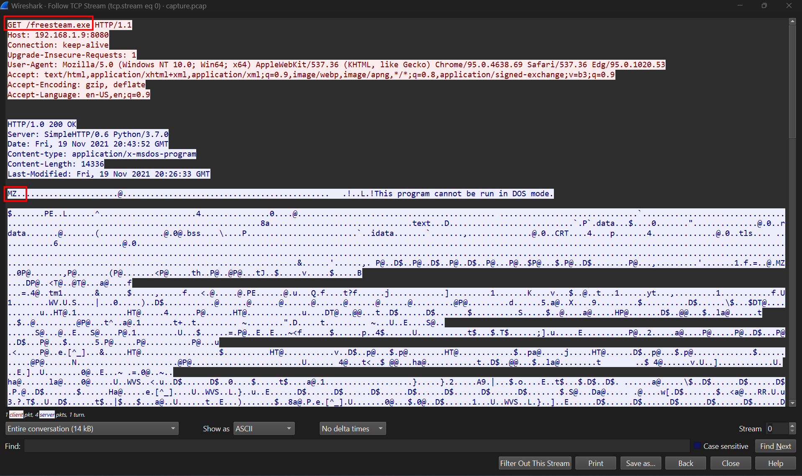
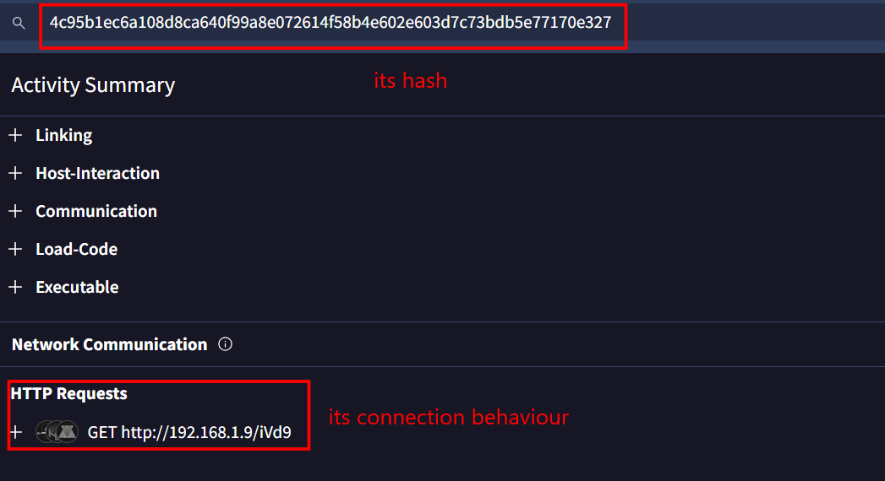
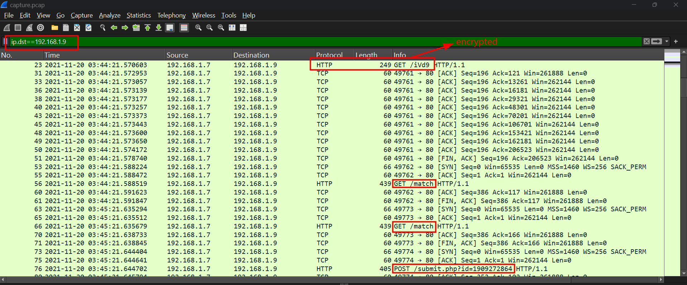
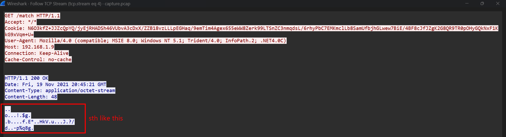
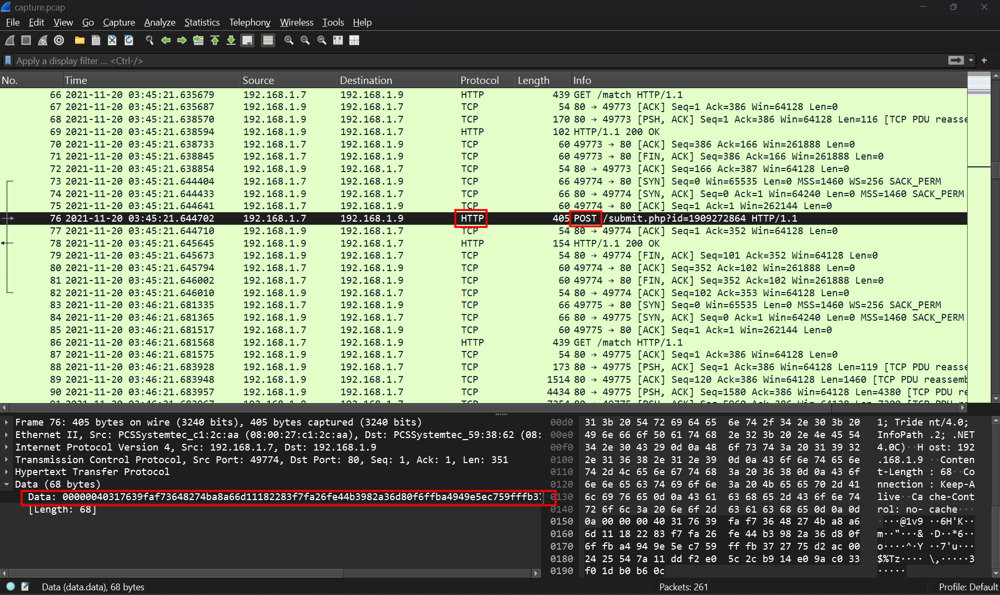
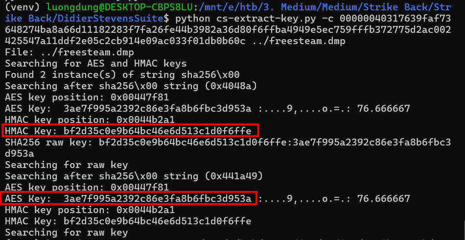
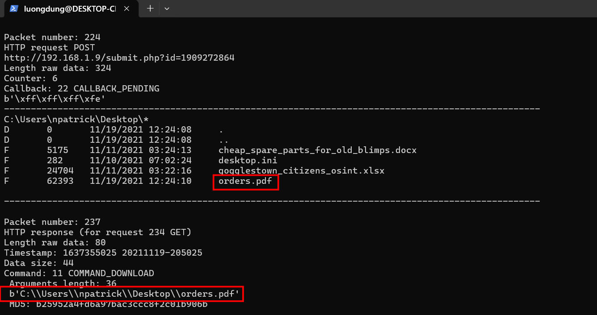
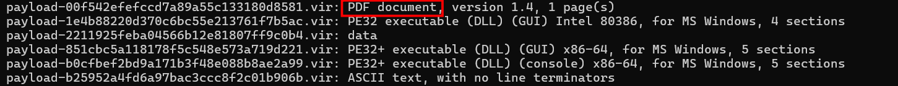

# Strike back
**Challenge scenario**: A fleet of steam blimps waits the final signal from their commander in order to attack gogglestown kingdom. A recent cyber attack had us thinking if the enemy managed to discover our plans and prepare a counter-attack. Will the fleet get ambused???

## Overview
The challenge provided a packet capture and a process dump, but what process??? I looked up for Hierarchy of the pcap file first.

I followed TCP Stream for more detail.

An executable is downloaded to victim's machine. Exporting it shown that is is compiled in C, also VirusTotal showed that this executable uses Cobalt Strike C2 Framework, which can be known as the standard Framework for every C2 model. 

Since it do has connection to IPv4 192.168.1.9, I filter for this IP in destination column, and saw that some posts and responses from user and server has already taken.

And turns out the process dump which is given as an artifact. So I guess now we need to decrypt this Cobalk Strike traffic.

## Retrieve AES key and HMAC key
I will explain rapidly how Cobalk Strike encrypt the traffic first.
First, beacon does not send data in plaintext, it is transfered through HTTP and encrypted with AES

Beacon creates exchange key session, sends metadata to C2, this metadata then will be encrypted by RSA public key embedded in Beacon. After that, Server will decrypt this metadata using RSA private key. Then client and server will use this session's AES and HMAC key to encrypt traffic since then. 
To decrypt the traffic, there are two popular ways. One is get the RSA private key from Team Server, decrypt initialized metadata, get AES and HMAC session keys to decrypt the traffic. Another method is from Beacon's process memory dump to extract AES and HMAC keys from memory to decrypt the traffic.
AES key will be use to decrypt the content, and HMAC key will be use to verify data to void tamper.
Since the Beacon's process dump is provided in this challenge, I will extract the AES and HMAC keys to decrypt the traffic. Didier Stevens's tools is so helpful in this approach. It helps extract AES key and HMAC key easily by cs-extract-key.py tool.
But to use this tool to find the AES key and HMAC key, we need the hex which is the encrypted callback data first. It is inside the Cobalk Strike Beacon HTTP Post, meaning data that Beacon sent back to C2 server after encryption. And here it is

Now I can use mentioned tool to get keys.


## Decrypt traffic
Using this command and I decrypted all packets which was sent through this traffic.
```
python cs-parse-traffic.py -k bf2d35c0e9b64bc46e6d513c1d0f6ffe:3ae7f995a2392c86e3fa8b6fbc3d953a ../capture.pcap
```




**FLAG: HTB{Th4nk_g0d_y0u_f0und_1t_0n_T1m3!!!!}**

---

