# Fruitzy
**Challenge scenario: CyberJunkie started out as a junior QA Analyst at his friend's startup. He called the CEO of the startup because he believed he had mistakenly downloaded something malicious. The CEO sought help from you, his friend in the cybersecurity field. You sent him a guide on collecting evidence from the machine using KAPE. Now you have been given the forensic image so you can analyze and help your friends, as they cannot afford to hire an MSSP.**

## Artifacts
The provided arifact was a Hard Disk C of the compromised system, a `.vhdk` file, and a `.eml` email file. Dumping it directly on my local machine and I have a copied C drive. As described in the scenario, all artifacts are collected by KAPE.

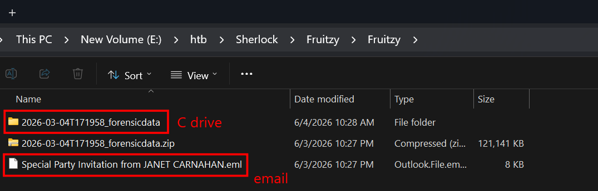

## Task 1
**What is the Subject/topic of the Phishing email?**

Reading the `.eml` file reveals the answer directly.

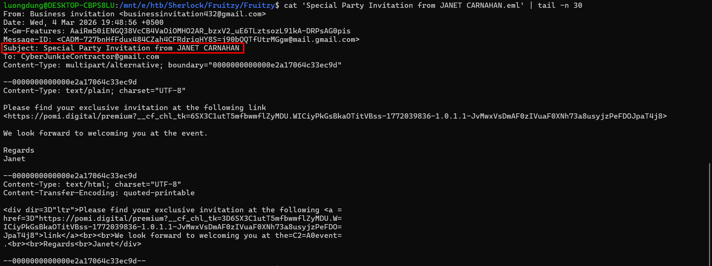

An invitation email to a party, and it also redirected to a link of `pomi.digital` domain.

```
Answer: Special Party Invitation from JANET CARNAHAN
```

## Task 2
**What is the malicious URI that the malicious link redirected to?**

As mentioned, the email redirected to `pomi.digital` domain, but to get the exact link, I used SQL queries in HISTORY database, located in
`C\Users\cyberjunkie\AppData\Local\Microsoft\Edge\User Data\Default`

Since it is a SQLite database, I used DB Browser for queries.

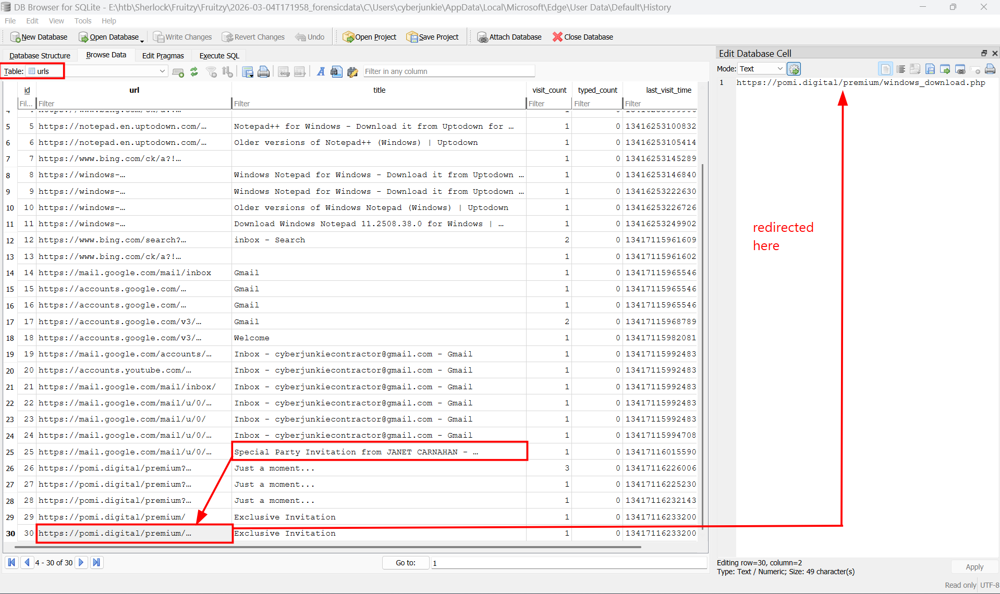

It redirected to a `.php` file

```
Answer: https://pomi.digital/premium/windows_download.php
```

## Task 3
**What is the name of the downloaded file?**

Also in this HISTORY database, checked in `downloads` table and there was the answer

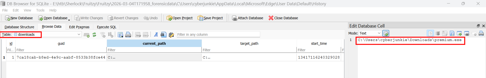

```
Answer: premium.exe
```

## Task 4
**When was the downloaded file executed by the victim according to Amcache?**

The question clearly hinted about the Amcache artifacts.

> Amcache artifact is a Windows forensic artifact used to investigate whether a file ever existed, ran, or was recorded by the system. It is especially useful when malware files have been deleted. Furthurmore it is also a Registry hive.
>
> Its default directory in Windows is C\Windows\AppCompat\Programs\Amcache.hve

Since it is a registry hive, I used RegistryExplorer to look for `premium.exe`, but in another way a parser tool is also effective, such as `AmcacheParser.exe` by Eric Zimmerman.

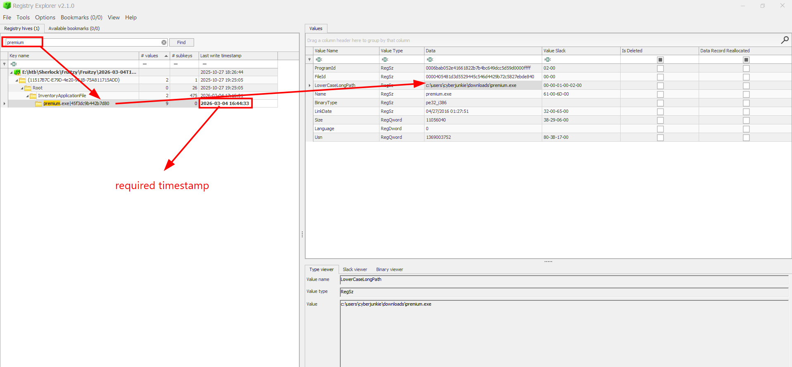

```
Answer: 2026-03-04 16:44:33
```

## Task 5
**What is the SHA256 hash of the malicious executable downloaded from the phishing Website?**

I found two approaches for this question.

### First approach

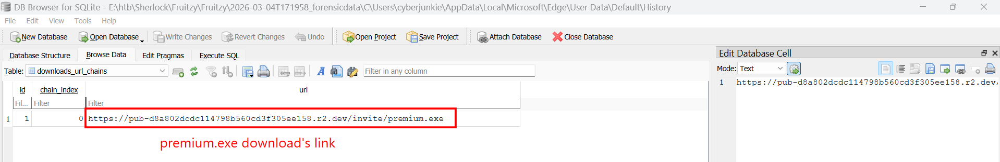

In `HISTORY` database, in downloads_url_chains table, I found the malicious link used to download this executable. Search for that link and the executable is auto downloaded.

Then I checked for its SHA256 hash.

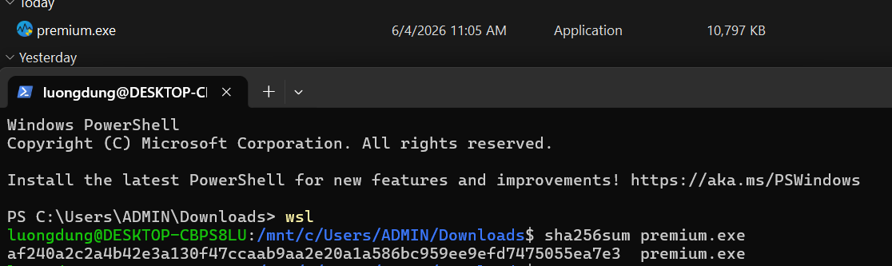

### Second approach

Again, I parsed the `Amcache.hve` file using `AmcacheParser.exe` to csv files.

Command line used: `./AmcacheParser.exe -f Amcache.hve --csv .`

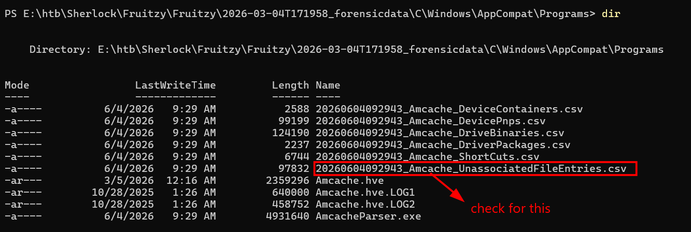

Using TimelineExplorer to open `UnassociatedFileEntries.csv` and filter for `premium.exe` to get its SHA1 hash.

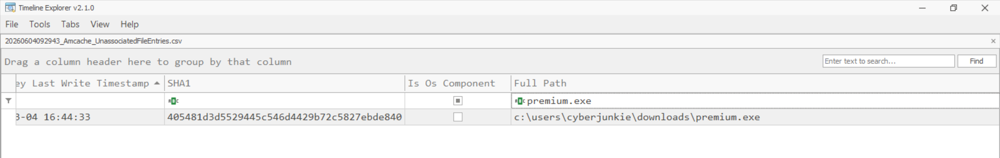

Taking this SHA1 hash on VirusTotal, and I had its SHA256.

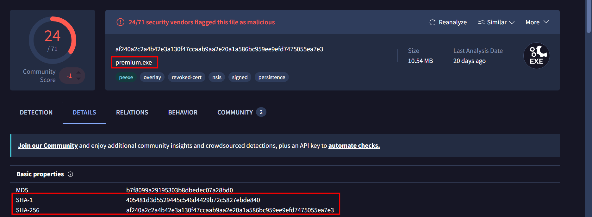

```
Answer: af240a2c2a4b42e3a130f47ccaab9aa2e20a1a586bc959ee9efd7475055ea7e3
```

## Task 6
**The user executed the file, but no invitation appeared or was found. They then used Microsoft Defender to scan the file. When was this scan initiated?**

When user run Microsoft Defender to scan the file, Windows will save this event in `Microsoft-Windows-Windows Defender%4Operational.evtx` as event ID 1000. So I just simply openned this file in Event Viewer and filter for Event ID 1000, around the timestamp when user executed this malware.

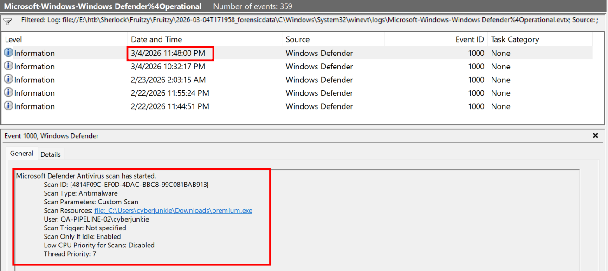

And here it is.

```
Answer: 2026-03-04 16:48:00
```

## Task 7
**The malware installed a Remote Monitoring and Management (RMM) tool as a backdoor for potential remote access. What was the service name?**

> RMM (Remote Monitoring and Management) which is tools assisting IT administrators with remote control. Installing this legacy tools can help run commands, script from remote, install and unistall applications, extract logs,...
>
>In incident, attacker often abuse this since it is not usually being notice by anvivirus, has remote access, can auto start after reboot.

When a service is installed in the system, `System.evtx` will save this event as Event ID 7045, stands for `A service was installed in the system.`

So I openned `System.evtx` in Event Viewer and filter for Event ID 7045, and notice around when the executable was ran.

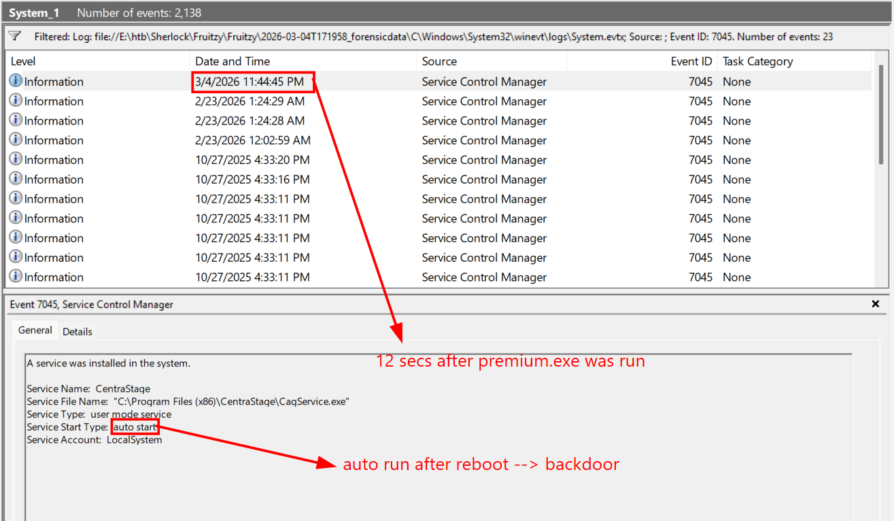

This service satisfies all conditions, it was installed 12 seconds after the executable was run, it has `auto start`, meaning auto run after reboot, this is a significant sign of any backdoor or persistence.

```
Answer: CentraStage
```

## Task 8
**The malicious backdoor installation time stomped the RMM executables. What was the modified timestamp set to these executables?**

Recognised that `CentraStage` was used for backdoor and remote control, I used `$MFT` artifact and look for this service in `Program Files (x86)\CentraStage\`.

Command line that I used to parse `$MFT` using `MFTECmd.exe`: './MFTECmd.exe -f '$MFT' --csv './output' --csvf mft.csv'

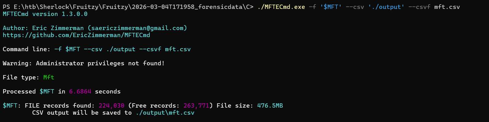

Then I filter for `CagService.exe` which is the application name or service `CentraStage`.

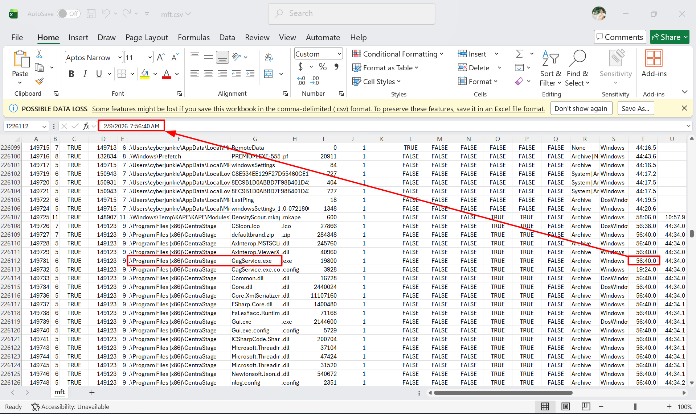

The modified timestamp was 2026-02-09 07:56:40.

```
Answer: 2026-02-09 07:56:40
```

## Task 9
**What is the name of the company whose product is the RMM tool?**

Doing some Osint will help in this task.

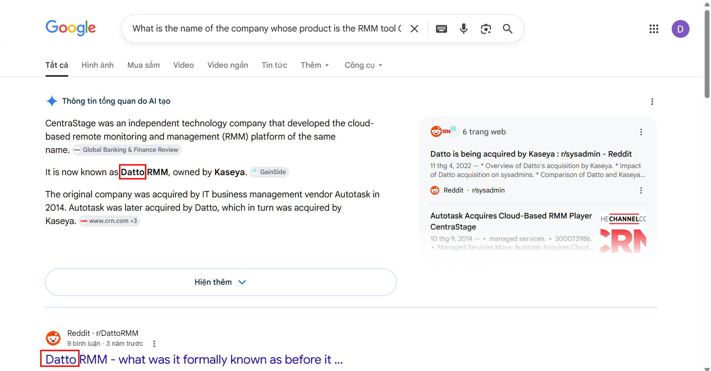

```
Answer: Datto
```

## Task 10
**Pivoting back to the malicious link, when was the domain registered?**

Another Osint-relating task. 

From domain name pomi.digital, which has TLD (Top-Level Domain) is .digital, I googled for IANA (Internet Assigned Numbers Authority), which is likely a handnote managing critical Internet identity resources.

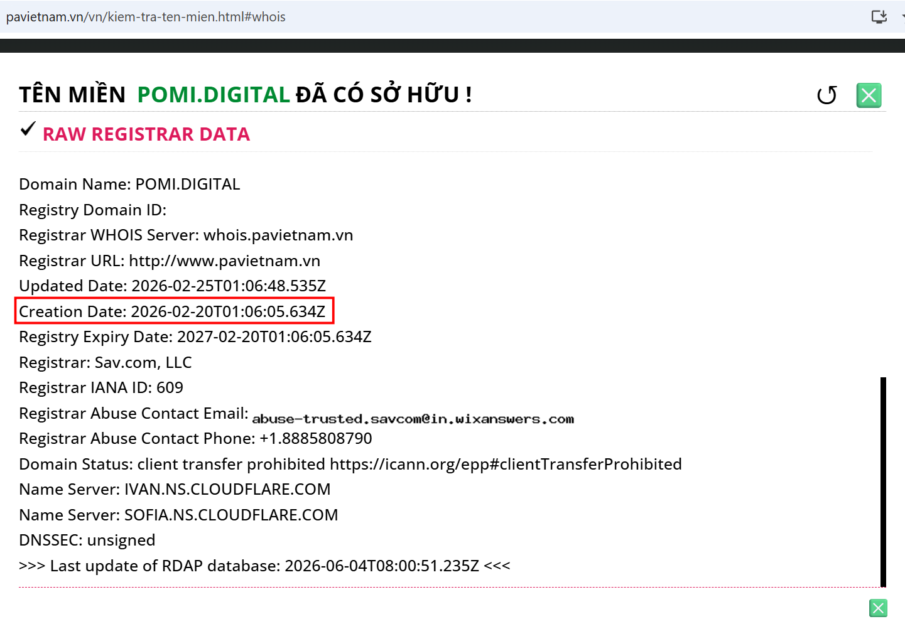

From [this](https://www.pavietnam.vn/vn/kiem-tra-ten-mien.html#whois) link, I knew some detail about this domain, including its registration time, which is also the answer for this task.

```
Answer: 2026-02-20 01:06:05
```

## Task 11
**Utilizing threat intelligence sources, what is another name for the executable that was initially downloaded?**

We can get some other names of this `premium.exe` file from VirusTotal.

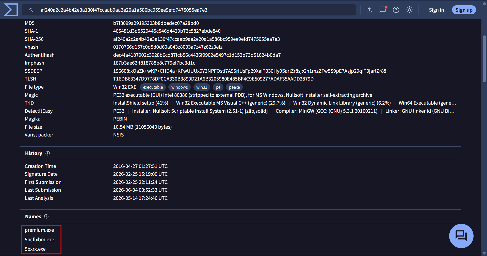

The answer for this task was

```
Answer: 5bxrx.exe
```

## Questions and Answer

| Task | Question | Answer |
|---|---|---|
| 1 | What is the Subject/topic of the Phishing email? | Special Party Invitation from JANET CARNAHAN |
| 2 | What is the malicious URI that the malicious link redirected to? | https://pomi.digital/premium/windows_download.php |
| 3 | What is the name of the downloaded file? | premium.exe |
| 4 | When was the downloaded file executed by the victim according to Amcache? | 2026-03-04 16:44:33 |
| 5 | What is the SHA256 hash of the malicious executable downloaded from the phishing Website? | af240a2c2a4b42e3a130f47ccaab9aa2e20a1a586bc959ee9efd7475055ea7e3 |
| 6 | The user executed the file, but no invitation appeared or was found. They then used Microsoft Defender to scan the file. When was this scan initiated? | 2026-03-04 16:48:00 |
| 7 | The malware installed a Remote Monitoring and Management (RMM) tool as a backdoor for potential remote access. What was the service name? | CentraStage |
| 8 | The malicious backdoor installation time stomped the RMM executables. What was the modified timestamp set to these executables? | 2026-02-09 07:56:40 |
| 9 | What is the name of the company whose product is the RMM tool? | Datto |
| 10 | Pivoting back to the malicious link, when was the domain registered? | 2026-02-20 01:06:05 |
| 11 | Utilizing threat intelligence sources, what is another name for the executable that was initially downloaded? | 5bxrx.exe |
