---
title: HACKTHEBOX SHERLOCK EASY MONEY

---

# HACKTHEBOX SHERLOCK EASY MONEY

**Sherlock scenario**: John is an employee at a mid-sized tech company. He works as a Senior IT support specialist, but his true passion is finding ways to make extra money. John is always on the lookout for giveaways, discounts, and any opportunity to earn a quick buck. He’s not particularly tech-savvy when it comes to cybersecurity, but he’s resourceful and knows how to follow online tutorials.

Recently, John came across an enticing giveaway that promised exciting rewards. However, when he opened the giveaway, he didn’t find or win anything. This made him suspicious that something might have gone wrong with his machine. Concerned about the unusual behavior, John has reached out to you, the investigator, to uncover what happened and whether his system has been compromised.

## Task 1: At what exact time did the user execute the malicious shortcut file?
The C directory of victim's compromised machine is given in this challenge. From the scenario, I have raised suspicion what John may have download that malicious giveaway file, which will be save in Downloads folder. But unfortunately, the attacker has deleted it (otherwise it would not be a medium sherlock). But with the existence of the MFT file, I can take a look for all files, even when the attacker has removed it. So I used MFTExplorer to view $MFT file.
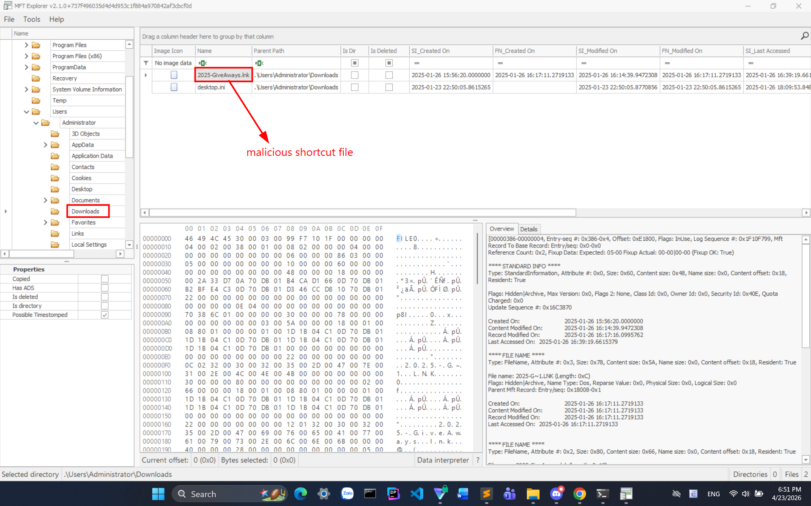
And I spotted the malicious shortcut file that the task mentioning. Trying those SI_LastAccess time in MFTExplorer returned incorrect answer. So I switch my attention to prefetch files.
Prefetch files are stored in C:\Windows\Prefetch\ and record metadata about executed programs to help Windows speed up application launches. Those are valuable because they show which programs were run, along with timestamps and execution counts.
I used PECmd by Eric Zimmerman to parse the Powershell prefetch file first.
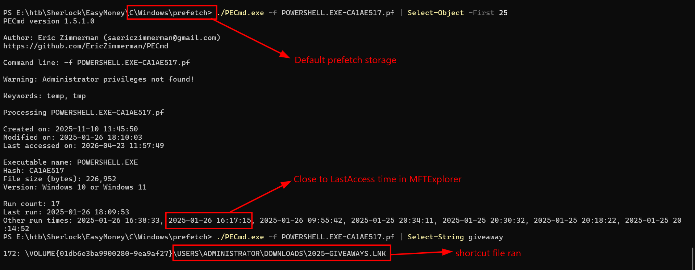
I spotted a timeline which is 16:17:15 which is very close to the Last Accessed time that I previously saw in MFTExplorer. Beside, this prefetch also confirm that the malicious shortcut file has been run.

**Answer**: 2025-01-26 16:17:15

---
## Task 2: The previous malicious file executed an initial payload. What is the full path of this payload?
Also when parsing Powershell prefetch file, I noticed a malicious executable named **svch0st.exe** which highly raised suspicion, this is a fake process of svchost.exe.
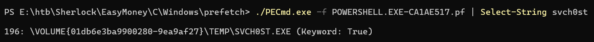

**Answer**: C:\Temp\svch0st.exe

---
## Task 3: At what timestamp did the payload execute and grant the attacker shell access?
This is just basicly the time when that svch0st file run, parsing the svch0st prefetch file printed out the answer of this task.
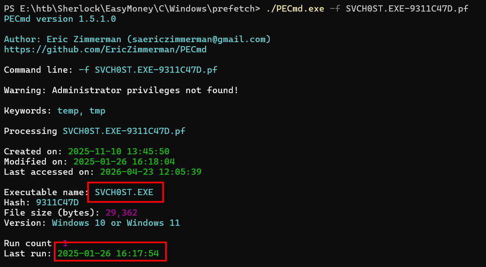

**Answer**: 2025-01-26 16:17:54

---
## Task 4: What is the command line the attacker used to enumerate installed packages on the system?
Unfortunately, the system did not have sysmon, it would be much faster to parse the Sysmon log and view with Timeline Explorer. So I check for the Powershell log, and tried to notice any suspicious commands around 11:17 PM because Event Viewer will show its time in UTC+7.
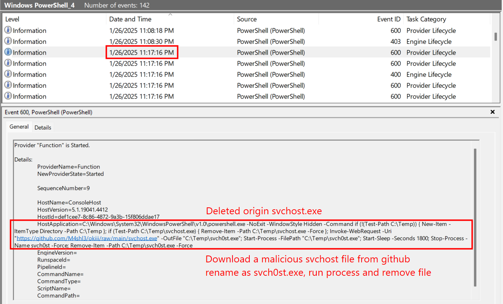
I noticed this log, this explained how that executable svch0st file is downloaded and since the attacker has deleted it immediately so it is no longer visible on the system.
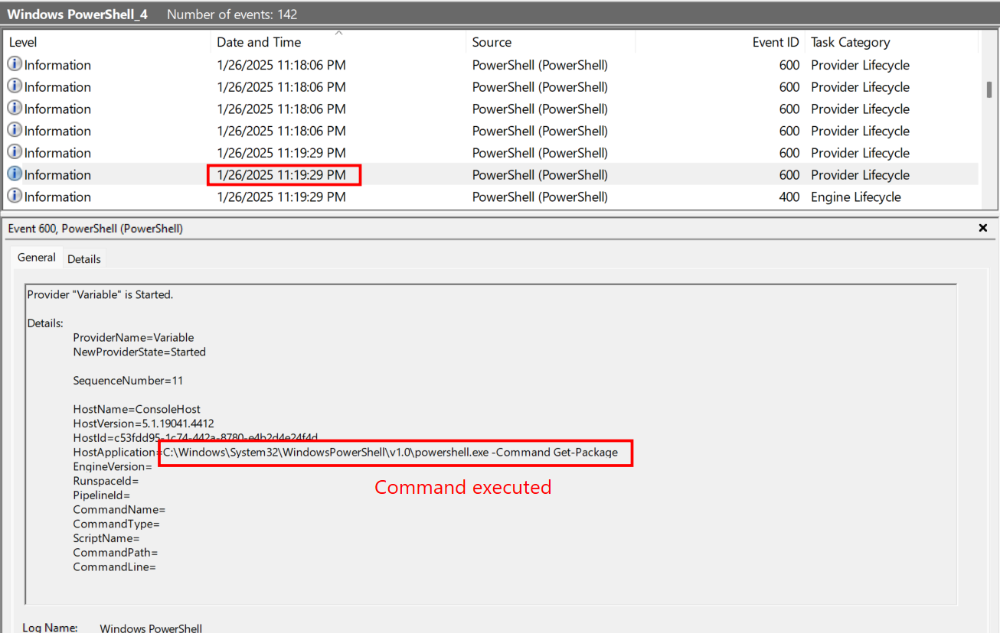
Diving down a bit and I found the command line used by the attacker to enumerate installed packages

**Answer**: C:\Windows\System32\WindowsPowerShell\v1.0\powershell.exe -Command Get-Package

---
## Task 5: Which application did the attacker identify as vulnerable?
A real tricky one. The ultimate purpose of mostly attackers are obtaining Remote Code Execution (RCE) or data exfiltration. They must somehow install a reverse shell back to his machine to execute commands, or setup persistence. So I check for **NTUSER.DAT** file in **C\Users\Administrator**, which is a registry hive that stores configuration settings and activity data for that specific Windows user, here is Administrator. Since it is a Microsoft Windows registry file, I used RegistryExplorer to examine it.
Looking in **Software\Microsoft\Windows\CurrentVersion\Run**, this will store every programs running when the system reboot, including persistence. 
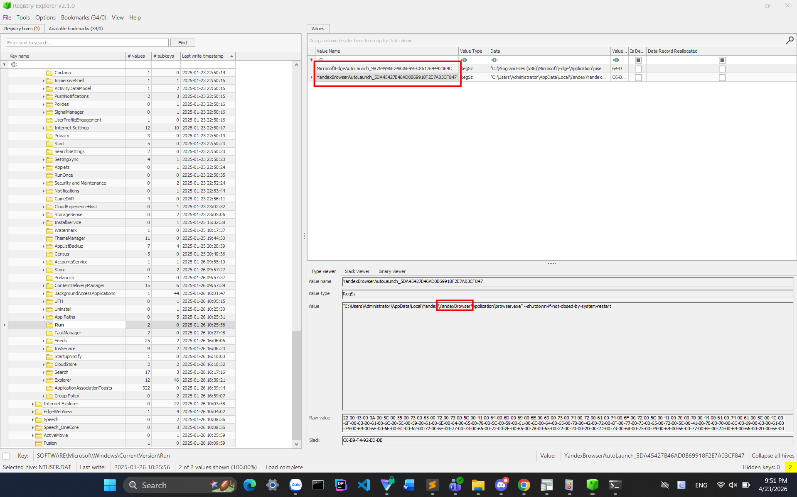
There are only two programs, and the vulnerable one that detected by the attacker is YandexBrowser.

**Answer**: YandexBrowser

---
## Task 6: What version of that vulnerable application did the attacker identify?
Since I did not find the version of YandexBrowser in earlier picture, I searched for all Yandex file in this registry and found its version.
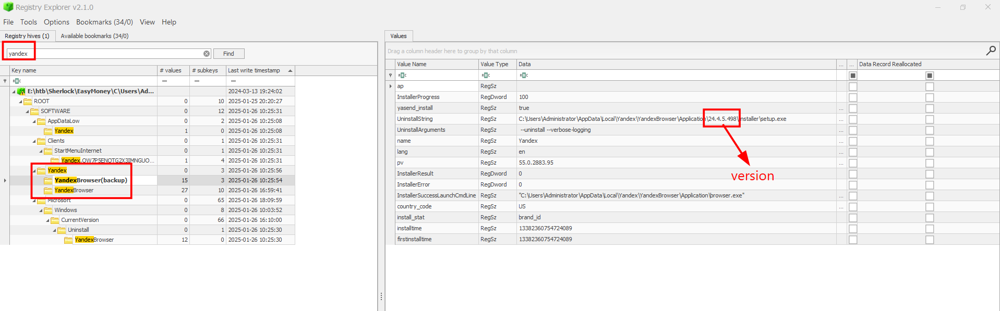

**Answer**: 24.4.5.498

---
## Task 7: What is the CVE associated with this vulnerability?
Doing some google for this version of Yandex revealed its CVE.
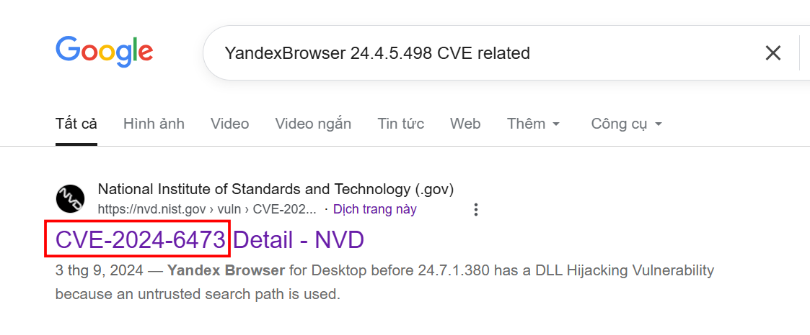
CVE-2024-6473 is a DLL hijacking vulnerability in Yandex Browser for Desktop caused by using an untrusted search path when loading DLL files. 
An attacker can exploit this by placing a malicious DLL in a searched directory, leading to arbitrary code execution on the affected system.

**Answer**: CVE-2024-6473

---
## Task 8: What is the name of the legitimate binary that the attacker used to deliver the malicious payload and establish persistence on the compromised system?
A nearly brute-force one...
I parsed all the prefetch files into a single csv file, opened it in Timeline Explorer.
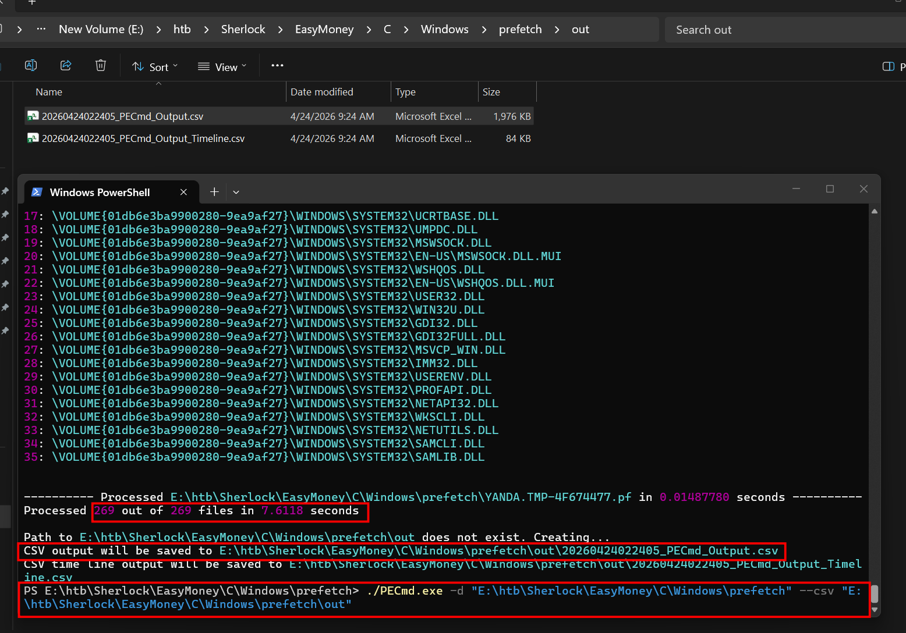
Then used Timeline Explorer to look for any suspicious binary that ran after 16:17.
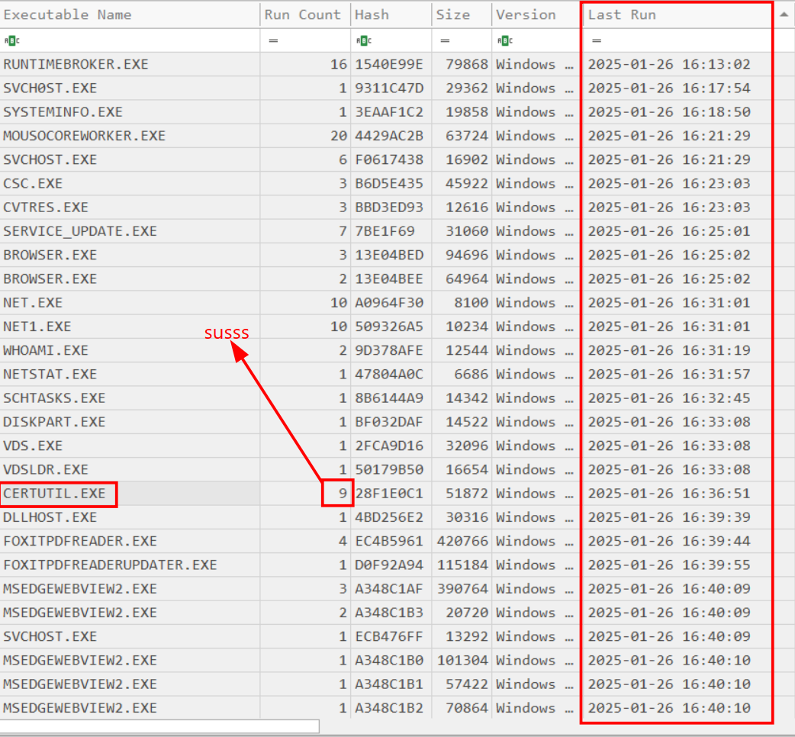
Then I noticed that certutil.exe has run 9 times. It is a built-in Windows tool used to manage certificates and sometimes download or convert files. But sometimes being misused by the attacker to download malicious files. Running with 9 continuos time really raised suspicion.

**Answer**: certutil.exe

---
## Task 9: What is the name of the malicious Portable Executable (PE) file that enabled him to accomplish his objective?
Knowing certutil.exe was used to deliver harmful payload, I parsed the certutil prefetch again for more detail.
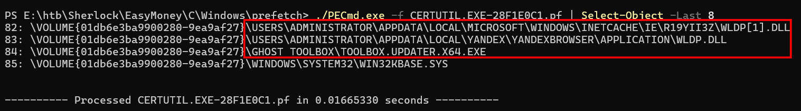
I spotted these three malicious file. Although wldp.dll is a legtimate PE on Windows, but its default directory is C:\Windows\System32, on like the one on the picture. Another suspicious one is toolbox.updater.x64.exe, this is not a standard Windows binary and is located outside System32.
Trying all three of this reveals the correct answer.

**Answer**: wldp.dll

---
## Task 10: What is the SHA-256 hash of that malicious file?
So I need to extract that wldp.exe file, I found it in MFTExplorer but cannot extract it. So I though for another idea is to parse the Amcache.hve file, takes it Sha1 and search for it on VirusTotal for its Sha256, but I did not find the corresponding file.
I switched my attention back to the output after parsing certutil prefetch and noticed a directory.
**C:\Users\Administrator\AppData\LocalLow\Microsoft\CryptnetUrlCache\Content\***, this will stores files downloaded. When tools like certutil.exe access something online, the data often gets cached here.
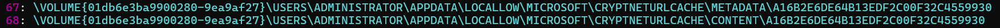
I took its Sha256 and used VirusTotal for its detail.
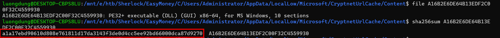
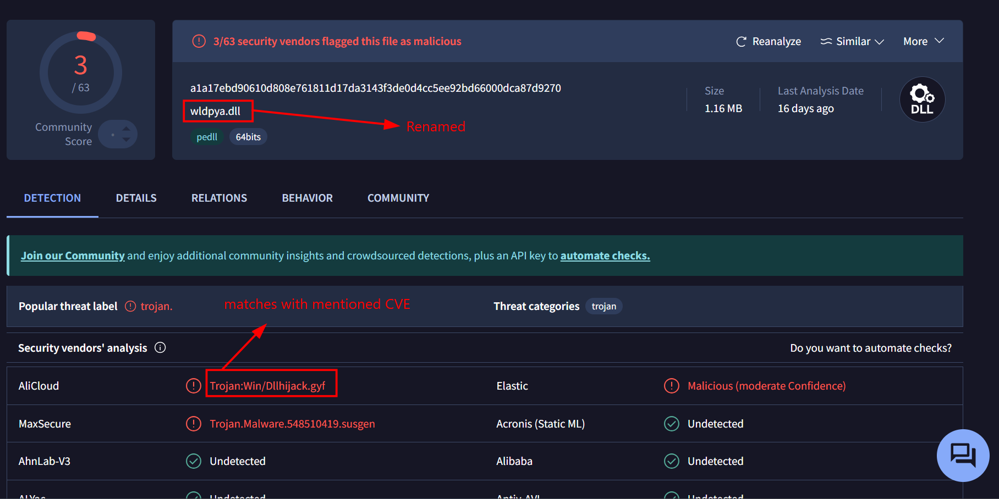
It is truly wldp.exe but has been renamed, VirusTotal also mentioned Dllhijack, which is corresponding to the mentioned CVE.

**Answer**: a1a17ebd90610d808e761811d17da3143f3de0d4cc5ee92bd66000dca87d9270

---
## Task 11: How many milliseconds of cumulative coded sleep delays occurred before the C2 binary provided a shell after the vulnerable application was launched?
Reversing time. Since it is compiled in C+ (Detect It Easy), I used IDA for furthur investigation. 
There is no function DllMain in this PE, so I looked for DllEntryPoint first.
But it just simply calls to DllEntryPoint_0.
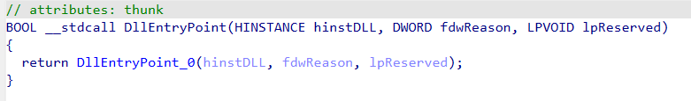

Exploring a bit through function callings in IDA, I found this malicious function **sub_1800748E0()** code block.

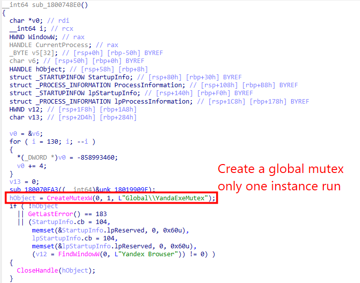
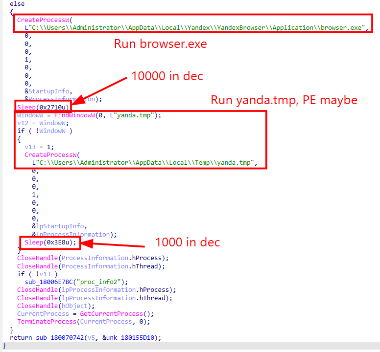
It creates a Global Mutex, launched browser.exe, looked for yanda.tmp and ran it. Although yanda.tmp has the extansion of .tmp, it is rather an Executable. Finally terminated itself.
A mutex (Mutual Exclusion) is a synchronization mechanism in programming. It ensures that only a single thread has access to a shared resource (variable, file, memory) at any given time, preventing race conditions.
There are also two Sleep function call in this code, with variables 0x2710 and 0x3E8 which are 10000 and 1000 in decimal. So the total sleeping time is 11000ms.

**Answer**: 11000

---
## Task 12: What is the mutex name used to ensure only one instance of the C2 binary runs at a time?
Explained in the previous task and also visible in that function code block.
**Answer**: Global\\YandaExeMutex

---
## Task 13: What is the full path of the Command and Control (C2) Binary?
The malicious code calls to execute yanda.tmp, but it is more likely a Portable Executable.
**Answer**: C:\Users\Administrator\AppData\Local\Temp\yanda.tmp

---
## Task 14: What is the name of the C2 framework used by the attacker?
Well because there are six characters in the answer to I just guess it is **sliver**.
But for furthur analysis I have to find that malicious payload. Once again, the attacker has deleted it, but MFTExplorer confirmed its existence.

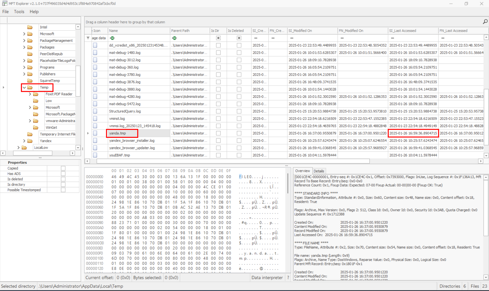

Parsing yanda prefetch file did not returns its framework or IP address, it only confirmed that it did have external connection.

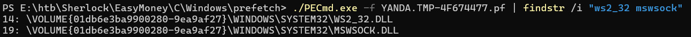

**WS2_32.dll** is the core Windows Winsock library that provides networking functions like creating sockets and connecting to remote servers. **MSWSOCK.dll** helps it do this by handling extra background networking tasks.

Again, I switched my attention to **C\Users\Administrator\AppData\LocalLow\Microsoft\CryptnetUrlCache\Content** because data that downloaded online will be cached here. And I spotted another malicious executable, apart from wldp.dll.
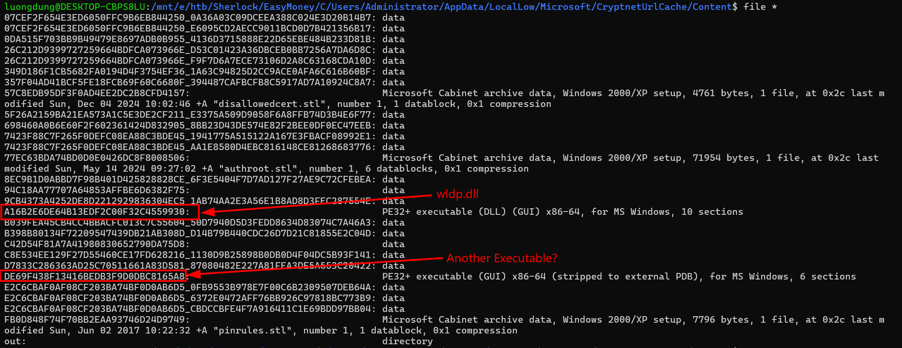
There are also some .cab files, I tried to extract it but nothing seemed note-taking.
This should be the yanda.tmp that I was looking for. I threw that file to any.run for dynamic analysis.

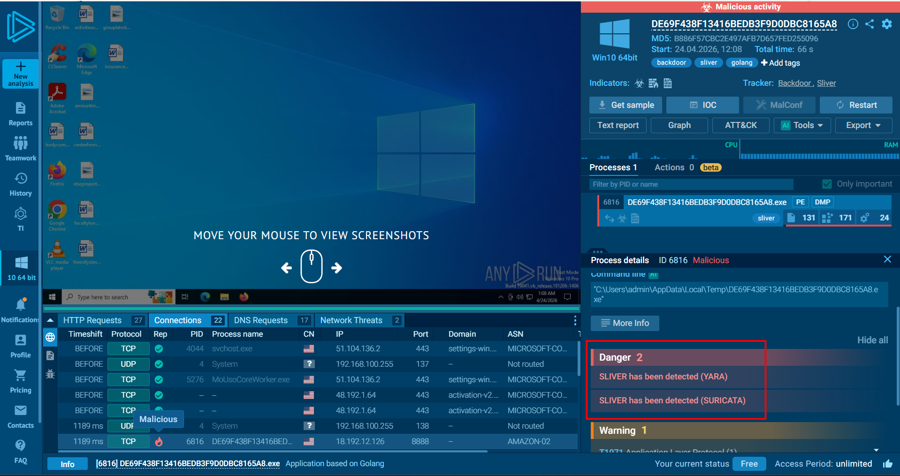

And Sliver Command and Control Framework was detected.

**Answer**: Sliver

---
## Task 15: What is the IP address and port number of the malicious C2 server used by the attacker?
The final task asks for the IP address that yanda.tmp trying to connect to, perhaps the attacker's machine. It is also detected by any.run when trying to his IP address.
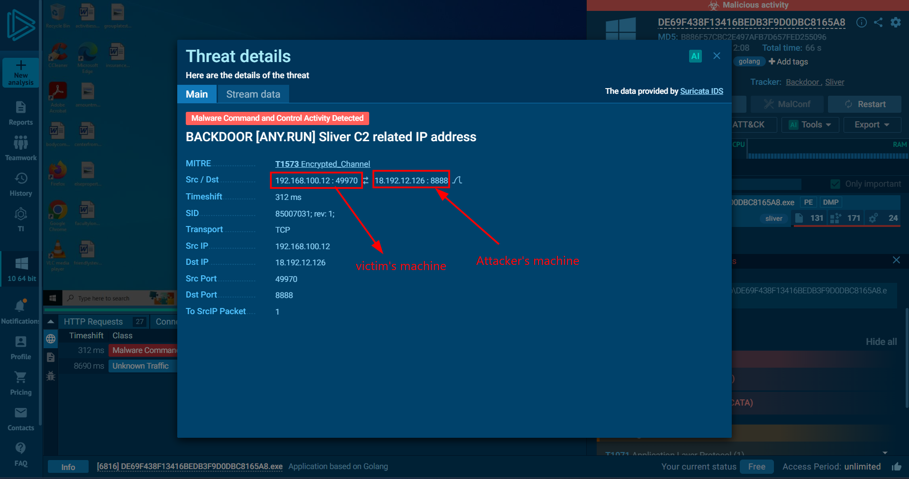

**Answer**: 18.192.12.126:8888

# Attack chain and Conclusion

**1. Initial Access**
- John downloaded a malicious giveaway file, a shortcut filr with extension .lnk
- He executed it at 2025-01-26 16:17:15 and triggered Powershell activity.

**2. Initial Payload Execution**
- The shortcut launched a fake Windows binary svch0st.exe at 16:17:54 of the same day
- Proving the attacker with initial shell access.

**3. Payload executed**
- The attacker used Powershell commands to enumerate installed software and identify attack surface.

**4. Vulnerability Identification**
- The attacker identify YandexBworser version 24.4.5.498 as vulnerable application
- Exploited CVE-2024-6473 about DllHijacking

**5. Malicious payload installed**
- Attcker has misused certutil.exe, a legitimate Windows binary to download a malicious payload
- wldp.dll is downloaded, which is a dropper file, the file is store in Cryptnet URL cache.

**6. Exploitation and Execution**
- DLL hijacking used against Yandex Browser
- Created mutex Global\YandaExeMutex
- Execute legitimate browser process, launced another suspicious payload, yanda.tmp which is an executable.

**7. Command and Control (C2)**
- Using Sliver C2 Framework to connect back to the attacker's machine of IP address 18.192.12.126:8888.
- Post Exploitation on victim's machine.....

